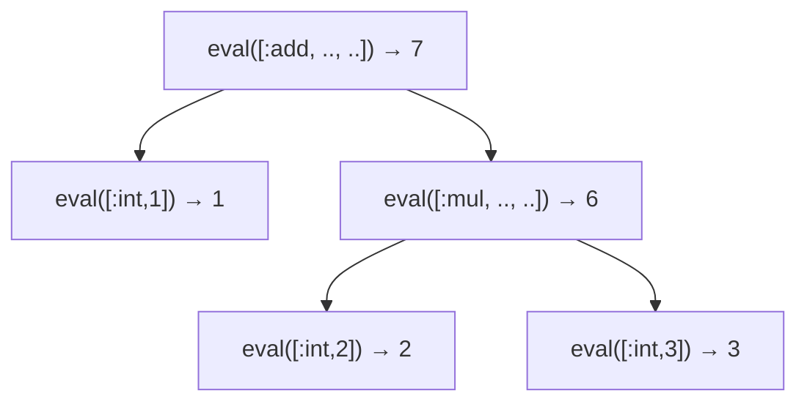

# AST インタプリタ ── 木をたどって実行する

ついに、手に入れた AST を**実行**します。最初の実行方式は、考え方がいちばん素直なもの ── **木を根から再帰的にたどりながら、その場で計算していく**方式です。これを **AST walking interpreter**（木をたどるインタプリタ）と呼びます。バイトコードへの変換もコード生成もありません。木のノードを見て、「これは足し算だから左と右を計算して足す」「これは `if` だから条件を見て分岐する」と、ノードの種類ごとに処理を分けていくだけです。

この章では、前章までに定義した配列表現の AST を入力に、MiniRuby を完全に動かすインタプリタを Ruby で実装します。短いコードで本当に動く処理系ができあがるので、ぜひ手元で動かしてください。

## 基本のアイデア ── 評価とは木をたどること

インタプリタの中心にあるのは、たったひとつの関数です。それは「**式（AST のノード）を受け取り、その値を返す**」関数で、慣例的に `eval`（evaluate＝評価する、の略）と呼びます。木は再帰的な構造なので、`eval` も再帰的に書けます。

たとえば `[:add, 左, 右]` を評価するには、

1. まず左の部分木を `eval` して値を得る、
2. 次に右の部分木を `eval` して値を得る、
3. その 2 つを足して返す。

これだけです。`左` や `右` がさらに複雑な式（たとえば `[:mul, ...]`）でも、`eval` を再帰的に呼べば自動的に処理されます。**「木の構造に沿って再帰する」というこの素直さが、AST インタプリタの最大の長所**です。`1 + 2 * 3` の評価は、次のように木をたどります。



葉（`[:int, n]`）はそのまま値を返し、内側のノードは子の値を組み合わせて値を返す ── 値が葉から根へと「染み上がってくる」イメージです。

## 変数をどう持つか ── 環境

数値計算だけなら上の話で済みますが、MiniRuby には変数があります。`x = 10` のあとに `x + 1` を評価したら `11` になってほしい。そのためには「変数名 → 現在の値」の対応表を、評価の間ずっと持ち歩く必要があります。この対応表を **環境（environment）** と呼びます。Ruby ではハッシュで素直に表せます。

```ruby
env = {}            # 最初は空
env["x"] = 10       # x = 10 を実行すると…
env["x"] + 1        # x + 1 は 11
```

前章のスコープ規則を思い出してください ── 「ローカル変数は関数の中だけで有効」でした。これを実現するには、**関数を呼ぶたびに新しい環境を作り、その関数の引数とローカル変数だけをそこに入れる**ようにします。関数を抜ければその環境は捨てられ、呼び出し元の環境には影響しません。こうして各関数呼び出しが独立した変数の置き場所を持ち、再帰も正しく動くようになります。

## 実装する ── 式の評価

それでは実装に入ります。まずインタプリタの骨格と、式の評価から書きましょう。

```ruby
class Interpreter
  def initialize
    @functions = {}   # 関数名 => [引数名の配列, 本体の文の配列]
  end

  # 式 node を環境 env のもとで評価し、値（整数）を返す
  def eval(node, env)
    case node[0]
    when :int
      node[1]                                   # [:int, 3] → 3

    when :var
      name = node[1]
      raise "未定義の変数: #{name}" unless env.key?(name)
      env[name]                                 # 環境から値を取り出す

    when :add then eval(node[1], env) + eval(node[2], env)
    when :sub then eval(node[1], env) - eval(node[2], env)
    when :mul then eval(node[1], env) * eval(node[2], env)
    when :div then eval(node[1], env) / eval(node[2], env)

    # 比較は、成り立てば 1、成り立たなければ 0 を返す（前章の取り決め）
    when :lt then eval(node[1], env) <  eval(node[2], env) ? 1 : 0
    when :gt then eval(node[1], env) >  eval(node[2], env) ? 1 : 0
    when :eq then eval(node[1], env) == eval(node[2], env) ? 1 : 0

    when :call
      eval_call(node, env)                      # 関数呼び出しは後述

    else
      raise "未知のノード: #{node.inspect}"
    end
  end
end
```

`case node[0]` で**ノードの種類**を見て分岐し、`:add` なら左右を再帰評価して足す ── 先ほどの図がそのままコードになっています。比較演算が三項演算子 `... ? 1 : 0` で整数を返しているのは、前章で「真偽は整数で表す」と決めたからです。これで `if` の条件として使えます。

## 文の実行と環境の更新

式の次は文です。文は値そのものより**動作**（変数を書き換える、画面に出すなど）が目的でした。文の並びを順に実行し、最後の式の値を返す関数を書きます。

```ruby
class Interpreter
  # 文の並び stmts を順に実行し、最後の文の値を返す
  def eval_stmts(stmts, env)
    result = nil
    stmts.each { |stmt| result = eval_stmt(stmt, env) }
    result
  end

  def eval_stmt(node, env)
    case node[0]
    when :assign
      name, expr = node[1], node[2]
      env[name] = eval(expr, env)               # 変数に値を入れる
    when :if
      _, cond, then_body, else_body = node
      if eval(cond, env) != 0                   # 0 でなければ真
        eval_stmts(then_body, env)
      else
        eval_stmts(else_body || [], env)
      end
    when :def
      _, name, params, body = node
      @functions[name] = [params, body]         # 関数を登録するだけ
      nil
    else
      eval(node, env)                           # それ以外は式として評価
    end
  end
end
```

ポイントを 3 つ。**代入**は環境のハッシュに値を入れるだけです。前章で「変数は初めて代入したときに作られる」と決めたので、宣言の手続きは要りません。**`if`** は条件を評価し、`0` でなければ then 側、そうでなければ else 側の文の並びを実行します（`else` がなければ空配列を実行＝何もしない）。**`def`** は、ここでは関数を**登録するだけ**で、本体は実行しません。本体が実行されるのは、その関数が**呼び出されたとき**です。

## 関数呼び出し ── 新しい環境を作る

いよいよ山場、関数呼び出しです。ここで「呼び出しごとに新しい環境を作る」という設計が効いてきます。

```ruby
class Interpreter
  def eval_call(node, env)
    _, name, arg_exprs = node

    # まず組み込み関数 puts を特別扱い
    if name == "puts"
      value = eval(arg_exprs[0], env)
      puts value
      return value
    end

    # ユーザー定義関数を探す
    params, body = @functions[name]
    raise "未定義の関数: #{name}" unless params
    if params.size != arg_exprs.size
      raise "引数の個数が違います: #{name}"
    end

    # 引数を「呼び出し元の環境」で評価しておく
    arg_values = arg_exprs.map { |e| eval(e, env) }

    # 関数本体のための「新しい環境」を作り、引数を束縛する
    new_env = {}
    params.each_with_index do |param, i|
      new_env[param] = arg_values[i]
    end

    # 新しい環境のもとで本体を実行。最後の文の値が戻り値
    eval_stmts(body, new_env)
  end
end
```

この関数の急所は **`new_env = {}`** の一行です。関数本体は、呼び出し元の `env` ではなく、**まっさらな `new_env`** のもとで実行されます。だから関数の中で変数をいじっても呼び出し元には漏れず、逆に呼び出し元の変数も（同名でも）関数からは見えません ── 前章で決めたスコープ規則そのものです。

引数の値を **呼び出し元の `env` で先に評価してから** `new_env` に移している点にも注目してください。`add(x + 1, y)` の `x` や `y` は、呼び出し**元**の変数だからです。

再帰も、この仕組みだけで自然に動きます。`fib(n)` の中で `fib(n - 1)` を呼ぶと、また新しい `new_env` が作られ、そこに新しい `n` が束縛されます。呼び出しごとに環境が積み重なる ── これがホスト言語 Ruby のメソッド呼び出しスタックの上に、そのまま乗っているわけです。

> [!NOTE]
> 本書のインタプリタは、MiniRuby の関数呼び出しを「ホスト言語 Ruby の `eval` 再帰呼び出し」で実現しています。つまり MiniRuby の呼び出しスタックは Ruby の呼び出しスタックに相乗りしています。そのため、MiniRuby で深い再帰をすると Ruby 側がスタックオーバーフローを起こします。スタックを自前で管理して相乗りをやめる方法は、次章の仮想マシンで見えてきます。

## 全体を組み立てて動かす

最後に、プログラム全体（トップレベルの文の並び）を実行する入口を用意します。トップレベルにもひとつ環境を与えれば完成です。

```ruby
class Interpreter
  def run(program)
    eval_stmts(program, {})   # トップレベルの環境は空ハッシュから
  end
end
```

前章のパーサと組み合わせて、実際に走らせてみましょう（`parse_program` は前章の方針で文の並びを解析する関数とします）。

```ruby
src = <<~MINIRUBY
  def fib(n)
    if n < 2
      n
    else
      fib(n - 1) + fib(n - 2)
    end
  end

  puts fib(10)
MINIRUBY

ast = parse_program(tokenize(src))
Interpreter.new.run(ast)
# => 55  と表示される
```

`55` が表示されれば成功です。**字句解析・構文解析・実行までを通した、正真正銘の処理系**が、ここに完成しました。たった 100 行ほどのコードで、再帰関数を含む小さな言語が動いています。これが「木をたどるインタプリタ」の威力です。

## AST インタプリタの長所と短所

この方式の特徴を整理しておきましょう。

**長所は、なんといっても簡単さ**です。AST の構造をそのまま再帰でたどるだけなので、設計が直感的で、書くのもデバッグするのも楽です。言語に新しい構文を足したいときも、`case` に分岐を一つ加えるだけで済みます。新しい言語を試作する初期段階や、設定用の小さな DSL には、この方式で十分なことが多いです。実際、Ruby も初期は AST インタプリタでした[Flanagan and Matsumoto, 2008](#cite:flanagan2008)。

**短所は、速度**です。式を評価するたびに、`case node[0]` でノードの種類を判定し、子ノードへの再帰呼び出しを行います。`1 + 2` のような単純な計算でも、毎回この「種類を調べて分岐する」オーバーヘッドがかかります。ループの中で同じ木を何百万回もたどると、この小さなコストが積もって無視できなくなります。また、前述のとおりホスト言語のスタックに相乗りするため、深い再帰に弱いという問題もあります。


この「遅さ」を改善する代表的な方法が、**いったんバイトコードへ翻訳してから実行する**という次章のアプローチです。木を毎回たどる代わりに、あらかじめ「やるべき命令の列」に変換しておけば、実行時の判定が減り、ずっと速くなります。インタプリタの実装方式とその性能特性は、研究としても古くから比較されてきました[Ertl and Gregg, 2003](#cite:ertl2003)。

---

木をたどるインタプリタで、MiniRuby は確かに動きました。次章では同じ MiniRuby を、より高速な実行方式 ── **スタックマシン型の仮想マシン** で動かします。AST を「バイトコード」へコンパイルし、それを仮想的な CPU が実行する、という処理系の王道に踏み込みます。
