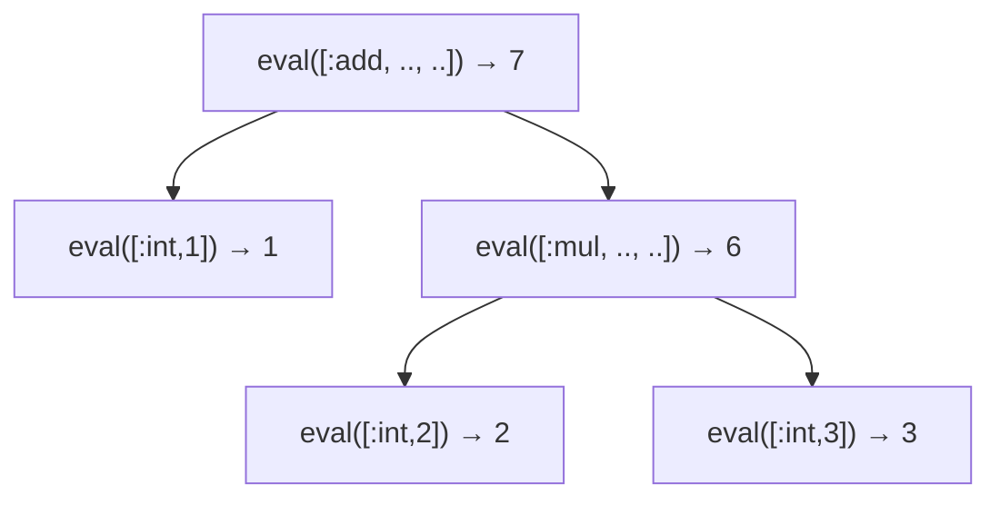

# AST インタプリタ ── 木をたどって実行する

ついに、手に入れた AST を**実行**します。最初の実行方式は、考え方がいちばん素直なもの ── **木を根から再帰的にたどりながら、その場で計算していく**方式です。これを **AST walking interpreter**（木をたどるインタプリタ）と呼びます。バイトコードへの変換もコード生成もありません。木のノードを見て、「これは足し算だから左と右を計算して足す」「これは `if` だから条件を見て分岐する」と、ノードの種類ごとに処理を分けていくだけです。

この章では、[構文解析の章で定義した配列表現の AST](parsing.md#AST をどう表現するか)（各ノードを `[:add, 左, 右]` のように Ruby の配列で表す方式）を入力に、MiniRuby を完全に動かすインタプリタを Ruby で実装します。**四則演算と画面出力 → 変数 → 関数** という順番でインタプリタを少しずつ育て、各節では新しく扱えるようになるノードを最初に示します。短いコードで本当に動く処理系ができあがるので、ぜひ手元で動かしてください。

## 基本のアイデア ── 評価とは木をたどること

インタプリタの中心にあるのは、たったひとつの関数です。それは「**式（AST のノード）を受け取り、その値を返す**」関数で、慣例的に `eval`（evaluate＝評価する、の略）と呼びます。木は再帰的な構造なので、`eval` も再帰的に書けます。

たとえば `[:add, 左, 右]` を評価するには、

1. まず左の部分木を `eval` して値を得る、
2. 次に右の部分木を `eval` して値を得る、
3. その 2 つを足して返す。

これだけです。`左` や `右` がさらに複雑な式（たとえば `[:mul, ...]`）でも、`eval` を再帰的に呼べば自動的に処理されます。**「木の構造に沿って再帰する」というこの素直さが、AST インタプリタの最大の長所**です。`1 + 2 * 3` の評価は、次のように木をたどります。



葉（`[:int, n]`）はそのまま値を返し、内側のノードは子の値を組み合わせて値を返す ── 値が葉から根へと「染み上がってくる」イメージです。

## 四則演算と print ── まず式を計算する

いきなり全部を作ると迷子になります。そこで、**いちばん小さいインタプリタ**から始め、節を追うごとに扱えるノードを少しずつ増やしていきましょう。最初は変数も関数もない、**四則演算と画面出力だけ**です。`1 + 2 * 3` を計算して表示できれば成功です。

### この節で扱うノード

| ノード | 意味 |
|------|------|
| `[:int, n]` | 整数 `n`（葉） |
| `[:add, 左, 右]` `[:sub, …]` `[:mul, …]` `[:div, …]` | 上 2 つを再帰評価して演算する |
| `[:print, 式]` | 式を評価して画面に出す |

### 式を評価する

まずインタプリタの中心、式を評価する `eval` です。`eval` は「式（AST のノード）を受け取り、その値を返す」関数でした。木の構造に沿って再帰します。

```ruby
class Interpreter
  # 式 node を評価し、値（整数）を返す
  def eval(node)
    case node[0]
    when :int
      node[1]                               # [:int, 3] → 3
    when :add
      eval(node[1]) + eval(node[2])
    when :sub
      eval(node[1]) - eval(node[2])
    when :mul
      eval(node[1]) * eval(node[2])
    when :div
      eval(node[1]) / eval(node[2])
    else
      raise "未知のノード: #{node.inspect}"
    end
  end
end
```

`case node[0]` で**ノードの種類**を見て分岐し、`:add` なら左右を再帰評価して足す ── 先ほどの図がそのままコードになっています。葉 `[:int, n]` はそのまま値を返し、内側のノードは子の値を組み合わせて返します。

### print も式として足す

式が評価できたら、その結果を画面に出したくなります。「画面に出す」`[:print, 式]` も、ひとつの**式**として `eval` に足してしまいましょう。式を評価し、その値を `puts` で画面に出すだけです。

```ruby
class Interpreter
  # 式 node を評価し、値（整数）を返す
  def eval(node)
    case node[0]
    when :int
      node[1]
    when :add
      eval(node[1]) + eval(node[2])
    when :sub
      eval(node[1]) - eval(node[2])
    when :mul
      eval(node[1]) * eval(node[2])
    when :div
      eval(node[1]) / eval(node[2])
    when :print
      puts eval(node[1])                    # 式を評価して画面に出す
    else
      raise "未知のノード: #{node.inspect}"
    end
  end

  # プログラム（式の並び）を順に評価する
  def run(program)
    program.each { |expr| eval(expr) }
  end
end
```

つないで動かしてみましょう。

```ruby
# print(1 + 2 * 3)
program = [                                                      # プログラム = 式の並び（配列）
  [:print, [:add, [:int, 1], [:mul, [:int, 2], [:int, 3]]]]    # ↑ の中身は式（ノード）が 1 つ
]
Interpreter.new.run(program)   # => 7 と表示される
```

外側の `[...]` は `run` が受け取る「プログラム（式の並び）」です。ここでは式が 1 つだけなので要素が 1 つの配列になっています。内側の `[:print, ...]` がその式（ノード）です。

掛け算が先に計算されるのは、パーサが優先順位を解決して `[:add, [:int, 1], [:mul, [:int, 2], [:int, 3]]]` という形の木を作ってくれているからです。`eval` は木の形に素直に従うだけで、優先順位を気にする必要はありません。

数十行で、最初のインタプリタが動きました。ここからノードを足していきます。なお `:print` は、いまは専用ノードで済ませますが、関数の節で `puts` という組み込み**関数**に作り直し、専用ノードとしては姿を消します。

> [!NOTE]
> **「式として足す」と決めた瞬間に生まれる問い** ── `print` を式にしたので、文法上は `print(1) + 2` のような式が書けてしまいます。では、これはどう動くべきでしょうか。`print(1)` は画面に `1` を出しますが、その**式としての値**は何で、`+ 2` は何を足すのか。たとえば「`print` は出力した値そのものを返す」と決めれば結果は `3`、「`print` は『出力しました』を表す特別な値（`nil` のようなもの）を返す」と決めれば、整数でない値に `2` を足そうとしてエラーにする、という設計もありえます。
>
> ここで大事なのは、**どちらが正しいという話ではない**ということです。「`print(1) + 2` に何を期待するか」を決めるのが**言語の設計**であり、「決めた振る舞いを `eval` でどう実現するか」を考えるのが**言語処理系の実装**です ── このふたつは地続きで、しかし別の問いです。本書のインタプリタは、いまは `puts eval(node[1])` の戻り値（Ruby の `puts` は `nil` を返す）をそのまま式の値にしているので、`print(1) + 2` は `nil + 2` となって Ruby がエラーにします。これも立派にひとつの「設計の選択」です。詳しくは後の章で値の種類を増やすときに改めて考えますが、まずは「**式として足すと、こういう問いが芋づる式に出てくる**」という感覚だけ持ち帰ってください。

## 変数が使える ── 環境

四則演算インタプリタは式を 1 つ計算するだけでした。本物のプログラムは、計算した値を**変数に覚え**、条件によって**流れを変え**ます。この節ではその 2 つ ── 変数と分岐 ── を足します。

### この節で扱うノード

| ノード | 意味 |
|------|------|
| `[:var, name]` | 変数の値を読む |
| `[:assign, name, 式]` | 変数に代入する |
| `[:lt, 左, 右]` `[:gt, …]` `[:eq, …]` | 比較（成り立てば `1`、なければ `0`） |
| `[:if, 条件, then本体, else本体]` | 条件分岐 |
| `[:while, 条件, 本体]` | 繰り返し |

### 変数をどう持つか ── 環境

`x = 10` のあとに `x + 1` を評価したら `11` になってほしい。そのためには「変数名 → 現在の値」の対応表を、評価の間ずっと持ち歩く必要があります。この対応表を **環境（environment）** と呼びます。Ruby ではハッシュで素直に表せます。

```ruby
env = {}            # 最初は空
env["x"] = 10       # x = 10 を実行すると…
env["x"] + 1        # x + 1 は 11
```

そこで、`eval` に**環境 `env` を引数として渡す**よう改めます。前節の `eval(node)` が `eval(node, env)` になる、という変化です。

### 式に変数と比較を足す

`eval` に、変数の読み出し `:var` と比較 `:lt`/`:gt`/`:eq` を加えます。

```ruby
  # 式 node を環境 env のもとで評価し、値（整数）を返す
  def eval(node, env)
    case node[0]
    when :int then node[1]

    when :var
      name = node[1]
      raise "未定義の変数: #{name}" unless env.key?(name)
      env[name]                               # 環境から値を取り出す

    when :add then eval(node[1], env) + eval(node[2], env)
    when :sub then eval(node[1], env) - eval(node[2], env)
    when :mul then eval(node[1], env) * eval(node[2], env)
    when :div then eval(node[1], env) / eval(node[2], env)

    # 比較は、成り立てば 1、成り立たなければ 0 を返す（設計の章の取り決め）
    when :lt then eval(node[1], env) <  eval(node[2], env) ? 1 : 0
    when :gt then eval(node[1], env) >  eval(node[2], env) ? 1 : 0
    when :eq then eval(node[1], env) == eval(node[2], env) ? 1 : 0

    else
      raise "未知のノード: #{node.inspect}"
    end
  end
```

比較が三項演算子 `... ? 1 : 0` で整数を返すのは、設計の章「[](language-design.md#値の種類)」で「真偽は整数で表す（`0` は偽、それ以外は真）」と決めたからです。これで `if` や `while` の条件として使えます。

### 代入と分岐を足す

`eval` に、代入 `:assign`、条件分岐 `:if`、繰り返し `:while` を足します。これらも「実行して値を返す式」として扱います。あわせて、式の並びを順に評価して**最後の式の値を返す** `eval_exprs` を用意します（あとで関数の戻り値に使います）。

```ruby
  # 式の並び exprs を順に評価し、最後の式の値を返す
  def eval_exprs(exprs, env)
    result = nil
    exprs.each { |expr| result = eval(expr, env) }
    result
  end

  # eval の case に、代入・分岐・繰り返しを足す
  # （int・var・四則・比較は前掲のまま）
  def eval(node, env)
    case node[0]
    when :assign
      name, expr = node[1], node[2]
      env[name] = eval(expr, env)             # 変数に値を入れ、その値を返す
    when :if
      _, cond, then_body, else_body = node
      if eval(cond, env) != 0                 # 0 でなければ真
        eval_exprs(then_body, env)
      else
        eval_exprs(else_body || [], env)
      end
    when :while
      _, cond, body = node
      eval_exprs(body, env) while eval(cond, env) != 0
      nil
    when :print
      puts eval(node[1], env)                 # （関数の節で puts に置き換える）
    end
  end
```

**代入**は環境のハッシュに値を入れるだけです。[](language-design.md)で「変数は初めて代入したときに作られる」と決めたので、宣言の手続きは要りません。**`if`** は条件を評価し、`0` でなければ then 側、そうでなければ else 側を実行します（`else` がなければ空配列＝何もしない）。**`while`** は、条件が成り立つあいだ本体を繰り返すだけ ── ホスト言語 Ruby の `while` にそのまま乗せています。

`while` で階乗（`1 × 2 × … × 5 = 120`）を計算してみましょう。

```ruby
# i = 1; result = 1
# while i < 6 do result = result * i; i = i + 1 end
program = [
  [:assign, "i",      [:int, 1]],
  [:assign, "result", [:int, 1]],
  [:while, [:lt, [:var, "i"], [:int, 6]], [
    [:assign, "result", [:mul, [:var, "result"], [:var, "i"]]],
    [:assign, "i",      [:add, [:var, "i"], [:int, 1]]],
  ]],
  [:print, [:var, "result"]],
]
Interpreter.new.run(program)   # => 120 と表示される
```

（トップレベルの `run` も環境を渡すよう `eval_exprs(program, {})` に変わります ── 完成形は最後のまとめに載せます。）変数と分岐がそろい、ようやく「プログラムらしいプログラム」が動くようになりました。残るは関数です。

## 関数が使える ── 新しい環境を作る

最後の拡張は**関数**です。関数を呼ぶと、呼ぶ側と呼ばれる側で別々の変数が要ります。`fib` が `fib` を呼べば、両者の `n` は違う値だからです。ここで「呼び出しごとに新しい環境を作る」という環境の設計が効いてきます。

### この節で扱うノード

| ノード | 意味 |
|------|------|
| `[:def, name, params, body]` | 関数を定義（登録）する |
| `[:call, name, 引数式の配列]` | 関数を呼ぶ（`puts` は組み込み）。各要素は値ではなく評価前の式（ノード） |

前章のスコープ規則を思い出してください ── 「ローカル変数は関数の中だけで有効」でした。これを実現するには、**関数を呼ぶたびに新しい環境を作り、その関数の引数とローカル変数だけをそこに入れる**ようにします。関数を抜ければその環境は捨てられ、呼び出し元の環境には影響しません。こうして各関数呼び出しが独立した変数の置き場所を持ち、再帰も正しく動くようになります。

### 関数を登録する ── `def`

まず関数定義 `:def` です。`def` は、ここでは関数を**登録するだけ**で、本体は実行しません。本体が実行されるのは、その関数が**呼び出されたとき**です。登録先として、インタプリタに「関数名 → 中身」の表 `@functions` を持たせ、`eval` に `:def` を 1 本足します。

```ruby
class Interpreter
  def initialize
    @functions = {}   # 関数名 => [引数名の配列, 本体の式の配列]
  end

  # eval の case に 1 本追加：
  #   when :def
  #     _, name, params, body = node
  #     @functions[name] = [params, body]   # 関数を登録するだけ
  #     nil
end
```

### 関数を呼ぶ ── `call`

その前に、`env` の位置づけをひとつ確認しておきます。ここまで `env` は、プログラム全体でただ **1 つ**でした。トップレベルで作った 1 枚の対応表を、`eval` から `eval` へそのまま渡し続けてきただけです。1 枚しかないのだから「グローバル」も「ローカル」も区別のしようがなく、どこで代入してもこの 1 枚に書き込まれていました。

関数を導入すると、ここが変わります。関数の中の変数は、その**呼び出しの間だけ**通用する自前の場所に置きたい ── 前章で決めたスコープ規則です。そこで関数呼び出しのたびに環境を**もう 1 枚**新しく作り、本体はそちらのもとで実行します。`env` が「プログラムにただ 1 つの表」から「呼び出しごとのローカルな表」へと役割を変える ── その転換点がこの節です。次に出てくる `new_env = {}` の一行が、まさにその「もう 1 枚」を用意している箇所だと思って読んでください。

呼び出し式 `[:call, name, 引数]` は、`eval` の `case` に 1 本足して `eval_call` に渡します。

```ruby
  # eval の case に 1 本追加：
  #   when :call
  #     eval_call(node, env)
```

その実体が `eval_call` です。

```ruby
class Interpreter
  def eval_call(node, env)
    _, name, arg_exprs = node

    # まず組み込み関数 puts を特別扱い
    if name == "puts"
      value = eval(arg_exprs[0], env)
      puts value
      return value
    end

    # ユーザー定義関数を探す
    params, body = @functions[name]
    raise "未定義の関数: #{name}" unless params
    if params.size != arg_exprs.size
      raise "引数の個数が違います: #{name}"
    end

    # 引数を「呼び出し元の環境」で評価しておく
    arg_values = arg_exprs.map { |e| eval(e, env) }

    # 関数本体のための「新しい環境」を作り、引数を束縛する
    new_env = {}
    params.each_with_index do |param, i|
      new_env[param] = arg_values[i]
    end

    # 新しい環境のもとで本体を実行。最後の式の値が戻り値
    eval_exprs(body, new_env)
  end
end
```

`puts` を**組み込み関数**として `eval_call` の中で特別扱いしている点に注目してください。前節まで専用ノードだった `:print` は、ここで役目を終えます。これからは `puts(式)`、すなわち `[:call, "puts", [式]]` という関数呼び出しで画面に出します。

この関数の急所は **`new_env = {}`** の一行です。関数本体は、呼び出し元の `env` ではなく、**まっさらな `new_env`** のもとで実行されます。だから関数の中で変数をいじっても呼び出し元には漏れず、逆に呼び出し元の変数も（同名でも）関数からは見えません ── 前章で決めたスコープ規則そのものです。

引数の値を **呼び出し元の `env` で先に評価してから** `new_env` に移している点にも注目してください。`add(x + 1, y)` の `x` や `y` は、呼び出し**元**の変数だからです。

再帰も、この仕組みだけで自然に動きます。`fib(n)` の中で `fib(n - 1)` を呼ぶと、また新しい `new_env` が作られ、そこに新しい `n` が束縛されます。呼び出しごとに環境が積み重なる ── これがホスト言語 Ruby のメソッド呼び出しスタックの上に、そのまま乗っているわけです。

> [!NOTE]
> 本書のインタプリタは、MiniRuby の関数呼び出しを「ホスト言語 Ruby の `eval` 再帰呼び出し」で実現しています。つまり MiniRuby の呼び出しスタックは Ruby の呼び出しスタックに相乗りしています。そのため、MiniRuby で深い再帰をすると Ruby 側がスタックオーバーフローを起こします。スタックを自前で管理して相乗りをやめる方法は、次章の仮想マシンで見えてきます。

### 全体を組み立てて動かす

最後に、プログラム全体（トップレベルの文の並び）を実行する入口 `run` を、環境を渡す形に仕上げます。トップレベルにもひとつ環境を与えれば完成です。

```ruby
class Interpreter
  def run(program)
    eval_exprs(program, {})   # トップレベルの環境は空ハッシュから
  end
end
```

前章のパーサと組み合わせて、実際に走らせてみましょう（`parse_program` は前章の方針で文の並びを解析する関数とします）。

```ruby
src = <<~MINIRUBY
  def fib(n)
    if n < 2
      n
    else
      fib(n - 1) + fib(n - 2)
    end
  end

  puts fib(10)
MINIRUBY

ast = parse_program(tokenize(src))
Interpreter.new.run(ast)
# => 55  と表示される
```

`55` が表示されれば成功です。**字句解析・構文解析・実行までを通した、正真正銘の処理系**が、ここに完成しました。たった 100 行ほどのコードで、再帰関数を含む小さな言語が動いています。これが「木をたどるインタプリタ」の威力です。

## ノード一覧と実装のまとめ

三段階で扱えるようにしてきたノードを、ここで一覧にまとめます。まず、MiniRuby インタプリタが**扱うノードの全体像**です。

| ノード | 意味 | 加わった節 |
|------|------|------|
| `[:int, n]` | 整数 `n`（葉） | 四則演算 |
| `[:add, 左, 右]` `[:sub, …]` `[:mul, …]` `[:div, …]` | 上 2 つを再帰評価して演算する | 四則演算 |
| `[:var, name]` | 変数の値を読む | 変数 |
| `[:assign, name, 式]` | 変数に代入する | 変数 |
| `[:lt, 左, 右]` `[:gt, …]` `[:eq, …]` | 比較し `1`/`0` を返す | 変数 |
| `[:if, 条件, then本体, else本体]` | 条件分岐 | 変数 |
| `[:while, 条件, 本体]` | 繰り返し | 変数 |
| `[:def, name, params, body]` | 関数を定義（登録）する | 関数 |
| `[:call, name, 引数式の配列]` | 関数を呼ぶ（`puts` は組み込み） | 関数 |

`:print` は四則演算の節で導入しましたが、関数の節で組み込み関数 `puts`（`[:call, "puts", …]`）に置き換わったので、最終的なノードには含まれていません。

### 完成したインタプリタ

節ごとに足してきた `eval`・`eval_exprs`・`eval_call` を 1 つにまとめると、インタプリタの全体はこうなります。`eval` に渡す `env`（環境）と、関数表 `@functions` が、この処理系を支える 2 本の柱です。

```ruby
class Interpreter
  def initialize
    @functions = {}   # 関数名 => [引数名の配列, 本体の式の配列]
  end

  # プログラム（トップレベルの式の並び）を実行する
  def run(program)
    eval_exprs(program, {})   # トップレベルの環境は空ハッシュから
  end

  # 式の並び exprs を順に評価し、最後の式の値を返す
  def eval_exprs(exprs, env)
    result = nil
    exprs.each { |expr| result = eval(expr, env) }
    result
  end

  # 式 node を環境 env のもとで評価し、値を返す
  def eval(node, env)
    case node[0]
    when :int
      node[1]                                   # [:int, 3] → 3
    when :var
      name = node[1]
      raise "未定義の変数: #{name}" unless env.key?(name)
      env[name]                                 # 環境から値を取り出す
    when :add
      eval(node[1], env) + eval(node[2], env)
    when :sub
      eval(node[1], env) - eval(node[2], env)
    when :mul
      eval(node[1], env) * eval(node[2], env)
    when :div
      eval(node[1], env) / eval(node[2], env)
    when :lt
      eval(node[1], env) <  eval(node[2], env) ? 1 : 0
    when :gt
      eval(node[1], env) >  eval(node[2], env) ? 1 : 0
    when :eq
      eval(node[1], env) == eval(node[2], env) ? 1 : 0
    when :assign
      name, expr = node[1], node[2]
      env[name] = eval(expr, env)               # 変数に値を入れ、その値を返す
    when :if
      _, cond, then_body, else_body = node
      if eval(cond, env) != 0                   # 0 でなければ真
        eval_exprs(then_body, env)
      else
        eval_exprs(else_body || [], env)
      end
    when :while
      _, cond, body = node
      eval_exprs(body, env) while eval(cond, env) != 0
      nil
    when :def
      _, name, params, body = node
      @functions[name] = [params, body]         # 関数を登録するだけ
      nil
    when :call
      eval_call(node, env)                      # 関数呼び出し
    else
      raise "未知のノード: #{node.inspect}"
    end
  end

  def eval_call(node, env)
    _, name, arg_exprs = node

    if name == "puts"                           # 組み込み関数
      value = eval(arg_exprs[0], env)
      puts value
      return value
    end

    params, body = @functions[name]
    raise "未定義の関数: #{name}" unless params
    if params.size != arg_exprs.size
      raise "引数の個数が違います: #{name}"
    end

    arg_values = arg_exprs.map { |e| eval(e, env) }   # 引数は呼び出し元の env で評価
    new_env = {}                                       # 関数本体のための新しい環境
    params.each_with_index { |param, i| new_env[param] = arg_values[i] }
    eval_exprs(body, new_env)                          # 最後の式の値が戻り値
  end
end
```

四則演算の数十行から始めて、変数・関数と足していくと、この 1 枚にたどり着きます。**どの行も、いつ・なぜ足したのかを説明できる** ── それがこの章を順に組み上げてきたねらいでした。次章では、まったく同じノードの並びを、今度は VM の命令列としてコンパイルし直していきます。

## AST インタプリタの長所と短所

この方式の特徴を整理しておきましょう。

**長所は、なんといっても簡単さ**です。AST の構造をそのまま再帰でたどるだけなので、設計が直感的で、書くのもデバッグするのも楽です。言語に新しい構文を足したいときも、`case` に分岐を一つ加えるだけで済みます。新しい言語を試作する初期段階や、設定用の小さな DSL には、この方式で十分なことが多いです。実際、Ruby も初期は AST インタプリタでした[Flanagan and Matsumoto, 2008](#cite:flanagan2008)。

**短所は、速度**です。式を評価するたびに、`case node[0]` でノードの種類を判定し、子ノードへの再帰呼び出しを行います。`1 + 2` のような単純な計算でも、毎回この「種類を調べて分岐する」オーバーヘッドがかかります。ループの中で同じ木を何百万回もたどると、この小さなコストが積もって無視できなくなります。また、前述のとおりホスト言語のスタックに相乗りするため、深い再帰に弱いという問題もあります。


この「遅さ」を改善する代表的な方法が、**いったんバイトコードへ翻訳してから実行する**という次章のアプローチです。木を毎回たどる代わりに、あらかじめ「やるべき命令の列」に変換しておけば、実行時の判定が減り、ずっと速くなります。インタプリタの実装方式とその性能特性は、研究としても古くから比較されてきました[Ertl and Gregg, 2003](#cite:ertl2003)。

---

木をたどるインタプリタで、MiniRuby は確かに動きました。次章では同じ MiniRuby を、より高速な実行方式 ── **スタックマシン型の仮想マシン** で動かします。AST を「バイトコード」へコンパイルし、それを仮想的な CPU が実行する、という処理系の王道に踏み込みます。
