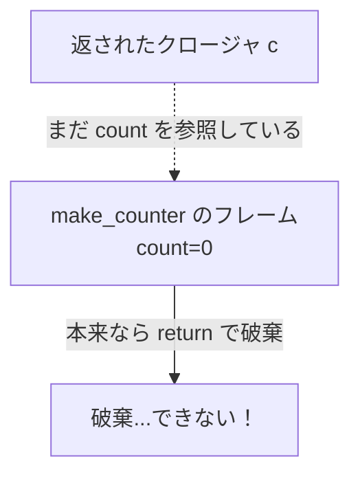
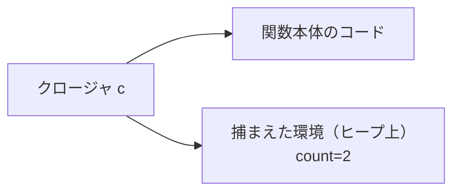

# クロージャ

ここまでの MiniRuby の関数は、引数と自分のローカル変数しか使えませんでした。しかし多くの現代の言語では、関数の中で別の関数を作り、その内側の関数が**外側の関数の変数を覚えている**、という芸当ができます。

```ruby
def make_counter
  count = 0
  increment = ->() { count = count + 1; count }  # 内側の無名関数
  increment
end

c = make_counter
puts c.call   # => 1
puts c.call   # => 2  ← count を覚えている！
```

`make_counter` はとっくに終了しているのに、返された関数 `c` は `count` を覚えていて、呼ぶたびに増やしていきます。このように、**自分が定義された環境（外側の変数）を捕まえて持ち運ぶ関数**を **クロージャ（closure）** と呼びます。この章では、クロージャがなぜ難しく、処理系がどう実現するのかを見ていきます。

## なぜ難しいのか ── 環境の寿命

クロージャの何が難しいのか。鍵は、基礎編で作った **環境（変数の置き場所）の寿命**にあります。

基礎編の VM では、関数を呼ぶとフレーム（ローカル変数の配列）を積み、`ret` で戻るとそのフレームを**捨て**ていました。「関数を抜けたらローカル変数は用済み」という前提で、スタックの出入りに合わせてきれいに片付けていたのです。ところがクロージャがあると、この前提が崩れます。`make_counter` を抜けた後も、返されたクロージャ `c` が `count` を使い続けるからです。



つまり、**「関数を抜けたら変数を捨てる」という単純な管理ができなくなる**のです。クロージャが捕まえた変数は、その関数が終わっても、クロージャが生きている限り生かし続けなければなりません。これは、歴史的に **funarg 問題（関数を値として扱うときに環境をどう扱うかの問題）** として知られてきた、言語処理系の古典的な難題です。

## 自由変数を見つける

実装の話に入る前に、用語をひとつ。クロージャの中で使われる変数は、2 種類に分けられます。

- **束縛変数（bound variable）**：その関数の引数や、その関数の中で定義したローカル変数。自分の中で「束縛」されている変数。
- **自由変数（free variable）**：その関数の中では定義されておらず、**外側から借りてきている**変数。

先ほどの `increment = ->() { count = count + 1; count }` では、`count` は `increment` の中では定義されていません。`increment` の外側、`make_counter` の中で定義された変数です。つまり `count` は `increment` にとっての**自由変数**です。クロージャが捕まえなければならないのは、まさにこの自由変数です。

処理系は、関数をコンパイルするときに「この関数の自由変数は何か」を調べます。これは前にも出てきた、ちょっとした**意味解析**です。「この関数の中で使われている変数のうち、引数でもローカルでもないものを集める」だけで、自由変数の一覧が得られます。

## 実現方法 ── 環境をヒープに置く

自由変数を生かし続けるには、どうすればよいでしょう。答えはシンプルです ── **捕まえる変数を、スタックではなくヒープに置く**。

スタックは関数の出入りで片付いてしまいますが、ヒープのオブジェクトは「[メモリ管理の章](memory-management.md)」で見たとおり、GC が「まだ参照されている」と判断する限り生き続けます。だから、クロージャに捕まえられる変数をヒープ上のオブジェクトに格納し、クロージャからそこへの参照を持たせれば、関数を抜けても変数は消えません。クロージャ自身が参照しているので、GC はその変数を回収しないのです。

クロージャは、概念的には**「関数の本体（コード）」と「捕まえた変数たち（環境）」の組**として表現されます。

```ruby
# クロージャ = コード + 捕まえた環境
Closure = Struct.new(:code, :captured_env)
```



`make_counter` が `increment` クロージャを作るとき、処理系は「`count` を入れたヒープ上の環境」を用意し、それへの参照をクロージャに持たせます。`make_counter` が終わってスタックのフレームが消えても、この**ヒープ上の環境は生き残り**、クロージャ `c` を通じてアクセスし続けられます。`c.call` を 2 回呼ぶと `count` が `1` → `2` と増えていくのは、同じヒープ上の環境を共有しているからです。

> [!NOTE]
> すべてのローカル変数をヒープに置くと、（ヒープ確保と GC のぶん）スタックより遅くなります。そこで賢い処理系は、「**クロージャに捕まえられる変数だけ**をヒープに置き、捕まえられないふつうの変数は今まで通りスタックに置く」という最適化をします。どの変数が捕まえられるかは、先ほどの自由変数の解析で分かります。Lua の **upvalue**（上位値）の仕組みは、この「捕まえられた変数だけを特別扱いする」工夫の有名な実装例です。

## レキシカルスコープとの関係

クロージャは、**レキシカルスコープ（lexical scope, 静的スコープ）** という考え方と表裏一体です。レキシカルスコープとは、「変数がどの定義を指すかは、**プログラムの字面（どこに書かれているか）** で決まる」という規則です。`increment` の中の `count` は、`increment` が**書かれている場所**から見える `count` ── すなわち `make_counter` の `count` ── を指します。これは「字面を見ればどの変数か分かる」という、人間にとって読みやすい規則です。

対になる考え方が **ダイナミックスコープ（dynamic scope, 動的スコープ）** で、「変数がどれを指すかは、**実行時にどういう順で呼ばれたか**」で決まります。古い LISP の一部などで使われましたが、字面だけ見ても何を指すか分からず読みにくいため、現代のほとんどの言語はレキシカルスコープを採用しています。クロージャが「定義されたときの環境」を捕まえるのは、まさにこのレキシカルスコープを正しく実現するためなのです[Flanagan and Matsumoto, 2008](#cite:flanagan2008)。

> [!TIP]
> クロージャは「関数を値として渡せる」言語（第一級関数を持つ言語）でこそ真価を発揮します。コールバック、イベントハンドラ、`map`/`filter` に渡す処理、設定をあらかじめ埋め込んだ関数 ── これらはすべてクロージャの応用です。「環境を持ち運ぶ関数」というひとつの仕組みが、現代的なプログラミングの多くの場面を支えています。

## クロージャと GC ── つながる話

ここで、これまでの章がつながります。クロージャを実装するには、

- 基礎編の **環境** の概念（変数の置き場所）が出発点になり、
- それを**ヒープ**に置く必要があり（[メモリ管理の章](memory-management.md)）、
- 生き残らせるかどうかを **GC** が到達可能性で判断する（[メモリ管理の章](memory-management.md)）。

クロージャは、これら個別の仕組みが組み合わさって初めて成り立つ機能です。「環境・ヒープ・GC」という土台がそろっているからこそ、「関数が変数を持ち運ぶ」という一見不思議な振る舞いが、自然に実現できるのです。処理系の各部品が独立した話ではなく、互いに支え合っていることが、ここでよく見えると思います。

---

クロージャで「関数と環境」の関係を深掘りしました。次章では、処理系のもうひとつの大きなテーマ ── 複数の処理を同時に進める **並行制御** に進みます。コルーチンやスレッドといった仕組みが、これまでの「フレーム」や「スタック」の話とどうつながるかを見ていきましょう。
