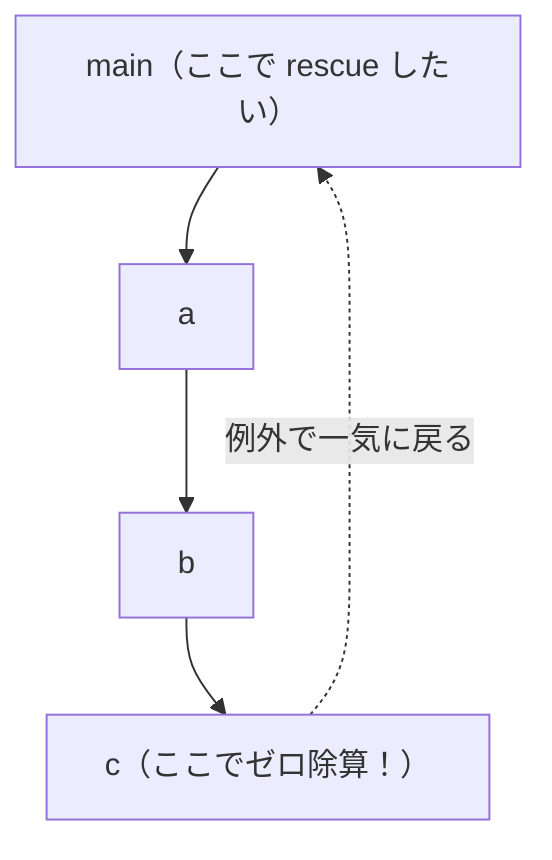

# 例外処理

プログラムは、いつも順調に進むとは限りません。ゼロで割ろうとした、配列の範囲外を読んだ、ファイルが見つからなかった ── こうした**異常**が起きたとき、処理系はどう振る舞うべきでしょうか。多くの言語は **例外処理（exception handling）** という仕組みを備えています。`raise`（または `throw`）で異常を投げ、`rescue`（または `catch`/`try`）で受け止める、あの仕組みです。この章では、例外を処理系の側からどう実現するか、代表的な 3 つの方法とその損得を見ていきます。

## 例外処理が解く問題

例外の本質は、「**今いる場所から、ずっと手前の呼び出し元まで、一気に処理を飛ばす**」ことです。深い関数呼び出しの奥でエラーが起きたとき、その場で処理を中断し、途中の関数をすべて飛び越えて、エラーを処理できる場所まで戻りたい ── これが例外の役割です。

具体例で考えましょう。`main` が `a` を呼び、`a` が `b` を呼び、`b` が `c` を呼んでいて、`c` の中でゼロ除算が起きたとします。



ふつうの戻り値（`return`）だと、`c` → `b` → `a` → `main` と**一段ずつ**戻り、各段で「エラーだったら自分も中断して戻る」と書かなければなりません。途中の `b` や `a` はエラーに関心がなくても、エラーを素通しさせるコードを書く羽目になります。例外は、この中間段を**すべて飛ばして**、一気に `main` まで戻してくれます。これを **大域脱出（non-local exit, 非局所脱出）** と呼びます。

処理系の課題は、この「一気に飛ぶ」をどう実装するかです。基礎編の VM を思い出すと、関数呼び出しごとにフレームが積まれていました。例外は、この**積まれたフレームを一気に何段も巻き戻す**操作にあたります。これを **スタック巻き戻し（stack unwinding）** と呼びます。実現方法は大きく 3 通りあります。

## 方法1 ── ホスト言語の大域脱出を借りる

最も手軽なのは、**ホスト言語が持つ例外機構をそのまま使う**ことです。本書のように Ruby をホスト言語にしているなら、MiniRuby の例外を、Ruby の例外（`raise`/`rescue`）に「載せて」しまえます。

考え方はこうです。MiniRuby の `raise` を実行したら、VM のループの中で**ホスト言語 Ruby の例外を投げる**。すると Ruby のランタイムが、VM のディスパッチループを呼んでいる Ruby のメソッド群を、勝手に巻き戻してくれます。MiniRuby の `rescue` のところには、Ruby の `begin`/`rescue` を仕込んでおき、そこで受け止めます。

```ruby
# MiniRuby の例外を表すホスト言語の例外クラス
class MiniRubyError < StandardError
  attr_reader :value
  def initialize(value) = (@value = value)   # 投げられた MiniRuby の値
end

class VM
  def execute(instr, frame)
    case instr[0]
    when :raise
      raise MiniRubyError.new(@stack.pop)     # ホスト言語の例外を投げる
    when :div
      b, a = @stack.pop, @stack.pop
      raise MiniRubyError.new("divided by 0") if b == 0
      @stack.push(a / b)
    # ...
    end
  end
end
```

そして、MiniRuby の `begin ... rescue ... end` をコンパイルするときは、保護したい範囲を Ruby の `begin`/`rescue` で囲んで実行する、という形にします。ホスト言語が巻き戻しの面倒をすべて見てくれるので、**実装が圧倒的に簡単**です。本書のようにホスト言語が高機能なら、まずこの方法を選ぶのが現実的です。

ちなみに、C 言語をホストにする処理系では、Ruby の例外に相当するものとして `setjmp`/`longjmp` という標準ライブラリ関数を使い、同じく「一気に飛ぶ」を実現します。現在の CRuby の例外実装も、この方式を採っています。

> [!NOTE]
> 「ホスト言語の例外に載せる」方法の限界は、**ホスト言語のスタックに依存する**ことです。基礎編のコラムで触れたとおり、関数呼び出しをホスト言語のスタックに相乗りさせていると、この方法が自然に効きます。逆に、後述するように VM が完全に自前でスタックを管理し、ホスト言語のスタックを使わない設計だと、ホスト言語の例外では巻き戻せず、次の方法が必要になります。

## 方法2 ── 二返戻値法（戻り値でエラーを返す）

もうひとつは、例外という特別な仕組みを使わず、**ふつうの戻り値でエラーを伝える**方法です。各処理が「正常な値」と「エラーかどうか」の**2 つの値**を返すようにするので、**二返戻値法（two-return-value method）** と呼びます。Go 言語の `value, err := f()` という書き方が、この方式の代表です。

VM の内部で考えると、各命令や各関数呼び出しが「結果」とともに「エラー標識」を返すようにします。呼び出した側は毎回エラー標識を確かめ、エラーなら自分も同じエラーを返して、一段ずつ巻き戻していきます。

```ruby
# 戻り値を [状態, 値] の組で表す
OK = :ok

class VM
  def call_function(name, args)
    # ... 本体を実行 ...
    status, value = execute_body(...)
    return [status, value] unless status == OK  # エラーなら即座に返す
    [OK, value]
  end

  def execute_div(a, b)
    return [:error, "divided by 0"] if b == 0   # エラーを値として返す
    [OK, a / b]
  end
end
```

ポイントは、**呼び出した側が毎段でエラーを確認し、エラーなら自分も返す**ことです。`unless status == OK` の一行が、各段に必要になります。これは方法1の「一気に飛ぶ」とは対照的に、「**一段ずつ、明示的に**」巻き戻していく方式です。

## 方法3 ── 例外テーブル（VM 自前の巻き戻し）

ホスト言語に依存せず、かつ二返戻値法のように「毎段でエラーを確認する」コストもかけない ── それを両立させるのが、**例外テーブル（exception table）** を使う方法です。JVM、CPython（バイトコード VM）、そして多くの本格 VM が採用しています。

考え方はシンプルです。コンパイラが `begin ... rescue ... end` などの保護区間を認識したとき、その区間の**開始 PC・終了 PC・ハンドラの飛び先 PC** を 1 エントリとして、**例外テーブル**に記録しておきます。フレームはこのテーブルを持ちます。

スタックマシン VM では、例外が起きた時点でスタックに中途半端な値が残っているため、ハンドラへ飛ぶ前にスタックを保護区間の開始時点の深さに巻き戻す必要があります。そのため、エントリには保護区間に入ったときの**スタック深さ（sp）** も記録します。また、`rescue`・`ensure` といったハンドラの種別（**どの大域脱出に対応するか**）も区別できるよう **type** フィールドを持たせます。

たとえば次のようなコードをコンパイルすると、

```ruby
begin        # ← 保護区間の開始（例: PC 5）
  x = a / b  # PC 5
  puts x     # PC 6
             # PC 7 ── 保護区間の終わり（end_pc = 7 なので PC 7 は含まない）
rescue
  puts "error"  # PC 7 ← ハンドラの先頭（handler_pc = 7）
end
```

例外テーブルには次の 1 エントリが生成されます。

| start_pc | end_pc | handler_pc | sp | type | 意味 |
|----------|--------|------------|-----|------|------|
| 5 | 7 | 7 | 0 | :rescue | PC 5〜6 で例外が起きたらスタックを深さ 0 に戻し PC 7 の rescue ハンドラへ |

`start_pc <= 現在PC < end_pc` の範囲に現在の PC が収まっているかをチェックすることで、保護区間にいるかどうかを O(n)（エントリ数）で判定できます。

> [!NOTE]
> ここでは単純化のため、検索に使う `@pc` は「**いま実行中の命令**の PC」を指しているものとします。基礎編の VM のように「命令を取り出した直後に PC を次へ進める」実装では、例外が起きた時点の PC はすでに**次の**命令を指しています。その場合は、`@pc - 1` を使うか、「例外を起こした命令の PC」を別に保存しておいて検索に使う必要があります ── 境界がひとつずれるだけでハンドラを取り逃すので、実装時に注意が要るところです。

```ruby
ExceptionEntry = Struct.new(:start_pc, :end_pc, :handler_pc, :sp, :type)

class Frame
  attr_accessor :pc
  def initialize(bytecode, exception_table)
    @pc = 0
    @bytecode = bytecode
    @exception_table = exception_table  # ExceptionEntry の配列
    @stack = []
  end

  def find_handler(type)
    @exception_table.find { |e| e.start_pc <= @pc && @pc < e.end_pc && e.type == type }
  end
end
```

例外が発生したら、VM は次のように動きます。

1. 現在のフレームの例外テーブルを検索し、現在 PC に対応するエントリを探す
2. 見つかれば、PC をハンドラの飛び先に設定して通常実行を再開する
3. 見つからなければ、フレームをポップして親フレームで同じ手順を繰り返す
4. どのフレームにも引っかからなければ、未処理例外として処理する

```ruby
class VM
  def raise_exception(value)
    while (frame = @frames.last)
      entry = frame.find_handler(:rescue)
      if entry
        frame.pc = entry.handler_pc              # ハンドラへ飛ぶ
        frame.stack = frame.stack[0, entry.sp]   # 中途半端な値を巻き戻す
        frame.stack.push(value)                  # 例外値をスタックに積む
        return                                   # 通常実行に戻る
      end
      @frames.pop                     # ハンドラがなければフレームを捨てる
    end
    abort "Unhandled exception: #{value}"
  end
end
```

> [!NOTE]
> ハンドラに入るとき「例外値をスタックトップに積む」のは、この VM の**内部規約**です。実際の言語では、これを `rescue => e` のような構文でローカル変数に束縛したり、例外オブジェクトとして参照できるようにしたりします。本章は VM 内部の巻き戻しの仕組みに集中するため、例外値をユーザがどんな構文で受け取るかは単純化しています。

この方法の最大の特長は、**正常実行時の追加処理をほとんどなくせる**ことです。例外テーブルはただのデータであり、例外が投げられない限り参照されないので、保護区間に入るたびに明示的な準備処理を実行する方式に比べ、正常パスは身軽になります。「例外は例外的にしか起きない」という前提に徹した設計で、この性質から C++ などでは「ゼロコスト例外（zero-cost exception）」と呼ばれる実装方式があります。ただし文字どおり一切コストがないわけではありません ── 例外テーブルを保持するメモリ、例外を投げたときの検索・巻き戻しのコストは存在しますし、`ensure`／`finally` のような「必ず実行する」処理や VM の状態管理が正常経路に残る設計もあります。

方法1との違いは、**ホスト言語に頼らず VM 自前でスタックを巻き戻す**点です。VM が自分でフレームを管理するため、ホスト言語のスタックとは独立して動きます。方法2との違いは、エラーの確認が**正常パスのコードに現れない**ことです。

## 3 つの方法の損得

どれを選ぶべきか。それぞれに、はっきりした長所と短所があります。

**ホスト言語の大域脱出（方法1）** は、なんといっても**書くのが楽**で、巻き戻しが**速い**（エラーが起きたときだけスタックを巻き戻し、正常時はコストがほぼゼロ）のが魅力です。一方、ホスト言語の機構に縛られ、VM の設計の自由度が下がります。また「どこから例外が飛んでくるか分かりにくい」という、例外機構につきものの読みにくさも抱えます。

**二返戻値法（方法2）** は、**処理系の設計が単純**で、ホスト言語に依存しません。エラーの流れがコード上に明示されるので追いやすいのも利点です。短所は、**正常時にも毎回エラー確認のコストがかかる**こと、そして「エラーを返す → 確認する」コードがあらゆる場所に散らばり、本筋の処理が埋もれがちなことです（Go の `if err != nil` が至る所に出てくる、あの問題です）。

**例外テーブル（方法3）** は、**正常時の追加コストがほとんどなく**、ホスト言語にも依存せず、かつエラー確認コードを各段に書く必要もありません。その代わり、コンパイラが例外テーブルを生成する処理と、VM が巻き戻し時にテーブルを検索するロジックを実装する手間がかかります。本格的な VM を自前で構築するときの定番の選択肢です。

3 つの方法を表にまとめます。

| 観点 | 大域脱出（方法1） | 二返戻値法（方法2） | 例外テーブル（方法3） |
|------|------------------|---------------------|----------------------|
| 実装の手間 | 小さい（ホスト任せ） | 中くらい（各段で確認） | やや大きい（テーブル生成・検索） |
| 正常時の速度 | 速い（コストほぼゼロ） | やや遅い（毎回確認） | 速い（追加コストほぼなし） |
| 異常時の速度 | 巻き戻しにコスト | 一段ずつなので素直 | テーブル検索のコスト |
| ホスト依存 | 強い | 弱い | ない |
| コードの見通し | 飛び先が見えにくい | エラーの流れが明示的 | VM 内部に隠れる |
| 前提とする実行方式 | ホスト言語スタックを使う実装 | 問わない | バイトコード VM |

> [!IMPORTANT]
> 「例外が速いか遅いか」は、**正常時か異常時か**で評価が逆転します。大域脱出は「異常はめったに起きない」という前提で、正常時を速くする設計です。だから例外を「ふつうの制御フロー」に使う（ループの脱出に例外を投げるなど）と、異常時のコストが頻発して遅くなります。例外は文字どおり「例外的な事態」のためのもの、という設計思想を理解しておくことが大切です。

実際の言語は、両方を提供することもあります。Go は二返戻値法を基本としつつ `panic`/`recover` という大域脱出も持ち、Rust は `Result` 型（二返戻値法に近い）と `panic!` を使い分けます。「回復可能なエラーは戻り値で、回復不能な異常は大域脱出で」という棲み分けが、ひとつの定石です。

> [!NOTE]
> **実行方式と例外実装の対応**：方法3（例外テーブル）は、命令列（バイトコード）と PC（プログラムカウンタ）を持つ VM が前提です。前章の AST インタプリタのようにホスト言語の再帰呼び出しで木をたどる方式には適用できません。AST インタプリタに例外処理を実装するなら、方法1（ホスト言語の大域脱出をそのまま使う）か方法2（二返戻値法）を選ぶことになります。

---

例外は「制御を遠くへ飛ばす」仕組みでした。次章では、もうひとつの強力な制御の道具 ── 関数が自分の生まれた環境を「覚えている」**クロージャ** を扱います。基礎編で作った環境の話が、ここで再び主役になります。
