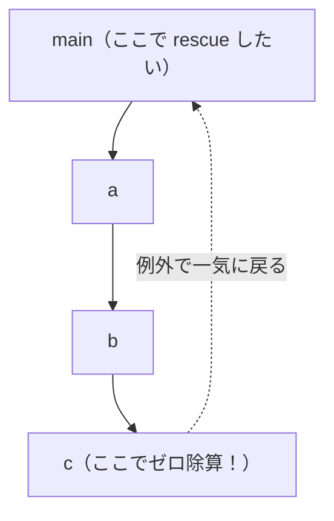

# 例外処理

プログラムは、いつも順調に進むとは限りません。ゼロで割ろうとした、配列の範囲外を読んだ、ファイルが見つからなかった ── こうした**異常**が起きたとき、処理系はどう振る舞うべきでしょうか。多くの言語は **例外処理（exception handling）** という仕組みを備えています。`raise`（または `throw`）で異常を投げ、`rescue`（または `catch`/`try`）で受け止める、あの仕組みです。この章では、例外を処理系の側からどう実現するか、代表的な 2 つの方法とその損得を見ていきます。

## 例外処理が解く問題

例外の本質は、「**今いる場所から、ずっと手前の呼び出し元まで、一気に処理を飛ばす**」ことです。深い関数呼び出しの奥でエラーが起きたとき、その場で処理を中断し、途中の関数をすべて飛び越えて、エラーを処理できる場所まで戻りたい ── これが例外の役割です。

具体例で考えましょう。`main` が `a` を呼び、`a` が `b` を呼び、`b` が `c` を呼んでいて、`c` の中でゼロ除算が起きたとします。



ふつうの戻り値（`return`）だと、`c` → `b` → `a` → `main` と**一段ずつ**戻り、各段で「エラーだったら自分も中断して戻る」と書かなければなりません。途中の `b` や `a` はエラーに関心がなくても、エラーを素通しさせるコードを書く羽目になります。例外は、この中間段を**すべて飛ばして**、一気に `main` まで戻してくれます。これを **大域脱出（non-local exit, 非局所脱出）** と呼びます。

処理系の課題は、この「一気に飛ぶ」をどう実装するかです。基礎編の VM を思い出すと、関数呼び出しごとにフレームが積まれていました。例外は、この**積まれたフレームを一気に何段も巻き戻す**操作にあたります。これを **スタック巻き戻し（stack unwinding）** と呼びます。実現方法は大きく 2 通りあります。

## 方法1 ── ホスト言語の大域脱出を借りる

最も手軽なのは、**ホスト言語が持つ例外機構をそのまま使う**ことです。本書のように Ruby をホスト言語にしているなら、MiniRuby の例外を、Ruby の例外（`raise`/`rescue`）に「載せて」しまえます。

考え方はこうです。MiniRuby の `raise` を実行したら、VM のループの中で**ホスト言語 Ruby の例外を投げる**。すると Ruby のランタイムが、VM のディスパッチループを呼んでいる Ruby のメソッド群を、勝手に巻き戻してくれます。MiniRuby の `rescue` のところには、Ruby の `begin`/`rescue` を仕込んでおき、そこで受け止めます。

```ruby
# MiniRuby の例外を表すホスト言語の例外クラス
class MiniRubyError < StandardError
  attr_reader :value
  def initialize(value) = (@value = value)   # 投げられた MiniRuby の値
end

class VM
  def execute(instr, frame)
    case instr[0]
    when :raise
      raise MiniRubyError.new(@stack.pop)     # ホスト言語の例外を投げる
    when :div
      b, a = @stack.pop, @stack.pop
      raise MiniRubyError.new("divided by 0") if b == 0
      @stack.push(a / b)
    # ...
    end
  end
end
```

そして、MiniRuby の `begin ... rescue ... end` をコンパイルするときは、保護したい範囲を Ruby の `begin`/`rescue` で囲んで実行する、という形にします。ホスト言語が巻き戻しの面倒をすべて見てくれるので、**実装が圧倒的に簡単**です。本書のようにホスト言語が高機能なら、まずこの方法を選ぶのが現実的です。

ちなみに、C 言語をホストにする処理系では、Ruby の例外に相当するものとして `setjmp`/`longjmp` という標準ライブラリ関数を使い、同じく「一気に飛ぶ」を実現します。古典的な CRuby の例外実装はこの方式でした。

> [!NOTE]
> 「ホスト言語の例外に載せる」方法の限界は、**ホスト言語のスタックに依存する**ことです。基礎編のコラムで触れたとおり、関数呼び出しをホスト言語のスタックに相乗りさせていると、この方法が自然に効きます。逆に、後述するように VM が完全に自前でスタックを管理し、ホスト言語のスタックを使わない設計だと、ホスト言語の例外では巻き戻せず、次の方法が必要になります。

## 方法2 ── 二返戻値法（戻り値でエラーを返す）

もうひとつは、例外という特別な仕組みを使わず、**ふつうの戻り値でエラーを伝える**方法です。各処理が「正常な値」と「エラーかどうか」の**2 つの値**を返すようにするので、**二返戻値法（two-return-value method）** と呼びます。Go 言語の `value, err := f()` という書き方が、この方式の代表です。

VM の内部で考えると、各命令や各関数呼び出しが「結果」とともに「エラー標識」を返すようにします。呼び出した側は毎回エラー標識を確かめ、エラーなら自分も同じエラーを返して、一段ずつ巻き戻していきます。

```ruby
# 戻り値を [状態, 値] の組で表す
OK = :ok

class VM
  def call_function(name, args)
    # ... 本体を実行 ...
    status, value = execute_body(...)
    return [status, value] unless status == OK  # エラーなら即座に返す
    [OK, value]
  end

  def execute_div(a, b)
    return [:error, "divided by 0"] if b == 0   # エラーを値として返す
    [OK, a / b]
  end
end
```

ポイントは、**呼び出した側が毎段でエラーを確認し、エラーなら自分も返す**ことです。`unless status == OK` の一行が、各段に必要になります。これは方法1の「一気に飛ぶ」とは対照的に、「**一段ずつ、明示的に**」巻き戻していく方式です。

## 二つの方法の損得

どちらを選ぶべきか。それぞれに、はっきりした長所と短所があります。

**ホスト言語の大域脱出（方法1）** は、なんといっても**書くのが楽**で、巻き戻しが**速い**(エラーが起きたときだけスタックを巻き戻し、正常時はコストがほぼゼロ)のが魅力です。一方、ホスト言語の機構に縛られ、VM の設計の自由度が下がります。また「どこから例外が飛んでくるか分かりにくい」という、例外機構につきものの読みにくさも抱えます。

**二返戻値法（方法2）** は、**処理系の設計が単純**で、ホスト言語に依存しません。エラーの流れがコード上に明示されるので追いやすいのも利点です。短所は、**正常時にも毎回エラー確認のコストがかかる**こと、そして「エラーを返す → 確認する」コードがあらゆる場所に散らばり、本筋の処理が埋もれがちなことです（Go の `if err != nil` が至る所に出てくる、あの問題です）。

両者を表にまとめます。

| 観点 | 大域脱出（方法1） | 二返戻値法（方法2） |
|------|------------------|---------------------|
| 実装の手間 | 小さい（ホスト任せ） | 中くらい（各段で確認） |
| 正常時の速度 | 速い（コストほぼゼロ） | やや遅い（毎回確認） |
| 異常時の速度 | 巻き戻しにコスト | 一段ずつなので素直 |
| ホスト依存 | 強い | 弱い |
| コードの見通し | 飛び先が見えにくい | エラーの流れが明示的 |

> [!IMPORTANT]
> 「例外が速いか遅いか」は、**正常時か異常時か**で評価が逆転します。大域脱出は「異常はめったに起きない」という前提で、正常時を速くする設計です。だから例外を「ふつうの制御フロー」に使う（ループの脱出に例外を投げるなど）と、異常時のコストが頻発して遅くなります。例外は文字どおり「例外的な事態」のためのもの、という設計思想を理解しておくことが大切です。

実際の言語は、両方を提供することもあります。Go は二返戻値法を基本としつつ `panic`/`recover` という大域脱出も持ち、Rust は `Result` 型（二返戻値法に近い）と `panic!` を使い分けます。「回復可能なエラーは戻り値で、回復不能な異常は大域脱出で」という棲み分けが、ひとつの定石です。

---

例外は「制御を遠くへ飛ばす」仕組みでした。次章では、もうひとつの強力な制御の道具 ── 関数が自分の生まれた環境を「覚えている」**クロージャ** を扱います。基礎編で作った環境の話が、ここで再び主役になります。
