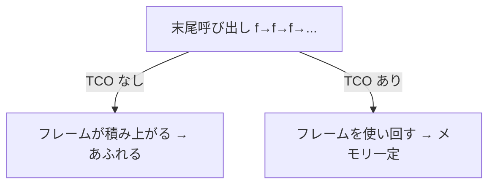

# 一般的な最適化

前章は VM の構造を磨く話でした。この章では、もっと普遍的な ── スタックマシンでもレジスタマシンでも、インタプリタでもコンパイラでも通用する ── **コードそのものをよりよく書き換える**最適化を見ていきます。これらはコンパイラ理論の中核として、長年にわたって体系化されてきました[Muchnick, 1997](#cite:muchnick1997)[Aho et al., 2006](#cite:aho2006)。ひとつひとつは素朴なアイデアですが、組み合わさると大きな効果を生みます。

## 最適化とは「意味を変えずに速くする」

最初に、最適化の鉄則を確認します。最適化とは「**プログラムの意味（結果）を一切変えずに、実行を速くしたりメモリを節約したりする**」変換です。結果が変わってしまっては、どんなに速くても意味がありません。「意味を保ったまま」という縛りが、最適化を慎重で論理的な作業にしています。

最適化の多くは、**中間表現（IR）** に対して行われます。基礎編で作ったバイトコードもその一種です。AST や IR を「読んで、安全だと確かめて、書き換える」── これが最適化器（オプティマイザ）の仕事です。

> [!IMPORTANT]
> 最適化に取りかかる前に肝に銘じるべき格言があります ── 「**早すぎる最適化は諸悪の根源**」。まず正しく動くものを作り、どこが本当に遅いのか測ってから、効く場所だけを最適化する。これは Knuth の有名な言葉ですが、彼自身、実際のプログラムを統計的に調べて「時間の大半はごく一部のコードに費やされる」ことを実証しました[Knuth, 1971](#cite:knuth1971)。やみくもな最適化は、コードを複雑にするばかりで報われないことが多いのです。

## のぞき穴最適化（ピープホール最適化）

最も素朴な最適化が **ピープホール最適化（peephole optimization, のぞき穴最適化）** です。生成されたコードを「のぞき穴（peephole）」── 数命令ぶんの小さな窓 ── でずらしながら見ていき、明らかに無駄な並びを、より短い並びに置き換えます。

たとえば、ある値をスタックに積んで、すぐに捨てる並び。

```
push 5
pop        ← 積んですぐ捨てる。両方まるごと不要
```

あるいは、同じ場所への連続したジャンプ、`x = x + 0` のような無意味な演算など。こうした「局所的に見れば明らかに無駄」なパターンを、表に登録しておいて機械的に潰します。視野が狭いぶん見つけられるものは限られますが、実装が簡単で、他の最適化が生み出した無駄の後始末としても役立ちます。

## 定数畳み込みと定数伝播

**定数畳み込み（constant folding）** は、「**コンパイル時に答えが分かる計算は、その場で計算してしまう**」最適化です。`3 * 4` という式は、実行するまでもなく `12` です。ならばコンパイル時に `12` に置き換えてしまえば、実行時の掛け算が消えます。

```
（畳み込み前）push 3 ; push 4 ; mul
（畳み込み後）push 12
```

これと相性がいいのが **定数伝播（constant propagation）** です。「ある変数が定数だと分かったら、その変数の使用箇所を定数で置き換える」最適化です。

```ruby
x = 10        # x は定数 10 だと分かる
y = x + 5     # → y = 10 + 5  （定数伝播）
              # → y = 15      （定数畳み込み）
```

定数伝播で `x` を `10` に置き換えると、`x + 5` が `10 + 5` になり、今度は定数畳み込みが効いて `15` になります。このように、**ひとつの最適化が次の最適化の機会を生む**のが、最適化の面白いところです。だから最適化器は、変化がなくなるまで何度も繰り返し適用することがあります。

## デッドコード除去

**デッドコード除去（dead code elimination, DCE）** は、「**実行結果に影響しないコードを消す**」最適化です。「デッド（dead, 死んだ）コード」とは、計算しても誰も使わない、あるいは決して実行されないコードのことです。

```ruby
x = 10
y = 20        # y はこの後どこでも使われない → 消せる
puts x
```

`y` への代入は、その後 `y` が一度も使われないなら、計算する意味がありません。安全に消せます。先ほどの定数伝播の例で `x` がすべて `10` に置き換わったら、元の `x = 10` という代入も使われなくなり、DCE で消せます。これも「最適化が次の最適化を呼ぶ」一例です。「どの変数がこの先使われるか」を調べるには、データフロー解析という意味解析の技術を使います（『意味解析入門』参照）。

## 共通部分式除去

**共通部分式除去（common subexpression elimination, CSE）** は、「**同じ計算を二度しない**」最適化です。

```ruby
a = (x + y) * 2
b = (x + y) * 3
```

`x + y` が 2 回現れています。`x` も `y` も間で変わらないなら、`x + y` の計算は 1 回で十分です。一度計算して一時変数に取っておき、両方で使い回します。

```ruby
t = x + y       # 1回だけ計算
a = t * 2
b = t * 3
```

「同じ式」かどうかを判定するには、間でオペランドが書き換えられていないことを確かめる必要があり、ここでもデータフローの情報が使われます。

## インライン展開

**インライン展開（inlining）** は、「**関数呼び出しを、その関数の中身で置き換える**」最適化です。小さな関数を呼ぶと、呼び出しの手間（フレームを積む、引数を渡す、戻る）がかかります。関数の中身が単純なら、呼び出しの代わりに中身を直接埋め込んだほうが速くなります。

```ruby
def square(x) = x * x
y = square(a) + square(b)

# インライン展開後
y = (a * a) + (b * b)   # 呼び出しの手間が消える
```

インライン展開の真価は、**展開した先で他の最適化が効くようになる**ことです。`square(3)` を展開すれば `3 * 3` になり、定数畳み込みで `9` になります。呼び出しの壁がなくなることで、定数伝播や CSE が関数の境界を越えて働けるのです。ただし、何でも展開するとコードが膨れあがる（コードサイズの増大）ので、「小さくてよく呼ばれる関数」を選んで展開するのが定石です。

## ループ最適化

プログラムの実行時間は、たいていループに集中します（Knuth の調査もそれを裏づけました[Knuth, 1971](#cite:knuth1971)）。だからループの最適化は、費用対効果が高い分野です。

**ループ不変式の巻き上げ（loop-invariant code motion, LICM）** は、「**ループの中で毎回同じ結果になる計算を、ループの外に追い出す**」最適化です。

```ruby
i = 0
while i < n
  x = a * b      # a も b もループ中変わらない → 毎回同じ
  sum = sum + x * i
  i = i + 1
end

# 巻き上げ後
x = a * b        # ループの外で1回だけ
i = 0
while i < n
  sum = sum + x * i
  i = i + 1
end
```

`a * b` がループの中で `n` 回計算されていたのを、外に出して 1 回にします。ループが何百万回回るなら、効果は絶大です。

**ループアンローリング（loop unrolling, ループ展開）** は、「**ループの本体を何回分かまとめて並べ、繰り返し回数を減らす**」最適化です。ループ 1 周ごとにかかる「条件判定とジャンプ」の手間を減らせます。

```ruby
# 元のループ（4回判定）
i = 0
while i < 4
  total = total + data[i]
  i = i + 1
end

# 4回分を展開（判定なし）
total = total + data[0]
total = total + data[1]
total = total + data[2]
total = total + data[3]
```

判定とジャンプが消えるぶん速くなりますが、コードは長くなります。これも速度とコードサイズのトレードオフです。

## 末尾呼び出し最適化

**末尾呼び出し最適化（tail call optimization, TCO）** は、再帰やループに関わる重要な最適化です。「末尾呼び出し」とは、関数の**いちばん最後**で別の関数（または自分自身）を呼び、その結果をそのまま返すような呼び出しのことです。

```ruby
def loop_sum(i, n, acc)
  if i > n
    acc
  else
    loop_sum(i + 1, n, acc + i)   # ← 末尾呼び出し（結果をそのまま返す）
  end
end
```

ふつうの呼び出しなら、呼ぶたびにフレームが積まれます。深い再帰でスタックがあふれるのは、このためでした（基礎編のコラムを参照）。しかし末尾呼び出しでは、呼び出し**後にすることが何もない**── 結果を返すだけ ── なので、**今のフレームを捨てて、新しい呼び出しに置き換えてしまってよい**のです。フレームが積み上がらず、メモリ一定で再帰が回せます。実質的にループと同じになるわけです。

この洞察は、関数呼び出しは本来 `goto` と同じくらい軽くできる、という Steele の古典的な議論にさかのぼります[Steele, 1977](#cite:steele1977)。Scheme などの言語は TCO を仕様で保証しており、ループ構文の代わりに末尾再帰を安心して使えます。



## まだまだある最適化

ここまでが代表的な最適化ですが、ほかにも多くの技法があります。いくつか名前だけ紹介します。

- **強度低減（strength reduction）**：重い演算を軽い演算に置き換える。`x * 2` をビットシフトに、ループ内の `i * 4` を「毎回 4 ずつ足す」に変えるなど。
- **末尾の共通化／コードホイスティング**：分岐の各枝に共通する処理を、分岐の前後にくくり出す。
- **レジスタ割り当て（register allocation）**：よく使う変数を、メモリではなく CPU のレジスタに置く。グラフ彩色などの理論が使われます。
- **命令スケジューリング（instruction scheduling）**：CPU のパイプラインが詰まらないよう、命令の順序を入れ替える。
- **自動ベクトル化（vectorization）**：ループを CPU の SIMD 命令（一度に複数データを処理）に変換する。

これらの多くは、AST や IR に対する解析と書き換えの組み合わせで、データフロー解析や制御フロー解析といった意味解析の技術を土台にしています。最適化の世界は広大で、機械語生成と密接に関わります。コード生成そのものに踏み込みたい読者は、姉妹編『[コード生成入門](https://kolanglab.github.io/book_code_gen/#cover)』を参照してください。

> [!NOTE]
> 多くの最適化は「**情報があるほど大胆にできる**」という性質を持ちます。「この変数は定数」「この計算結果は使われない」「この型はいつも `Point`」── こうした事実を多く知るほど、安全に削れるものが増えます。だから最適化の質は、その前段にある**解析（意味解析・データフロー解析）の精度**に大きく左右されます。「解析して、その情報を使って変換する」── これが最適化の基本構造です。

---

ここまでの最適化は、主にコンパイル時（実行前）に行うものでした。次章では、**実行時**に踏み込んだ高速化 ── プログラムの動きを観測しながらネイティブコードを生成する JIT コンパイラや、部分評価による高速化を見ていきます。
