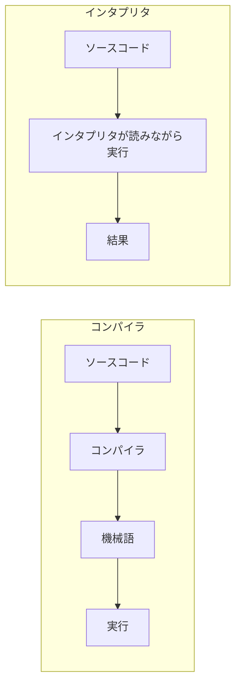
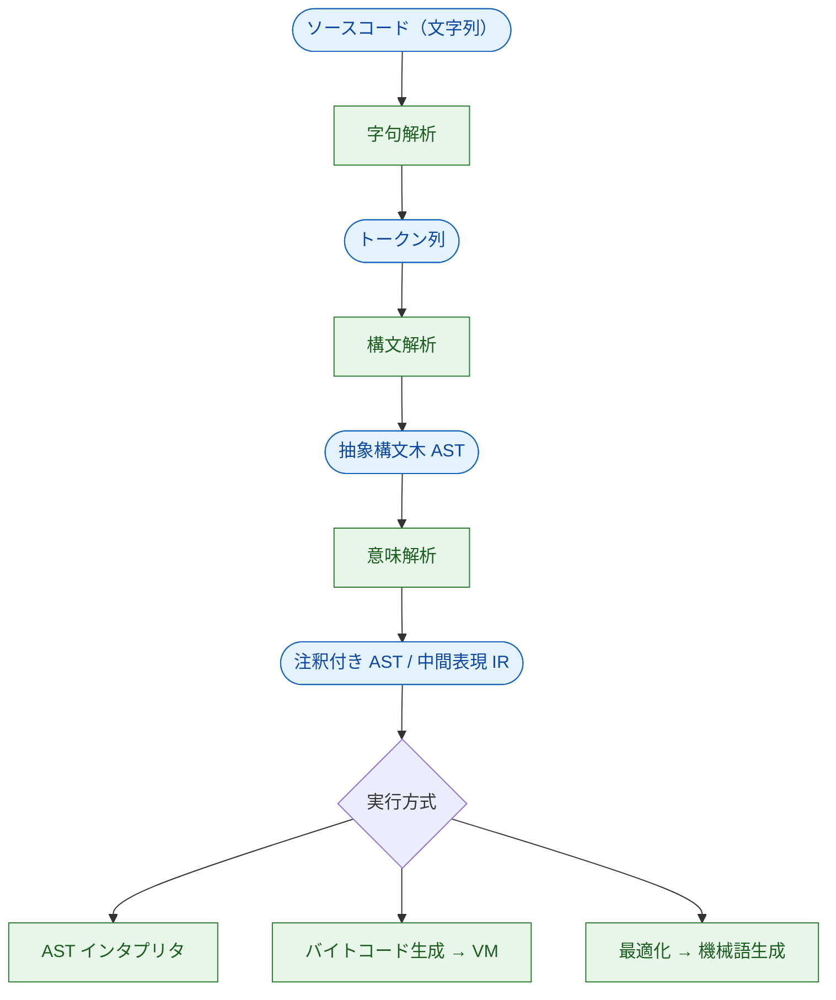

# 言語処理系とは何か

私たちは普段、Ruby や Python でプログラムを書き、「実行」ボタンを押すと結果が返ってくるのを当たり前のことだと思っています。しかし、コンピュータの CPU が直接理解できるのは、`add`・`load`・`jump` といった**機械語（machine code）** ── 0 と 1 の並び ── だけです。人間が書いた `puts 1 + 2` という文字列と、CPU が動かす機械語の間には、大きな隔たりがあります。この隔たりを埋めるソフトウェアが **言語処理系（language processor）** です。

この章では、言語処理系とは何をするものか、なぜそれを自分で作る価値があるのか、現実の言語はどんな処理系で動いているのか、そして処理系の内部はどんな流れになっているのかを、まず大づかみに見ていきます。

## 処理系がやっていること

言語処理系の仕事は、ひとことで言えば「**人間が書いたプログラムを、計算機が実行できる形にして、実際に計算させること**」です。実現方法は大きく 2 つに分かれます。

- **コンパイラ（compiler）**：あるプログラムを、別の言語のプログラムに**翻訳**するもの。たとえば C コンパイラは C のソースコードを機械語に翻訳します。翻訳した結果（実行ファイル）は、あとから何度でも実行できます。
- **インタプリタ（interpreter）**：プログラムを翻訳せず、**その場で読みながら実行**していくもの。Ruby や Python の標準的な処理系はこちらに近い動きをします。

> [!NOTE]
> 「コンパイラ言語」「インタプリタ言語」という分け方をよく聞きますが、これは正確ではありません。コンパイル／インタプリトは**言語そのものの性質ではなく、処理系の実装方法**です。同じ言語に複数の処理系があり、片方はコンパイル、片方はインタプリトということも珍しくありません。実際、現代の主要な処理系の多くは両者を組み合わせています（後述）。

コンパイラとインタプリタは対立する概念ではなく、地続きです。本書の基礎編では、まず木をたどって直接実行する**インタプリタ**を作り、次にそれを**バイトコードへコンパイルしてから仮想マシンで実行**する方式へ発展させます。この 2 つを自分の手で実装すれば、「翻訳」と「実行」の関係が体で分かるはずです。

## なぜ言語処理系を作るのか

「言語処理系なんて、ごく一部の専門家が作るものでは？」と思うかもしれません。確かに新しい汎用言語を一から設計する機会は多くありません。しかし、言語処理系の技術を学ぶ動機は、それだけではありません。

**第一に、ソフトウェアの「下の層」が見えるようになります。** あなたの書いたコードがなぜその速度で動くのか、なぜそのエラーが出るのか、メモリがどう使われているのか ── こうした問いに答えるには、処理系が内部で何をしているかを知るのが近道です。処理系を理解したプログラマは、性能の勘所やバグの原因を、より深いレベルで読み解けるようになります。

**第二に、「小さな言語」を作る場面は実は身近です。** 設定ファイルの記法、テンプレートエンジン、SQL のようなクエリ言語、ゲームのスクリプト、正規表現、電卓アプリの数式入力 ── これらはすべて「独自の小さな言語」を解釈する処理系です。こうした **ドメイン固有言語（Domain-Specific Language, DSL）** を作る技術は、現場のソフトウェア開発でしばしば役立ちます。

**第三に、計算機科学の核心的なアイデアが詰まっています。** 木構造の再帰的な処理、状態機械、スタックの使い方、メモリ管理、最適化 ── 処理系作りは、こうした基礎概念を一度に体験できる格好の題材です。だからこそ多くの大学で、コンパイラはコンピュータサイエンスの花形科目とされてきました[Aho et al., 2006](#cite:aho2006)。

> [!TIP]
> 「自分で作ってみる」のが理解の最短ルートです。本書はその方針で書かれています。読むだけでなく、ぜひ実際に Ruby を開いてコードを動かしてみてください。

## 現実世界の言語処理系

ここで、実際に使われている言語の処理系をいくつか紹介します。それぞれに設計の個性があり、後の章で学ぶ技術がどこで使われているかの見取り図になります。

### C ── 機械語へコンパイルする古典

C 言語の処理系（GCC や Clang など）は、典型的な **AOT コンパイラ（Ahead-Of-Time compiler）** です。AOT とは「実行に**先立って**（ahead of time）コンパイルしておく」という意味で、ソースコードをあらかじめ機械語の実行ファイルに変換します。実行時には翻訳の手間がかからないため非常に高速ですが、コンパイルという別の工程が必要で、ビルドした実行ファイルは特定の CPU・OS に固有のものになります。Clang の背後にある **LLVM** は、最適化とコード生成を担う再利用可能な基盤として広く使われています[Lattner and Adve, 2004](#cite:lattner2004)。

### Java ── バイトコードと仮想マシン

Java は、ソースコードを **バイトコード（bytecode）** という中間的な命令列にコンパイルし、それを **Java 仮想マシン（Java Virtual Machine, JVM）** が実行します[Lindholm et al., 2014](#cite:lindholm2014)。バイトコードは特定の CPU に依存しないので、「一度書けばどこでも動く（write once, run anywhere）」を実現できます。さらに JVM は、よく実行される部分を実行時に機械語へ変換する **JIT コンパイラ（Just-In-Time compiler）** を備えており、インタプリタの移植性とコンパイラの速度を両立しています。本書の基礎編で作る仮想マシンは、この JVM の発想をうんと小さくしたものです。

### Ruby ── AST インタプリタからバイトコード VM へ

Ruby の標準処理系（CRuby／MRI）は、もともとソースコードを構文木にして、その木を直接たどる **AST インタプリタ** でした。バージョン 1.9 で **YARV** というスタック型のバイトコード仮想マシンが導入され、さらに近年は **YJIT** などの JIT コンパイラも加わりました[Flanagan and Matsumoto, 2008](#cite:flanagan2008)。本書がたどる「AST インタプリタ → バイトコード VM → JIT」という道のりは、奇しくも Ruby 処理系自身が歩んできた歴史でもあります。

### LISP ── 「プログラム＝データ」と GC の源流

LISP は 1960 年に登場した古い言語ですが、言語処理系の歴史において極めて重要です[McCarthy, 1960](#cite:mccarthy1960)。プログラムをそれ自身のデータ構造（リスト）として表現する設計や、**ガベージコレクション（garbage collection, GC）** ── 使われなくなったメモリを自動で回収する仕組み ── を初めて備えた言語として知られます。今日の多くの言語が当たり前に持つ GC は、ここから始まりました。

### JavaScript ── ブラウザの中の高度な処理系

JavaScript は当初、Web ページを少し動かすための簡単なスクリプト言語でした。しかし今では、V8（Chrome）や SpiderMonkey（Firefox）といった処理系が、インタプリタと多段の JIT コンパイラを組み合わせた、世界でも最先端の高速化技術の結晶になっています。後の章で学ぶ **インラインキャッシュ**[Deutsch and Schiffman, 1984](#cite:deutsch1984) のような技術は、こうした動的言語の高速化で主役を演じています。

これらを並べると、「機械語へ直接コンパイル」「バイトコード＋VM」「木を直接たどる」「実行時 JIT」といった方式が、目的に応じて使い分けられている様子が見えてきます。

## 言語処理系の一般的な作り方

方式はさまざまでも、言語処理系の内部はおおむね共通の流れを持っています。ソースコードという文字列から出発し、段階的に「分かりやすい中間表現」へと変換しながら、最後に実行や機械語生成にたどり着きます。典型的な流れは次の通りです。

各工程の役割を、用語とともに押さえておきましょう。

- **字句解析（lexical analysis, lexing）**：文字の並びを、意味のある最小単位 **トークン（token）** に区切る工程。`x = 1 + 2` を `x` `=` `1` `+` `2` のような単語の列にします。
- **構文解析（parsing）**：トークン列が文法に合っているかを確かめ、プログラムの構造を表す木 ── **抽象構文木（Abstract Syntax Tree, AST）** ── に組み上げる工程。「`+` の左は `1`、右は `2`」といった入れ子関係を木で表します。
- **意味解析（semantic analysis）**：木を調べて、「この変数は定義されているか」「型は合っているか」など、**形（構文）だけでは分からない意味の整合性**を確かめ、実行に必要な情報を木に書き加える工程。
- **中間表現（Intermediate Representation, IR）**：最適化やコード生成をしやすくするための、AST よりも機械寄りの内部表現。バイトコードもその一種です。
- **実行／コード生成**：注釈付きの木や IR をもとに、その場で実行する（インタプリタ）か、機械語などへ翻訳する（コンパイラ）。

教科書的には字句解析・構文解析を **フロントエンド**、最適化・コード生成を **バックエンド** と呼びます[Cooper and Torczon, 2011](#cite:cooper2011)。フロントエンドは「言語を理解する側」、バックエンドは「ターゲット（CPU や VM）に合わせて出力する側」で、この分離のおかげで、ひとつの言語を複数の CPU 向けに、あるいは複数の言語をひとつの基盤（LLVM など）向けにコンパイルする、といった再利用がしやすくなります。

> [!IMPORTANT]
> すべての処理系がこの全工程を律儀に踏むわけではありません。簡単なインタプリタは意味解析や IR を省くこともありますし、高度な処理系は IR を何段階も重ねます。大切なのは「**文字列 → トークン → 木 → 意味のある内部表現 → 実行**」という**段階的に抽象度を上げ下げしていく発想**です。本書もこの順に章を進めます。

## 本書で作る言語 ── MiniRuby

抽象的な説明だけでは身につきません。本書では **MiniRuby** という小さな架空の言語を題材に、上の流れを実際にたどります。MiniRuby は整数の計算、条件分岐、ローカル変数、関数定義と呼び出しができるだけの、ごく小さな言語です。次章でその仕様をきちんと決め、その後の章で構文解析器・インタプリタ・仮想マシンを順に作っていきます。

処理系の実装言語（**ホスト言語**と呼びます）には Ruby を使います。Ruby は読みやすく、木構造やスタックを素直に書けるので、処理系の骨格を見通しよく書くのに向いています。Ruby を母語にした処理系で、Ruby に似た小さな言語 MiniRuby を動かす ── そんな入れ子構造で、言語処理系の世界に分け入っていきましょう。
