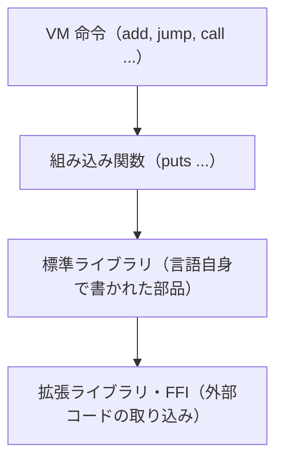

# 入出力と処理系の拡張

ここまでの MiniRuby は、`puts` で数を表示する以外、外の世界とほとんど関わりませんでした。しかし実用的な言語は、ファイルを読み書きし、ネットワークと通信し、キーボード入力を受け取ります。さらに、処理系本体だけではすべての機能をまかなえないので、後から機能を足すしくみも必要です。この章では、入出力（I/O）の位置づけと、処理系に機能を足すための代表的な層（命令、組み込み、標準ライブラリ、拡張ライブラリ、FFI）を整理します。

## 入出力をどう扱うか

**入出力（Input/Output, I/O）** とは、プログラムが外の世界（ファイル、画面、ネットワーク、キーボードなど）とデータをやりとりすることです。`puts` で画面に出すのも、ファイルを読むのも I/O です。

I/O が処理系にとって厄介なのは、遅くて、いつ終わるか分からない点です。メモリ上の足し算はナノ秒で終わりますが、ディスクの読み込みはその何百万倍も時間がかかり、ネットワークの応答はいつ返るか予測できません。この「待ち時間」をどう扱うかが、処理系設計の難所のひとつになります。素朴に「読み終わるまで待つ」方式（ブロッキング I/O）だと、待っている間プログラム全体が止まってしまいます。そこで「待っている間に別の仕事を進める」非同期 I/O やノンブロッキング I/O といった工夫が生まれます。これは次章以降の並行制御とも深く関わります。

I/O は、OS の機能（システムコール）を呼び出す部分でもあり、処理系の中でも OS に最も近い層です。その仕組みと実装は奥が深いので、本書では概観にとどめ、詳細は姉妹編『[言語処理系と I/O](https://kolanglab.github.io/book_lang_io/#cover)』に譲ります。ここで押さえてほしいのは、「**I/O は処理系が外界とつながる窓口であり、速度差と待ち時間という固有の難しさを持つ**」という位置づけです。

## どこまでが命令で、どこからが関数か

機能を足す話に入る前に、`puts` のような機能が処理系の中でどう実現されているかを整理しましょう。実は、言語の機能は層をなしています。MiniRuby を例に、内側から外側へ並べてみます。



- **VM 命令（instruction）**：基礎編で作った `add` や `jump` のような、VM が直接解釈する最も低レベルの機能。速いが、種類を増やすと VM 本体が複雑になります。
- **組み込み関数（built-in function）**：`puts` のように、処理系がホスト言語で書いて用意した関数。基礎編では `do_call` の中で `if name == "puts"` と特別扱いしました。VM 命令ほど低レベルではないが、処理系本体に組み込まれています。
- **標準ライブラリ**：その言語自身で書かれた部品。たとえば「配列を二分探索する関数」を MiniRuby 自身で書いて標準添付すれば、VM を一切変えずに機能が増えます。
- **拡張ライブラリ・FFI**：処理系の外にある、別の言語で書かれたコードを取り込むしくみ（後述）。

**どの機能をどの層に置くか**は、処理系設計の重要な判断です。原則として、「速度が要る・低レベルすぎて言語で書けない」ものほど内側（命令や組み込み）に、「言語で自然に書ける」ものは外側（ライブラリ）に置きます。`+` を VM 命令にするのは速度のため、複雑な文字列処理をライブラリにするのは保守性のため、といった具合です。内側に置くほど速いが処理系本体が太り、外側に置くほど柔軟だが遅くなる。このトレードオフを意識しましょう。

> [!TIP]
> 新しい言語を作るとき、よくある失敗は「便利だから」と何でも組み込み関数や命令にしてしまうことです。処理系本体が肥大化し、保守が苦しくなります。「**まず言語自身で書けないか**」を考え、書けないものだけを内側に下ろす、という順序がおすすめです。

## ホスト言語で機能を足す拡張ライブラリ

言語自身で書けない機能（たとえば画像処理や暗号計算のように、速度が要るか、OS の特殊な機能を使うもの）は、**拡張ライブラリ（extension library）** として足します。これは「処理系のホスト言語（C や Ruby など）で関数を書き、それを新しい言語から呼べるように登録する」しくみです。

基礎編の MiniRuby で考えてみましょう。`puts` は `do_call` に直接埋め込みましたが、これでは組み込み関数を足すたびに VM 本体を書き換えることになります。そこで、**組み込み関数を表（ハッシュ）で管理**するように変えます。

```ruby
class VM
  def register_builtins
    @builtins = {}
    # 名前 => [引数の個数, 実際の処理（Ruby の手続き）]
    define("puts", 1) { |x| puts x; x }
    define("abs",  1) { |x| x.abs }
    define("max",  2) { |a, b| a > b ? a : b }
  end

  def define(name, argc, &body)
    @builtins[name] = [argc, body]
  end

  def do_call(name, argc)
    if (entry = @builtins[name])
      expected, body = entry
      raise "引数の個数が違います: #{name}" if argc != expected
      args = @stack.pop(argc)
      return body.call(*args)        # ホスト言語の手続きを呼ぶ
    end
    # ... ユーザー定義関数の処理（前章と同じ）...
  end
end
```

こうしておけば、`define("sqrt", 1) { |x| Math.sqrt(x) }` のように一行足すだけで新しい組み込み関数が増え、VM のループには一切手を入れずに済みます。`@builtins` という表が、処理系本体と拡張の間の**境界（インタフェース）** になっているわけです。本物の処理系の拡張 API（Ruby の C 拡張 API など）も、本質的にはこの「関数を名前で登録する表」を、もっと本格的にしたものです。

> [!NOTE]
> 拡張ライブラリの関数は「処理系の内部に手を突っ込む」ことになるため、値の表現（前章のタグや即値）や GC の作法を正しく守らないと、処理系全体を壊してしまいます。たとえば GC に「この拡張が今この値を使っている」と伝え忘れると、使用中のオブジェクトが回収されてしまいます。拡張 API の設計は、その「お作法」をいかに安全かつ簡単にするかの勝負でもあります。

## 既存の外部ライブラリを呼ぶ FFI

拡張ライブラリは「処理系のために専用のつなぎコードを書く」方式でした。一方、世の中には C で書かれた膨大な既存ライブラリ（数値計算、画像、データベースなど）があります。これらを、つなぎコードをほとんど書かずに直接呼びたい。そのための仕組みが **FFI（Foreign Function Interface, 外部関数インタフェース）** です。

FFI は、「この C 関数は、引数を 2 つ（整数と文字列）取り、整数を返す」といった**関数の型情報**を言語側で宣言し、処理系がその情報をもとに、実行時に C 関数を呼び出せるようにします。イメージとしては、次のような宣言を言語の中に書く形になります（概念を示す擬似コードです）。

```ruby
# 「libm の sqrt は double を 1 つ取り double を返す」と宣言する
attach_function "sqrt", from: "libm", args: [:double], returns: :double

puts sqrt(2.0)   # C のライブラリ関数をそのまま呼べる
```

FFI の利点は、C 側に専用コードを書かなくても既存ライブラリを使えることです。多くの言語（Ruby、Python、LuaJIT など）が FFI を備えています。欠点は、型の宣言を間違えるとプログラムが簡単にクラッシュすること、そして言語をまたぐぶん、データの受け渡し（文字列の文字コード変換、構造体の配置合わせなど）に細かな注意が要ることです。

拡張ライブラリと FFI の使い分けは、おおむね次のようになります。

| 方式 | つなぎコード | 主な用途 |
|------|------------|---------|
| 拡張ライブラリ | 処理系の API に沿って書く | 処理系と密に連携する機能、高速化 |
| FFI | ほぼ不要（型宣言のみ） | 既存の C ライブラリを手軽に利用 |

---

これで、処理系が外界とつながり、機能を増やしていく道筋が見えました。冒頭で触れた「I/O は遅く、いつ終わるか分からない」という問題そのものは、後の[並行制御の章](concurrency.md)で扱います。次章からは、より「言語らしい」制御の仕組みに踏み込みます。まずは、処理の途中で異常を伝える **例外処理** を、処理系がどう実現するかを見ていきましょう。
