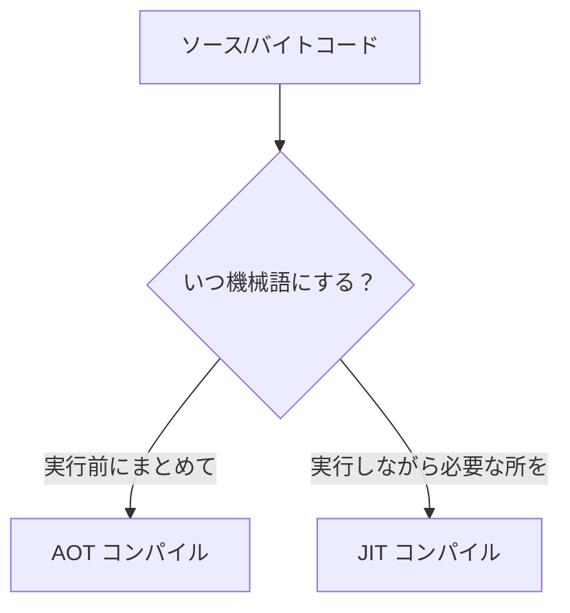
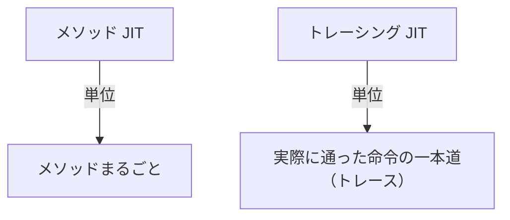
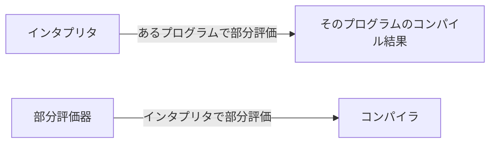

# JIT・AOT コンパイルと部分評価

ここまでの高速化は、VM の構造を磨いたり、コードを書き換えたりするものでした。本書の最後に、最も野心的な高速化 ── **機械語を生成して CPU に直接実行させる**── に踏み込みます。AOT と JIT という 2 つのコンパイル戦略、プロファイリングによる賢い JIT、そして「部分評価」という美しい理論を見ていきましょう。これらは現代の高性能処理系（JavaScript エンジン、JVM、近年の Ruby など）の心臓部です[Aycock, 2003](#cite:aycock2003)。

## なぜ機械語を生成するのか

基礎編の VM がどれだけ速くなっても、原理的な限界があります。VM はバイトコードを「ソフトウェアで解釈」しているので、命令 1 つごとにディスパッチのコストがかかります（前々章）。一方、CPU が直接実行できる **機械語（ネイティブコード）** には、その解釈の層がありません。`a + b` が本当に CPU の足し算命令 1 つになります。

そこで、バイトコードを解釈する代わりに、**機械語に翻訳してから CPU に直接実行させる**ことを考えます。これがコンパイルによる高速化です。いつ翻訳するかで、大きく 2 つの戦略に分かれます。



## AOT コンパイル ── 先にまとめて翻訳

**AOT コンパイル（Ahead-Of-Time compilation, 事前コンパイル）** は、プログラムを**実行する前に**、まとめて機械語へ翻訳しておく戦略です。[導入の章](introduction.md)で見た C コンパイラがその典型です。Go や Rust もこの方式です。なお AOT には、C・Go・Rust のようにソースコードから直接ネイティブコードを生成するものだけでなく、いったん作ったバイトコードや中間表現を実行前にまとめてネイティブコード化するもの（Android の ART など）もあります。

利点は明快です。**実行時に翻訳の手間がかからない**ので起動が速く、翻訳に十分な時間をかけて**じっくり最適化**できます。前章の最適化をすべて、コンパイル時に心ゆくまで適用できます。

欠点もあります。翻訳した機械語は**特定の CPU・OS に固有**になるので、移植性が下がります。また、JIT のように「**まさに今走っている実行**」から得た情報をその場で使うことはできません。「この変数は実際にはいつも整数だった」「この分岐はほぼ常に真だった」といった、動かしてみないと分からない事実を、AOT はそのままは前提にできないのです。ただし、事前の訓練実行で集めたプロファイルをコンパイルに反映する **PGO（profile-guided optimization）** のように、実行時に近い情報を AOT に取り込む技術はあります。

AOT で機械語を生成する具体的な技術 ── レジスタ割り当て、命令選択、コード生成 ── は、それ自体が大きなテーマです。再利用可能なコード生成基盤として **LLVM** が広く使われており[Lattner and Adve, 2004](#cite:lattner2004)、多くの言語が「自分はフロントエンドだけ作り、機械語生成は LLVM に任せる」という分担をしています。コード生成の詳細は、姉妹編『[コード生成入門](https://kolanglab.github.io/book_code_gen/#cover)』に譲ります。

## JIT コンパイル ── 走りながら翻訳

**JIT コンパイル（Just-In-Time compilation, 実行時コンパイル）** は、プログラムを**実行しながら**、必要な部分を機械語に翻訳する戦略です[Aycock, 2003](#cite:aycock2003)。Java（JVM）、JavaScript（V8 など）、近年の Ruby（YJIT）が採用しています。

発想はこうです ── プログラムを最初はインタプリタ（VM）で実行し始めます。起動が速いからです。実行しながら「**どこが何度も実行されているか**」を観測し、頻繁に実行される「**ホットスポット（hot spot, 熱い場所）**」を見つけたら、そこだけを機械語にコンパイルして、以後はその機械語を実行します。めったに通らない場所はインタプリタのまま放っておきます。


JIT の強みは、AOT が使えなかった**実行時の情報**を最適化に活かせることです。「この場所の変数は、これまで 100 万回ずっと整数だった」と観測できれば、「整数だと仮定した、極めて速い機械語」を生成できます。前々章のインラインキャッシュが集めた型の情報[Deutsch and Schiffman, 1984](#cite:deutsch1984)は、まさにこの JIT 最適化の燃料になります。

もちろん「仮定」が外れることもあります。整数だと仮定した場所に、突然文字列が来たら？ そのために JIT は、**仮定が崩れたらインタプリタに戻る**安全装置を持ちます。これを **脱最適化（deoptimization）** と呼びます。「ふだんは速い機械語で走り、想定外が来たら安全なインタプリタへ退避する」── この二段構えが、動的言語を高速かつ正しく実行する鍵です。

言うのは簡単ですが、この「戻る」は JIT 実装の最難所のひとつです。生成する機械語には、仮定を確かめる検査 ── **ガード（guard）** ── をあらかじめ埋め込んでおきます。ガードに失敗したら、機械語が CPU のレジスタなどに持っていた計算途中の値と「いまどこまで実行したか」を、インタプリタのフレーム（ローカル変数の配列と PC）の形に**移し替えて**から、インタプリタとして続きを実行します。速い世界の実行状態を、安全な世界の実行状態へ正確に翻訳して引き継ぐ ── この退路が用意できてはじめて、JIT は大胆な仮定を置けるのです。

> [!NOTE]
> 実際の JIT には、このほかにも多くの仕掛けが要ります。インタプリタからコンパイル済みコードへ入る**入口の切り替え**、長く回っているループの途中から機械語へ乗り換える **OSR（on-stack replacement）**、仮定が崩れたコードの**無効化（invalidation）**、生成した機械語を保持・破棄する**コードキャッシュ**の管理、最適化の度合いが違うコンパイラを段階的に使い分ける**多段コンパイル（tiered compilation）** などです。本書では「ホットな関数やループを見つけて機械語版を使う」という基本形に絞って眺めています。

> [!IMPORTANT]
> AOT と JIT は対立するものではなく、**得意分野が違う**だけです。起動の速さと最適化のじっくり具合なら AOT、実行時情報を活かした動的言語の高速化なら JIT。両者を組み合わせる処理系も増えています。「いつ翻訳するか」という時間軸の選択が、処理系の性格を大きく決めるのです。

## メソッド JIT とトレーシング JIT ── 何を翻訳の単位にするか

「ホットな部分を機械語にする」と言いましたが、その「部分」をどう切り取るかで、JIT は大きく 2 つの流派に分かれます。**翻訳の単位（コンパイルの粒度）**の違いです。

**メソッド JIT（method-based JIT）** は、**メソッド（関数）を主な境界**として翻訳の単位にします。「このメソッドは何度も呼ばれている＝ホットだ」と判断したら、メソッドを機械語にコンパイルします。境界が分かりやすく、既存のコンパイラ技術（前章の最適化やレジスタ割り当て）をそのまま適用できるのが強みです。メソッド単位の最適化を中心にする JVM の HotSpot が代表例です。現代の JavaScript エンジン（V8 など）や Ruby の YJIT も、トレーシング JIT ではなく、メソッドや**基本ブロック**といった静的なコード領域を単位にコンパイルする方式の仲間です ── ただし実際の粒度や戦略は処理系ごとに異なり、たとえば YJIT はメソッドをまるごと一気に訳すのではなく、基本ブロックを実行が到達した順に遅延コンパイルしていきますし、V8 は複数段のコンパイラを組み合わせています。

**トレーシング JIT（tracing JIT）** は、メソッドの区切りを無視して、**実際に通った命令の一本道（トレース, trace）**を単位にします。発想はこうです ── ホットなループを 1 周実行する間に「実際に通った命令の列」を記録し、その一本道だけを機械語にコンパイルするのです[Bala et al., 2000](#cite:bala2000)。



トレースはメソッドの壁を平気で越えます。ループの中で別のメソッドを呼んでいれば、その呼び先の中身までひとつながりの直線として取り込まれる ── つまり**インライン展開（前章）が自然に起こる**のです。分岐は「実際に通った側」だけを直線に含め、トレースの途中には別の側へ進んだ場合の出口 ── **side exit** ── を置いておきます。side exit に当たったときは、いったんインタプリタへ退避するか、その経路を新たなトレースとして記録・コンパイルします。だから生成されるのは、分岐のほとんどない、CPU にとって極めて素直で速い機械語です。動的言語向けにこの方式を洗練させた研究が知られており[Gal et al., 2009](#cite:gal2009)、LuaJIT や PyPy が代表例です。

> [!NOTE]
> どちらが優れているという話ではありません。メソッド JIT は単位が明快で実装が素直、トレーシング JIT は熱い一本道に特化して攻めた最適化ができる代わりに、トレースが増えすぎる・分岐の多いコードで崩れやすいといった難しさを抱えます。近年は実装の手間や安定性からメソッド（基本ブロック）単位を選ぶ処理系が増えています。

## プロファイリング ── 賢さの源

JIT が「どこがホットか」「どの型が来やすいか」を知るには、実行中のプログラムを**観測**する必要があります。この観測の仕組みを **プロファイリング（profiling）** と呼びます。

最も基本的なのは **カウンタ**です。各関数やループに「何回実行されたか」を数えるカウンタを仕込み、しきい値を超えたら「ホットだ」と判断します。この観測は、基礎編の VM になら数行で仕込めます ── `do_call` の先頭で、関数ごとの呼び出し回数を数えるだけです。

```ruby
def do_call(name, argc)
  @call_count[name] += 1          # 呼ばれるたびに数える（最小のプロファイラ）
  if @call_count[name] == 10_000  # しきい値を超えたら「ホット」と判断
    # ここで name の命令列を機械語へコンパイルする（JIT の出番）
  end
  # ... 以降は基礎編の VM のまま ...
end
```

さらに進んだプロファイリングでは、「この呼び出し地点に来た相手の型の割合」「この分岐が真になった割合」といった、より細かい統計を集めます。

プロファイリングは JIT のためだけのものではありません。プログラマがプログラムの遅い場所を突き止めるための**プロファイラ**（性能計測ツール）も、同じ技術です。「どこに時間がかかっているか測ってから最適化する」という前章の鉄則[Knuth, 1971](#cite:knuth1971)を、実際に支えるのがプロファイリングです。

> [!NOTE]
> プロファイリングには「観測のコスト」というジレンマがあります。詳しく観測すればよい最適化ができますが、観測そのものがプログラムを遅くします。だから JIT のプロファイリングは「軽く観測して、ホットだと分かったら詳しく観測する」といった段階を踏むのが普通です。「測ることで対象が変わってしまう」という、計測につきものの難しさがここにもあります。

## 部分評価 ── コンパイルの正体

最後に、少し理論的ですが美しい話題 ── **部分評価（partial evaluation）** を紹介します。これは「コンパイルとは何か」を深く照らし出す考え方です。

部分評価とは、「**プログラムの入力の一部だけが分かっているとき、その分かっている部分を先に計算してしまい、残りを待つ、特殊化されたプログラムを作る**」ことです。例で考えましょう。べき乗を計算する関数 `power(base, n)` があるとします。

```ruby
def power(base, n)
  result = 1
  n.times { result = result * base }
  result
end
```

もし「`n` は 3 だ」と**事前に分かっている**なら、ループを回す必要はありません。`n = 3` の部分を先に計算（部分評価）してしまえば、次のような、`base` だけを待つ特殊版が作れます。

```ruby
def power_3(base)
  base * base * base   # n=3 を先に評価し、ループが消えた
end
```

`power_3` は `power(base, 3)` より速い。これが部分評価による高速化です。「分かっている入力で、できる計算を先にやってしまう」── 前章の定数畳み込みや定数伝播を、関数全体に押し広げた発想だと思ってください。

ここからが圧巻です。**インタプリタ**を考えてみましょう。インタプリタは「プログラム」と「入力データ」の 2 つを受け取って実行します。このうち「プログラム」のほうだけが分かっているとき、インタプリタを部分評価したら何が得られるでしょうか。

答えは ── **そのプログラム専用の、コンパイル済みコード**です。インタプリタから「構文を解釈する手間」が部分評価で消え、そのプログラムを実行する効率的なコードだけが残るのです。つまり、

> **インタプリタを、あるプログラムについて部分評価すると、そのプログラムをコンパイルしたものが得られる。**

この驚くべき関係は **Futamura 投影（Futamura projection）** として知られ、1971 年に Futamura によって示されました[Futamura, 1971](#cite:futamura1971)。さらに「部分評価器を、インタプリタについて部分評価するとコンパイラが得られる」「部分評価器を部分評価器について部分評価するとコンパイラ生成器が得られる」という、三段階の投影が知られています。「コンパイル結果とは、インタプリタを対象プログラムについて特殊化したものと見ることができる」── 現実のコンパイラの多くは専用の解析・変換・コード生成器として設計されており、インタプリタから機械的に作られているわけではありませんが、この理論的な見方は、JIT コンパイラの設計（インタプリタを実行時に特殊化する、と捉えられる）にも、現代の処理系生成の研究にも、深い影響を与え続けています。



## メタコンパイル ── インタプリタを書けば JIT が手に入る

Futamura 投影の洞察は、机上の理論にとどまりません。「言語実装者がインタプリタを書くだけで、フレームワークが自動的に JIT コンパイラを生成する」というアーキテクチャが、部分評価とトレーシングという 2 つの異なる道具によって実用化されています。

### 部分評価アプローチ ── Truffle

Oracle の **GraalVM** に含まれる **Truffle** フレームワークは、第一 Futamura 投影に近い考え方 ──「インタプリタを対象プログラムに合わせて特殊化する」── を実用的な JIT フレームワークとして具体化した代表例と見なせます[Würthinger et al., 2017](#cite:wuerthinger2017)。Truffle では言語実装者が AST インタプリタを書くだけでよく、実行時に Graal コンパイラが「インタプリタ＋対象プログラム」を部分評価・特殊化して機械語を生成します ── つまり「インタプリタを書けば、部分評価が JIT コンパイラを作ってくれる」のです。ただし、古典的な自己適用可能な部分評価器をそのまま動かしているわけではなく、部分評価に特殊化・インライン化・escape analysis などを組み合わせた実装です。この基盤の上で TruffleRuby・GraalPy・GraalJS といった処理系が動いています。

### メタトレース JIT アプローチ ── PyPy

**メタトレース JIT** は、Futamura 投影のアイデアをトレーシング JIT で近似した、もう一つの実用的なアプローチです。通常のトレーシング JIT が「ユーザープログラムの実行」をトレースするのに対し、メタトレース JIT は**インタプリタの実行そのものをトレース**します。「インタプリタがユーザープログラムを動かしている様子」を記録し、インタプリタの中でプログラムに固有な部分だけを特殊化 ── 第一 Futamura 投影のトレーシングによる近似 ── して機械語を得るのです。**PyPy** が代表例で、言語実装者がインタプリタを RPython という制約付き言語で書きヒントを与えると、フレームワークが自動的にメタトレース JIT を生成します[Bolz et al., 2009](#cite:bolz2009)。「インタプリタを書けば JIT が手に入る」という設計思想は Truffle と共通ですが、Truffle が部分評価を、PyPy がトレーシングを、それぞれの主な道具として選んでいます。

## 本書のまとめ

長い旅もここで終わりです。導入で「文字列 → トークン → 木 → 意味 → 実行」という地図を描き、基礎編で MiniRuby を構文解析から VM まで自分の手で動かし、応用編で値・メモリ・I/O・例外・クロージャ・並行制御という「本物の言語」の機能を見渡し、そして高速化編で VM の磨き方から JIT、部分評価までたどり着きました。

言語処理系は、計算機科学のさまざまなアイデアが出会う交差点です。木の再帰、スタック、状態機械、メモリ管理、最適化、そして「コンパイルとは特殊化である」という深い洞察まで ── そのすべてが、「人間の書いた言葉を、機械に実行させる」という一点に注ぎ込まれています。本書はその入り口を示したにすぎません。各章で紹介した姉妹編や定番教科書[Aho et al., 2006](#cite:aho2006)、[Cooper and Torczon, 2011](#cite:cooper2011)、[Nystrom, 2021](#cite:nystrom2021)を道しるべに、ぜひ自分の言語を作り、この世界の奥へと進んでいってください。
