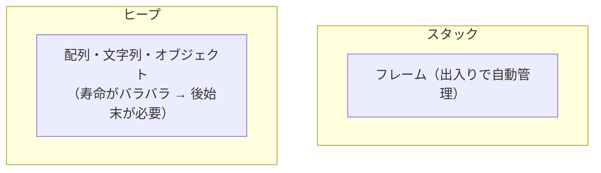
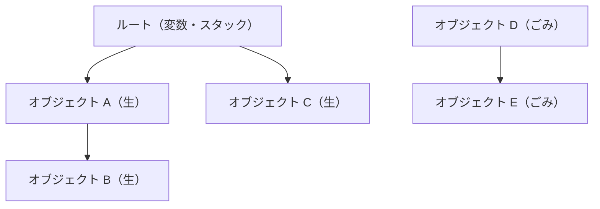

# メモリ管理とガベージコレクション

前章で導入した配列・文字列・ハッシュ・オブジェクトは、いずれも **ヒープ（heap）** ── 実行中に自由に確保・解放できるメモリ領域 ── に置かれます。確保したら、いつかは片付けなければなりません。片付け忘れればメモリは食いつぶされ（メモリリーク）、まだ使っている領域を誤って片付ければプログラムは壊れます。この「メモリの後始末」を誰が、どうやって行うか ── それが **メモリ管理（memory management）** の問題です。この章では、その全体像と、自動でメモリを回収する **ガベージコレクション（garbage collection, GC）** の代表的な方式を概観します。

## スタックとヒープ

そもそもメモリには、性質の違う 2 つの使い方があります。

**スタック領域**は、関数の呼び出しと戻りに合わせて、きれいに積んでは崩れる領域です。基礎編の VM で作った呼び出しフレームを思い出してください ── 関数を呼ぶと積まれ、戻ると捨てられました。寿命が「関数の出入り」とぴったり一致するので、後始末は自動的かつ高速です。ローカル変数のような、関数を抜ければ用済みになるデータに向いています。

**ヒープ領域**は、それより自由です。いつでも確保でき、好きなときまで生かしておけます。関数を抜けても残せるので、「関数の中で作って、呼び出し元に返すオブジェクト」などに必須です。しかし自由なぶん、「いつ片付けるか」を誰かが決めなければなりません。コンテナやオブジェクトはヒープに置かれるので、その後始末がこの章の主題です。

## 手動管理か、自動管理か

ヒープの後始末には、大きく 2 つの流儀があります。

**手動メモリ管理**は、プログラマが「確保した（`malloc`）」「もう使わないので解放する（`free`）」を明示的に書く方式です。C や C++ がこれです。無駄がなく速い反面、解放し忘れ（リーク）や、解放したメモリを使ってしまう **ダングリングポインタ（dangling pointer）**、二重解放といった、発見しにくく危険なバグの温床になります。

**自動メモリ管理**は、処理系が「もう使われていないメモリ」を自動で見つけて回収する方式です。これが GC です。プログラマは確保するだけでよく、解放は処理系任せ。バグの大きな一群を根本から消せるので、Ruby・Python・Java・Go・JavaScript など、現代の多くの言語が採用しています。GC は LISP で初めて実用化され[McCarthy, 1960](#cite:mccarthy1960)、以来半世紀以上にわたって研究が積み重ねられてきた、処理系技術の一大分野です[Jones et al., 2012](#cite:jones2012)。

> [!NOTE]
> 近年は Rust のように、「所有権（ownership）」という型システムの規則で、GC なしでもメモリ安全を保証する第三の道も実用化されています。コンパイル時に「いつ解放すべきか」を決めてしまう考え方で、本書では深入りしませんが、メモリ管理が今も活発な研究領域であることを示す好例です。

## GC の基本的な考え方

GC の核心は、「**いまも使われているメモリ（生きている, live）**」と「**もう使われないメモリ（ごみ, garbage）**」を見分けることです。では「使われている」とは何でしょう。答えは「**プログラムから到達できる**」です。

プログラムが直接触れる出発点 ── ローカル変数、グローバル変数、スタック上の値など ── を **ルート（root）** と呼びます。ルートから参照をたどっていき、たどり着けるオブジェクトは「生きている」、どこからもたどり着けないオブジェクトは「ごみ」です。誰からも参照されていないオブジェクトは、二度と使われようがないからです。

この「到達可能性」をどう調べ、ごみをどう回収するか、の違いが GC の方式の違いです。代表的な 3 つを見てみましょう。

## 代表的な GC の方式

### 参照カウント

**参照カウント（reference counting）** は、各オブジェクトに「いま自分は何か所から参照されているか」というカウンタを持たせる方式です。参照が増えれば +1、減れば −1。カウンタが `0` になった瞬間、そのオブジェクトはごみだと分かるので、即座に解放します。

実装が比較的素直で、ごみがすぐ回収される（メモリを長く無駄にしない）のが長所です。一方、参照の増減のたびにカウンタ更新のコストがかかること、そして **循環参照** ── A が B を、B が A を参照し合うと、外から誰も使っていなくてもカウンタが `0` にならない ── を回収できない弱点があります。Python（CPython）は参照カウントを主軸にしつつ、循環を別の仕組みで補っています。

### マークアンドスイープ

**マークアンドスイープ（mark and sweep, マーク・スイープ）** は、2 段階で動きます。まず **マーク**段階で、ルートから参照をたどり、到達できたオブジェクトすべてに「生きている」印をつけます。次に **スイープ**段階で、ヒープ全体を走査し、印のついていないオブジェクト（＝ごみ）を回収します。

循環参照も正しく回収できる（循環していてもルートから到達できなければごみと判定される）のが大きな利点です。欠点は、GC を実行する間、プログラムを止める必要があること（**ストップ・ザ・ワールド**）と、回収後にヒープが虫食い状になる **断片化（fragmentation）** が起きうることです。

### コピー方式

**コピー GC（copying GC）** は、ヒープを 2 つに分け、片方だけを使います。片方が一杯になったら、生きているオブジェクトだけを**もう片方へ詰めて移し替え**、元の領域は丸ごと空にします。生きたものを移すだけなので、ごみには一切触れません。移すときに隙間なく詰めるので、断片化が起きないのも利点です。代償として、ヒープの半分が常に予備として空いている必要があります。

これらの方式の損得を整理すると、次のようになります。

| 方式 | 循環参照 | 断片化 | 主なコスト |
|------|----------|--------|-----------|
| 参照カウント | 回収できない | 起きうる | 参照の増減ごとの更新 |
| マークアンドスイープ | 回収できる | 起きうる | 全ヒープ走査・停止時間 |
| コピー | 回収できる | 起きない | ヒープの半分が予備 |

## 世代別 GC ── 経験則を活かす

現実のプログラムには、ある経験則が成り立つことが知られています ── **「ほとんどのオブジェクトはすぐ死ぬ」**（弱世代仮説, weak generational hypothesis）。一時的な計算結果のように、生まれてすぐ用済みになるオブジェクトが大多数で、長生きするものは少数だ、というものです。

この経験則を使うのが **世代別 GC（generational GC）** です。オブジェクトを「若い世代」と「古い世代」に分け、新しく作られたものは若い世代に置きます。GC はまず**若い世代だけ**を頻繁に調べます。若い世代の大半はすぐ死ぬので、小さな領域を調べるだけで効率よくごみを回収でき、毎回ヒープ全体を走査せずに済みます。何度かの GC を生き延びたオブジェクトは「長生きする見込みが高い」として古い世代に移し、そちらはたまにしか調べません。この戦略により、平均的な GC の停止時間を大きく短縮できます[Jones et al., 2012](#cite:jones2012)。GC の各方式とその設計上のトレードオフを俯瞰した古典的なサーベイとしては[Wilson, 1992](#cite:wilson1992)が定評があります。

## 保守的か、正確か

GC が「これはポインタか、ただの整数か」をどう見分けるかにも、2 つの立場があります。

**正確な GC（precise GC）** は、処理系が「メモリ上のどこがポインタで、どこが整数か」を正確に把握している方式です。前章の値表現（タグや型情報）を使えば、ある値がオブジェクトへの参照かどうかを確実に判定できます。誤りなく回収でき、オブジェクトの移動（コピーや圧縮）も安全に行えます。

**保守的な GC（conservative GC）** は、その情報がない（あるいは取りにくい）場合に、「ポインタかもしれない値は、ぜんぶポインタだとみなして安全側に倒す」方式です。たとえば C で書かれたプログラムのスタックは、どこがポインタか正確には分からないので、ポインタに見える値はすべて「生きている参照」として扱います。実装しやすく既存の C コードにも後付けできる反面、たまたまポインタに見えただけの整数のせいで、本当はごみのオブジェクトを生かしてしまうことがあります。

GC は、本書で扱いきれないほど奥の深い分野です。各方式の詳細や実装テクニックに踏み込みたい読者のために、姉妹編が複数あります。

- 保守的 GC の仕組みと実装：『[保守的 GC 入門](https://kolanglab.github.io/book_Conservative_GC/)』
- 正確な GC の仕組みと実装：『[正確な GC 入門](https://kolanglab.github.io/book_precise_gc/)』
- GC のより進んだ話題：『[GC の詳細](https://kolanglab.github.io/book_gc_details/)』

> [!IMPORTANT]
> GC は「あれば速度を気にしなくてよい」魔法ではありません。GC が動くタイミングや停止時間は、アプリケーションの応答性に直結します。ゲームやリアルタイム処理では「GC でカクつく」ことが現実の問題になります。処理系を作る人にとっても、使う人にとっても、自分の言語の GC がどんな方式で、どんな性能特性を持つかを知っておくことは大切です。

---

メモリの確保と回収の仕組みが見えてきました。ここで学んだ「参照されている限り生かしておく」という GC の考え方は、後のクロージャの章でもう一度主役になります ── 関数を抜けたあとも生き続ける変数の置き場所を支えるのが、まさにヒープと GC だからです。次章は、処理系が「外の世界」とやりとりする方法 ── ファイルや画面への入出力（I/O）と、処理系に新しい機能を足す拡張のしくみ ── を扱います。
