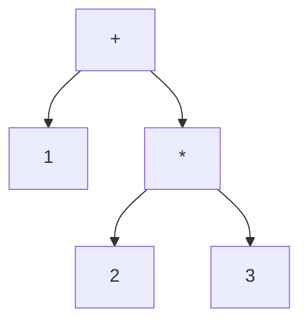

# 構文解析 ── 文字列を木に変える

ソースコードはただの文字の並びです。`"def add(a, b)\n  a + b\nend"` という文字列を見て、人間は「これは引数 2 つの関数定義だ」と分かりますが、処理系はそうではありません。**構文解析（parsing）** は、この文字列を、プログラムの構造を表す木 ── **抽象構文木（AST）** ── に変換する工程です。この章では、構文解析が何をするのかを理解し、MiniRuby のソースコードを AST にする方法を、**既存のパーサを使う道**と**自分で書く道**の両方から見ていきます。

## 字句解析と構文解析

構文解析は、ふつう 2 段階に分けて考えます。

まず **字句解析（lexical analysis, lexing）** で、文字の並びを **トークン（token）** に区切ります。トークンとは、言語にとって意味のある最小の単語のことです。たとえば `x = 1 + 23` は、次の 5 つのトークンに分かれます。

```
[識別子 x] [記号 =] [整数 1] [記号 +] [整数 23]
```

ここで `23` が「`2` と `3`」ではなく「`23` という 1 つの整数」だと判断するのが字句解析の仕事です。空白や改行も、この段階で扱いを決めます。

次に **構文解析（parsing）** で、トークンの並びが文法に合っているかを確かめながら、入れ子構造を表す木を組み立てます。`1 + 2 * 3` なら、「`*` のほうが `+` より強い」という規則に従って、次のような木になります。



この木が AST です。木の形そのものが「先に `2 * 3` を計算し、その結果に `1` を足す」という計算順序を表しています。**括弧や演算子の優先順位といった「書き方の都合」は、木になった時点ですべて構造に吸収され、消えてなくなる** ── これが構文解析の重要なポイントです。後の工程（インタプリタや VM）は、もう優先順位を気にせず、ただ木をたどればよくなります。

## AST をどう表現するか

木を作る前に、「木をどんなデータで表すか」を決めましょう。本書では、各ノードを **Ruby の配列**で表す、素朴で見やすい方式を採ります。配列の先頭要素を**ノードの種類を表す記号（シンボル）**とし、残りを子要素にします。LISP の S 式に似た表現です。

| 構文 | AST 表現 |
|------|----------|
| 整数 `3` | `[:int, 3]` |
| 変数参照 `x` | `[:var, "x"]` |
| 加算 `a + b` | `[:add, 左, 右]` |
| 減算・乗算・除算 | `[:sub, ...]` `[:mul, ...]` `[:div, ...]` |
| 比較 `a < b` | `[:lt, 左, 右]`（`>` は `:gt`、`==` は `:eq`） |
| 代入 `x = e` | `[:assign, "x", e]` |
| `if` 文 | `[:if, 条件, [then の文...], [else の文...]]` |
| 関数定義 | `[:def, "名前", [引数名...], [本体の文...]]` |
| 関数呼び出し | `[:call, "名前", [引数式...]]` |

たとえば冒頭の `def add(a, b) a + b end` は、次の AST になります。

```ruby
[:def, "add", ["a", "b"],
  [[:add, [:var, "a"], [:var, "b"]]]]
```

このようにシンプルな配列にしておくと、次章以降のインタプリタや VM が `node[0]` でノードの種類を見て分岐するだけで処理を書けます。構造体やクラスで表現する流儀もありますが（その方が型安全です）、本書では一目で全体が読める配列表現で進めます。

## 既存のパーサを使うという選択

「構文解析器（パーサ）を自分で書く」のは勉強になりますが、実務では**既存のパーサや、パーサを生成するツールを使う**ことのほうが多いです。文法が大きくなると手書きは大変ですし、枯れたツールを使えばバグも減ります。代表的な選択肢を紹介します。

- **パーサジェネレータ（parser generator）**：文法定義（BNF に似た記法）を書くと、構文解析器のコードを自動生成してくれるツール。C 系の **yacc/bison**、Java の **ANTLR**、Ruby の **Racc** などが有名です。LR 法などの理論に裏打ちされ、大きな文法も扱えます。
- **PEG（Parsing Expression Grammar）系**：文法を「上から順に試す」規則として書く方式。Ruby の **Parslet**、**Treetop** などがあります。優先順位つきの選択が直感的で、人気があります。
- **パーサコンビネータ（parser combinator）**：小さなパーサを関数として組み合わせて大きなパーサを作る手法。ホスト言語の中に文法を直接書けるのが特徴です。
- **言語付属のパーサを再利用する**：その言語の処理系自身が公開しているパーサを使う手。Ruby なら **Prism** や `RubyVM::AbstractSyntaxTree`、`Ripper` が標準で使えます。

MiniRuby は **Ruby の部分集合**として設計したので、最後の手が特に強力です。なんと、**Ruby 自身のパーサにそのまま食わせて AST を取り出せる**のです。これを使えば、字句解析も構文解析も自分で書かずに済みます。

> [!TIP]
> 構文解析それ自体を深く学びたい人は、姉妹編『[構文解析入門](https://kolanglab.github.io/book_parser_intro)』を参照してください。LR・LL・PEG といった解析手法や、パーサジェネレータの使い方を体系的に扱っています。本書では「AST を手に入れてからが本番」という立場で、構文解析は手早く済ませます。

### ハンズオン：Ruby のパーサで AST を取り出す

実際に、Ruby 標準の `RubyVM::AbstractSyntaxTree` を使って MiniRuby（＝Ruby の部分集合）のソースを解析してみましょう。次のコードを Ruby で実行してみてください。

```ruby
src = <<~MINIRUBY
  def add(a, b)
    a + b
  end
MINIRUBY

tree = RubyVM::AbstractSyntaxTree.parse(src)
pp tree
```

すると、Ruby 内部の AST ノード（`RubyVM::AbstractSyntaxTree::Node` のオブジェクト）が表示されます。各ノードには「種類」を表す `type`（たとえば `:DEFN`＝関数定義、`:OPCALL`＝演算子呼び出し）と、子ノードを返す `children` があります。これをたどれば、Ruby が解析した構文木の中身を直接観察できます。

```ruby
def show(node, depth = 0)
  return unless node.is_a?(RubyVM::AbstractSyntaxTree::Node)
  puts "#{'  ' * depth}#{node.type}"
  node.children.each { |c| show(c, depth + 1) }
end

show(RubyVM::AbstractSyntaxTree.parse("a + b * 2"))
```

実行すると、`OPCALL`（`+`）の下に `OPCALL`（`*`）がぶら下がる、優先順位どおりの木が表示されます。「`a + b * 2` が `a + (b * 2)` の木になっている」ことを、自分の目で確かめられるはずです。これが「構文解析で優先順位が構造に吸収される」ということです。

ただし、Ruby の AST ノードはそのまま使うには情報が多く、本書独自の `[:add, ...]` 形式とは形が違います。実務でも「既存パーサが返す木を、自分の処理系で扱いやすい形へ**変換（lowering）** する」工程はよくあります。Ruby の AST を本書の配列表現へ変換する関数の骨格は、次のようになります。

```ruby
def convert(node)
  case node.type
  when :INTEGER
    [:int, node.children[0]]
  when :LVAR, :VCALL          # ローカル変数の参照
    [:var, node.children[0].to_s]
  when :OPCALL                # a + b のような演算子呼び出し
    left, op, args = node.children
    right = args.children[0]
    table = { :+ => :add, :- => :sub, :* => :mul, :/ => :div,
              :< => :lt, :> => :gt, :== => :eq }
    [table.fetch(op), convert(left), convert(right)]
  # ... :IF, :DEFN, :CALL なども同様に変換する ...
  end
end
```

このように、既存パーサを使う場合の作業の中心は「解析」そのものではなく「**相手の木を自分の木へ翻訳すること**」になります。

## 手書きの構文解析器 ── 再帰下降法

既存パーサは強力ですが、「パーサの中で何が起きているか」を理解するには、一度は自分で書いてみる価値があります。ここでは、文法をほぼそのままコードに写せる **再帰下降構文解析（recursive descent parsing）** で、MiniRuby の式を解析する小さなパーサを作ります。本書の後の章はこの自作パーサが返す AST を使うので、ここで全体像を持っておきましょう。

再帰下降法のアイデアはこうです ── **文法の規則ひとつひとつを、関数ひとつに対応させる**。`add` 規則を解析する関数 `parse_add`、`mul` 規則の `parse_mul`、というように。規則が別の規則を参照していれば、対応する関数を呼び出します。`add` が `mul` を含むなら、`parse_add` は `parse_mul` を呼ぶ ── 文法の構造がそのまま関数の呼び出し構造になります。

まずは字句解析。文字列をトークンの配列に変えます。

```ruby
def tokenize(src)
  tokens = []
  s = src.dup
  until s.empty?
    case s
    when /\A\s+/                      # 空白・改行は読み飛ばす
    when /\A\d+/                      # 整数
      tokens << [:int, $&.to_i]
    when /\A[a-zA-Z_]\w*/             # 識別子・キーワード
      word = $&
      if %w[def end if else].include?(word)
        tokens << [word.to_sym, word] # キーワードは専用トークンに
      else
        tokens << [:ident, word]
      end
    when /\A(==|[+\-*\/<>(),=])/      # 記号（== は先に試す）
      tokens << [:op, $&]
    else
      raise "字句解析エラー: #{s.inspect}"
    end
    s = $'                            # マッチした残りで続ける
  end
  tokens << [:eof, nil]
end
```

正規表現の `\A` は「文字列の先頭」を意味し、先頭から順にトークンを切り出していきます。`==` を `=` より**先に**試しているのに注目してください。順番を逆にすると `==` が `=` 二つに割れてしまいます。字句解析にはこうした「貪欲に長く取る」配慮が必要です。

次に構文解析の本体です。トークン列を先頭から消費していく形で書きます。式の優先順位（`comparison` → `add` → `mul` → `primary`）が、関数の呼び出し階層にそのまま現れます。

```ruby
class Parser
  def initialize(tokens)
    @tokens = tokens
    @pos = 0
  end

  def peek = @tokens[@pos]                 # 次のトークンを覗く
  def advance                              # 1つ読んで位置を進める
    tok = @tokens[@pos]
    @pos += 1
    tok
  end

  # comparison ::= add (("<"|">"|"==") add)*
  def parse_comparison
    node = parse_add
    while peek == [:op, "<"] || peek == [:op, ">"] || peek == [:op, "=="]
      op = advance[1]
      right = parse_add
      kind = { "<" => :lt, ">" => :gt, "==" => :eq }[op]
      node = [kind, node, right]
    end
    node
  end

  # add ::= mul (("+"|"-") mul)*
  def parse_add
    node = parse_mul
    while peek == [:op, "+"] || peek == [:op, "-"]
      op = advance[1]
      right = parse_mul
      node = [op == "+" ? :add : :sub, node, right]
    end
    node
  end

  # mul ::= primary (("*"|"/") primary)*
  def parse_mul
    node = parse_primary
    while peek == [:op, "*"] || peek == [:op, "/"]
      op = advance[1]
      right = parse_primary
      node = [op == "*" ? :mul : :div, node, right]
    end
    node
  end

  # primary ::= INT | IDENT | call | "(" expr ")"
  def parse_primary
    tok = advance
    case tok[0]
    when :int   then [:int, tok[1]]
    when :ident then [:var, tok[1]]   # 関数呼び出しの判定は後述
    when :op
      raise "( を期待" unless tok[1] == "("
      node = parse_comparison
      raise ") を期待" unless advance == [:op, ")"]
      node
    else
      raise "予期しないトークン: #{tok.inspect}"
    end
  end
end
```

`parse_add` の `while` ループが、`1 - 2 - 3` を `(1 - 2) - 3` という**左結合**の木に組み立てている点に注目してください。先に作った部分木 `node` を、次の演算子の左側に押し込んでいくことで、自然に左から結合されます。

> [!NOTE]
> 上のコードは式（`expr`）の解析に絞っています。文（代入・`if`・`def`）の解析も同じ要領で、`parse_statement` のような関数を足していけば書けます。`def` なら「`def` を読む → 関数名を読む → `(` 引数列 `)` を読む → `end` まで本体の文を読む」という手順を、そのままコードにします。紙幅の都合で全体は割愛しますが、難しいのは式の優先順位の部分で、文の解析はむしろ素直です。

実際に動かしてみましょう。

```ruby
ast = Parser.new(tokenize("1 + 2 * 3")).parse_comparison
pp ast
# => [:add, [:int, 1], [:mul, [:int, 2], [:int, 3]]]
```

`2 * 3` が内側にまとまり、`+` が外側に来る ── 優先順位どおりの木が得られました。これで文字列が木になりました。

## どちらの道を選ぶか

既存パーサと手書きパーサ、どちらを選ぶべきでしょうか。目安はこうです。

- **言語が既存言語の部分集合**なら、その言語のパーサを再利用するのが最速です（本書の MiniRuby のように）。
- **独自の文法を持つ DSL** を一から作るなら、文法が小さいうちは手書きの再帰下降法が見通しよく、大きくなったらパーサジェネレータや PEG ツールに移行するのが定石です。
- **学習目的**なら、一度は手書きしてみると、AST がどう組み上がるかが腹に落ちます。

いずれの道でも、ゴールは同じ ── **後の工程が扱いやすい AST を手に入れること**です。本書ではこの先、上で定義した配列表現の AST を入力として受け取る前提で話を進めます。

---

これで「文字列 → トークン → AST」までたどり着きました。次章では、できあがった AST が「意味として筋が通っているか」を確かめる **意味解析** を、流れの中に位置づけて見ていきます。
