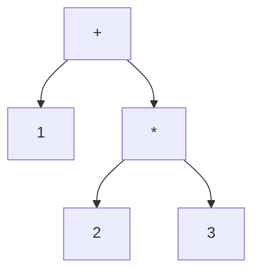

# 構文解析 ── 文字列を木に変える

ソースコードはただの文字の並びです。`"def add(a, b)\n  a + b\nend"` という文字列を見て、人間は「これは引数 2 つの関数定義だ」と分かりますが、処理系はそうではありません。**構文解析（parsing）** は、この文字列を、プログラムの構造を表す木 ── **抽象構文木（AST）** ── に変換する工程です。この章では、構文解析が何をするのかを理解し、MiniRuby のソースコードを AST にする方法を、**既存のパーサを使う道**と**自分で書く道**の両方から見ていきます。

## 字句解析と構文解析

構文解析は、ふつう 2 段階に分けて考えます。

まず **字句解析（lexical analysis, lexing）** で、文字の並びを **トークン（token）** に区切ります。トークンとは、言語にとって意味のある最小の単語のことです。たとえば `x = 1 + 23` は、次の 5 つのトークンに分かれます。

```
[識別子 x] [記号 =] [整数 1] [記号 +] [整数 23]
```

ここで `23` が「`2` と `3`」ではなく「`23` という 1 つの整数」だと判断するのが字句解析の仕事です。空白や改行も、この段階で扱いを決めます。

次に **構文解析（parsing）** で、トークンの並びが文法に合っているかを確かめながら、入れ子構造を表す木を組み立てます。`1 + 2 * 3` なら、「`*` のほうが `+` より強い」という規則に従って、次のような木になります。



この木が AST です。木の形そのものが「先に `2 * 3` を計算し、その結果に `1` を足す」という計算順序を表しています。**括弧や演算子の優先順位といった「書き方の都合」は、木になった時点ですべて構造に吸収され、消えてなくなる** ── これが構文解析の重要なポイントです。後の工程（インタプリタや VM）は、もう優先順位を気にせず、ただ木をたどればよくなります。

## AST をどう表現するか

木を作る前に、「木をどんなデータで表すか」を決めましょう。本書では、各ノードを **Ruby の配列**で表す、素朴で見やすい方式を採ります。配列の先頭要素を**ノードの種類を表す記号（シンボル）**とし、残りを子要素にします。LISP の S 式に似た表現です。

| 構文 | AST 表現 |
|------|----------|
| 整数 `3` | `[:int, 3]` |
| 変数参照 `x` | `[:var, "x"]` |
| 加算 `a + b` | `[:add, 左, 右]` |
| 減算・乗算・除算 | `[:sub, ...]` `[:mul, ...]` `[:div, ...]` |
| 比較 `a < b` | `[:lt, 左, 右]`（`>` は `:gt`、`==` は `:eq`） |
| 代入 `x = e` | `[:assign, "x", e]` |
| `if` 文 | `[:if, 条件, [then の文...], [else の文...]]` |
| 関数定義 | `[:def, "名前", [引数名...], [本体の文...]]` |
| 関数呼び出し | `[:call, "名前", [引数式...]]` |

たとえば冒頭の `def add(a, b) a + b end` は、次の AST になります。

```ruby
[:def, "add", ["a", "b"],
  [[:add, [:var, "a"], [:var, "b"]]]]
```

このようにシンプルな配列にしておくと、次章以降のインタプリタや VM が `node[0]` でノードの種類を見て分岐するだけで処理を書けます。構造体やクラスで表現する流儀もありますが（その方が型安全です）、本書では一目で全体が読める配列表現で進めます。

## 既存のパーサを使うという選択

構文解析器（パーサ）を一から自分で書くのは勉強になりますが、実務では**既存のパーサをそのまま再利用する**ことのほうが多いです。とくに、作りたい言語が既存言語の文法に近い（あるいはその部分集合である）なら、その言語の処理系がすでに持っているパーサを借りてくるのが最速です。字句解析も構文解析も書かずに済み、枯れた実装なのでバグも少なくて済みます。

うれしいことに、多くの言語は自分自身のパーサを**ライブラリとして外部から呼べる形で公開**しています。代表的なものを言語別に挙げます。

- **Ruby**：**Prism** が現在の標準パーサで、処理系本体から切り離してライブラリ単体でも使えます。ほかに `RubyVM::AbstractSyntaxTree` や `Ripper` も標準添付です。
- **Python**：標準ライブラリの **`ast`** モジュール（`ast.parse`）で、Python 自身が使うのと同じ AST をそのまま取り出せます。
- **JavaScript / TypeScript**：**acorn**、**esprima**、**@babel/parser** などが定番で、TypeScript には公式の Compiler API があります。
- **Go**：標準ライブラリの **`go/parser`・`go/ast`** で、Go のソースを解析して AST を得られます。
- **Rust**：**`syn`** クレートが、マクロを書く人を中心に広く使われています。
- **C / C++**：Clang の **libclang** が、本物の C/C++ パーサを API として提供します。
- **Java**：**JavaParser** や Eclipse JDT が AST を返してくれます。

こうしたパーサは、その言語の処理系自身が使っている「本物」なので、込み入ったエッジケースまで正確に解析できます。作りたい言語をホスト言語の方言（部分集合や拡張）として設計しておけば、これらをそのまま流用できるわけです。

> [!NOTE]
> パーサを**自分で生成・記述する**道 ── パーサジェネレータ（yacc/bison、ANTLR、Racc）、PEG（Parslet、Treetop）、パーサコンビネータなど ── もありますが、これらは文法を自分で書き起こす「パーサの自作」に分類されます。手書きの再帰下降法は次節で、解析手法そのものの体系は後述の姉妹編で扱います。

MiniRuby は **Ruby の部分集合**として設計したので、この「既存パーサの再利用」が特に強力です。なんと、**Ruby 自身のパーサにそのまま食わせて AST を取り出せる**のです。これを使えば、字句解析も構文解析も自分で書かずに済みます。

> [!TIP]
> 構文解析それ自体を深く学びたい人は、姉妹編『[構文解析入門](https://kolanglab.github.io/book_parser_intro)』を参照してください。LR・LL・PEG といった解析手法や、パーサジェネレータの使い方を体系的に扱っています。本書では「AST を手に入れてからが本番」という立場で、構文解析は手早く済ませます。

### ハンズオン：Ruby のパーサで AST を取り出す

実際に解析してみましょう。Ruby のパーサには歴史的に `RubyVM::AbstractSyntaxTree` や `Ripper` もありますが、ここでは前節で「現在の標準パーサ」として挙げた **Prism** を使います。Prism は Ruby 3.3 から標準添付で（古い Ruby でも `gem install prism` で入ります）、処理系本体から切り離してライブラリ単体で呼べるのが利点です。次のコードを実行してみてください。

```ruby
require "prism"

src = <<~MINIRUBY
  def add(a, b)
    a + b
  end
MINIRUBY

result = Prism.parse(src)
pp result.value
```

`Prism.parse` は解析結果（`Prism::ParseResult`）を返し、`result.value` がルートノード（`Prism::ProgramNode`）です。各ノードは「種類」を表す `type`（たとえば `:def_node`＝関数定義、`:call_node`＝メソッド／演算子呼び出し）を持ち、`compact_child_nodes` で子ノードをたどれます。これをたどれば、Ruby が解析した構文木の中身を直接観察できます。

```ruby
def show(node, depth = 0)
  puts "#{'  ' * depth}#{node.type}"
  node.compact_child_nodes.each { |c| show(c, depth + 1) }
end

show(Prism.parse("a + b * 2").value)
```

実行すると、`call_node`（`+`）の下に `call_node`（`*`）がぶら下がる、優先順位どおりの木が表示されます。「`a + b * 2` が `a + (b * 2)` の木になっている」ことを、自分の目で確かめられるはずです。これが「構文解析で優先順位が構造に吸収される」ということです。

ただし、Prism の AST ノードはそのまま使うには情報が多く、本書独自の `[:add, ...]` 形式とは形が違います。実務でも「既存パーサが返す木を、自分の処理系で扱いやすい形へ**変換（lowering）** する」工程はよくあります。Prism の AST を本書の配列表現へ変換する関数の骨格は、次のようになります。

```ruby
OP = { :+ => :add, :- => :sub, :* => :mul, :/ => :div,
       :< => :lt, :> => :gt, :== => :eq }

def convert(node)
  case node.type
  when :program_node              # ルート。中の文の並びへ
    convert(node.statements)
  when :statements_node           # 文の並び → 配列
    node.body.map { |stmt| convert(stmt) }
  when :integer_node
    [:int, node.value]
  when :local_variable_read_node  # 代入済みローカル変数の参照
    [:var, node.name.to_s]
  when :call_node
    if node.receiver && OP.key?(node.name)          # a + b のような演算子呼び出し
      right = node.arguments.arguments.first
      [OP.fetch(node.name), convert(node.receiver), convert(right)]
    elsif node.receiver.nil? && node.arguments.nil? # 裸の名前は変数参照とみなす
      [:var, node.name.to_s]
    else                                            # f(x, y) のような関数呼び出し
      args = node.arguments&.arguments&.map { |a| convert(a) } || []
      [:call, node.name.to_s, args]
    end
  when :def_node
    params = node.parameters&.requireds&.map { |p| p.name.to_s } || []
    body   = node.body ? convert(node.body) : []
    [:def, node.name.to_s, params, body]
  # ... :if_node なども同様に変換する ...
  end
end
```

このように、既存パーサを使う場合の作業の中心は「解析」そのものではなく「**相手の木を自分の木へ翻訳すること**」になります。

### Prism の出力を JSON にして、他言語で処理系を書く

この「配列表現」のうれしい点は、**そのまま JSON にできる**ことです。`convert` の結果はシンボル・配列・整数だけなので、`JSON.generate` に渡すとシンボルが文字列になり、`["add", ["int", 1], ...]` のような素直な JSON が得られます。

```ruby
require "prism"
require "json"

ast = convert(Prism.parse("1 + 2 * 3").value)
puts JSON.pretty_generate(ast)
```

出力はこうなります（トップレベルは文のリストなので、いちばん外側が配列です）。

```json
[
  ["add", ["int", 1], ["mul", ["int", 2], ["int", 3]]]
]
```

ここまで来ると、**構文解析だけを Ruby（Prism）に任せ、その先の処理系本体は好きな言語で書く**、という分担ができます。JSON はほとんどの言語が標準で読めるからです。たとえば、この JSON を標準入力から受け取って評価する小さなインタプリタは、Python なら次のように書けます。

```python
import json, sys

def ev(node, env):
    tag, *rest = node
    if tag == "int":
        return rest[0]
    elif tag == "var":
        return env[rest[0]]
    elif tag in ("add", "sub", "mul", "div"):
        a, b = ev(rest[0], env), ev(rest[1], env)
        return {"add": a + b, "sub": a - b,
                "mul": a * b, "div": a // b}[tag]
    else:
        raise ValueError(f"未対応のノード: {tag}")

ast = json.load(sys.stdin)         # 文のリスト
result = None
for stmt in ast:
    result = ev(stmt, {})
print(result)                      # => 7
```

あとは 2 つをパイプでつなぐだけです。

```
$ ruby to_json.rb | python eval.py
7
```

Ruby 側は「Prism で解析して JSON を吐く」だけ、Python 側は「JSON を読んで評価する」だけ。**言語の境界を JSON という共通フォーマットで橋渡しする**この構成は、解析の難しい部分を成熟したパーサに任せつつ、処理系本体は手になじんだ言語で実装したい、というときの定番の型です。

## 手書きの構文解析器 ── 再帰下降法（おまけ）

> [!NOTE]
> **この節はおまけです。** 授業ではスキップしてかまいません。手書きパーサを読み書きしなくても、以降の章は既存パーサが返す AST を前提に読み進められます。再帰下降法の中身に興味がある人向けの補足としてお楽しみください。

既存パーサは強力ですが、「パーサの中で何が起きているか」を理解するには、一度は自分で書いてみる価値があります。ここでは、文法をほぼそのままコードに写せる **再帰下降構文解析（recursive descent parsing）** で、MiniRuby の式を解析する小さなパーサを作ります。本書の後の章はこの自作パーサが返す AST を使うので、ここで全体像を持っておきましょう。

再帰下降法のアイデアはこうです ── **文法の規則ひとつひとつを、関数ひとつに対応させる**。`add` 規則を解析する関数 `parse_add`、`mul` 規則の `parse_mul`、というように。規則が別の規則を参照していれば、対応する関数を呼び出します。`add` が `mul` を含むなら、`parse_add` は `parse_mul` を呼ぶ ── 文法の構造がそのまま関数の呼び出し構造になります。

まずは字句解析。文字列をトークンの配列に変えます。

```ruby
def tokenize(src)
  tokens = []
  s = src.dup
  until s.empty?
    case s
    when /\A\s+/                      # 空白・改行は読み飛ばす
    when /\A\d+/                      # 整数
      tokens << [:int, $&.to_i]
    when /\A[a-zA-Z_]\w*/             # 識別子・キーワード
      word = $&
      if %w[def end if else].include?(word)
        tokens << [word.to_sym, word] # キーワードは専用トークンに
      else
        tokens << [:ident, word]
      end
    when /\A(==|[+\-*\/<>(),=])/      # 記号（== は先に試す）
      tokens << [:op, $&]
    else
      raise "字句解析エラー: #{s.inspect}"
    end
    s = $'                            # マッチした残りで続ける
  end
  tokens << [:eof, nil]
end
```

正規表現の `\A` は「文字列の先頭」を意味し、先頭から順にトークンを切り出していきます。`==` を `=` より**先に**試しているのに注目してください。順番を逆にすると `==` が `=` 二つに割れてしまいます。字句解析にはこうした「貪欲に長く取る」配慮が必要です。

次に構文解析の本体です。トークン列を先頭から消費していく形で書きます。式の優先順位（`comparison` → `add` → `mul` → `primary`）が、関数の呼び出し階層にそのまま現れます。

```ruby
class Parser
  def initialize(tokens)
    @tokens = tokens
    @pos = 0
  end

  def peek = @tokens[@pos]                 # 次のトークンを覗く
  def advance                              # 1つ読んで位置を進める
    tok = @tokens[@pos]
    @pos += 1
    tok
  end

  # comparison ::= add (("<"|">"|"==") add)*
  def parse_comparison
    node = parse_add
    while peek == [:op, "<"] || peek == [:op, ">"] || peek == [:op, "=="]
      op = advance[1]
      right = parse_add
      kind = { "<" => :lt, ">" => :gt, "==" => :eq }[op]
      node = [kind, node, right]
    end
    node
  end

  # add ::= mul (("+"|"-") mul)*
  def parse_add
    node = parse_mul
    while peek == [:op, "+"] || peek == [:op, "-"]
      op = advance[1]
      right = parse_mul
      node = [op == "+" ? :add : :sub, node, right]
    end
    node
  end

  # mul ::= primary (("*"|"/") primary)*
  def parse_mul
    node = parse_primary
    while peek == [:op, "*"] || peek == [:op, "/"]
      op = advance[1]
      right = parse_primary
      node = [op == "*" ? :mul : :div, node, right]
    end
    node
  end

  # primary ::= INT | IDENT | call | "(" expr ")"
  def parse_primary
    tok = advance
    case tok[0]
    when :int   then [:int, tok[1]]
    when :ident then [:var, tok[1]]   # 関数呼び出しの判定は後述
    when :op
      raise "( を期待" unless tok[1] == "("
      node = parse_comparison
      raise ") を期待" unless advance == [:op, ")"]
      node
    else
      raise "予期しないトークン: #{tok.inspect}"
    end
  end
end
```

`parse_add` の `while` ループが、`1 - 2 - 3` を `(1 - 2) - 3` という**左結合**の木に組み立てている点に注目してください。先に作った部分木 `node` を、次の演算子の左側に押し込んでいくことで、自然に左から結合されます。

> [!NOTE]
> 上のコードは式（`expr`）の解析に絞っています。文（代入・`if`・`def`）の解析も同じ要領で、`parse_statement` のような関数を足していけば書けます。`def` なら「`def` を読む → 関数名を読む → `(` 引数列 `)` を読む → `end` まで本体の文を読む」という手順を、そのままコードにします。紙幅の都合で全体は割愛しますが、難しいのは式の優先順位の部分で、文の解析はむしろ素直です。

実際に動かしてみましょう。

```ruby
ast = Parser.new(tokenize("1 + 2 * 3")).parse_comparison
pp ast
# => [:add, [:int, 1], [:mul, [:int, 2], [:int, 3]]]
```

`2 * 3` が内側にまとまり、`+` が外側に来る ── 優先順位どおりの木が得られました。これで文字列が木になりました。

## どちらの道を選ぶか

既存パーサと手書きパーサ、どちらを選ぶべきでしょうか。目安はこうです。

- **言語が既存言語の部分集合**なら、その言語のパーサを再利用するのが最速です（本書の MiniRuby のように）。
- **独自の文法を持つ DSL** を一から作るなら、文法が小さいうちは手書きの再帰下降法が見通しよく、大きくなったらパーサジェネレータや PEG ツールに移行するのが定石です。
- **学習目的**なら、一度は手書きしてみると、AST がどう組み上がるかが腹に落ちます。

いずれの道でも、ゴールは同じ ── **後の工程が扱いやすい AST を手に入れること**です。本書ではこの先、上で定義した配列表現の AST を入力として受け取る前提で話を進めます。

---

これで「文字列 → トークン → AST」までたどり着きました。次章では、できあがった AST が「意味として筋が通っているか」を確かめる **意味解析** を、流れの中に位置づけて見ていきます。
