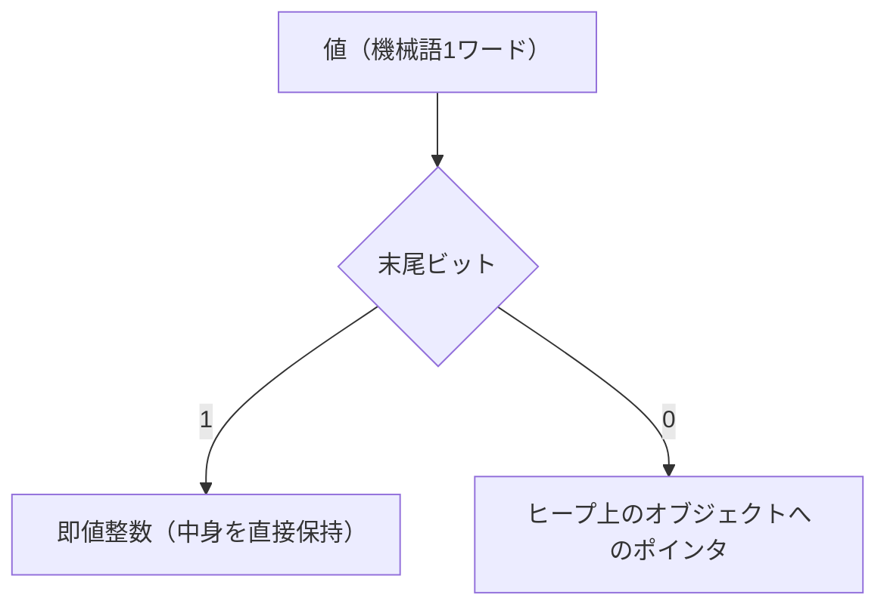
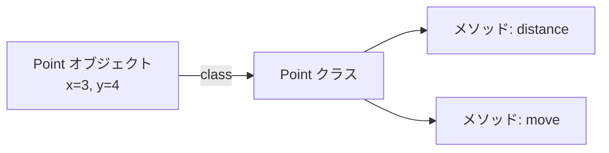

# 値の表現とコンテナ

基礎編の MiniRuby が扱える値は整数だけでした。本物の言語は、小数・文字列・配列・ハッシュ・オブジェクトなど、さまざまな種類の値を扱います。すると処理系には新しい問題が生まれます ── **「種類の違う値を、どうやって同じスタックや変数に入れるのか」**。この章では、値の内部表現という処理系の基礎を押さえたうえで、配列・文字列・ハッシュ・オブジェクトといった **コンテナ（容器）** をどう実装するかを見ていきます。

## 値をどう表現するか

これまで、MiniRuby の値は「Ruby の整数」そのものでした。スタックや `locals` 配列には Ruby の `Integer` が入っていました。しかし整数と文字列と配列が混在すると、VM は「いまスタックのてっぺんにあるのは何者か」を区別できなければなりません。`add` 命令は整数同士なら足し算ですが、文字列同士なら連結かもしれず、整数と配列なら誤りです。**値には「種類の情報」が必要**になります。

### タグ付き表現とボックス化

代表的なやり方が 2 つあります。

ひとつは、値といっしょに「種類を表す札（タグ, tag）」を持つ **タグ付き表現（tagged representation）** です。Ruby で素直に書くなら、各値を「種類と中身の組」で表します。

```ruby
[:int, 42]          # 整数 42
[:str, "hello"]     # 文字列 "hello"
[:array, [1, 2, 3]] # 配列
[:nil]              # nil
```

VM はてっぺんの値の先頭要素（タグ）を見て、整数同士なら加算、文字列同士なら連結、と振る舞いを切り替えられます。分かりやすい反面、ひとつひとつの値が「組」になるためメモリと手間が増えます。

もうひとつは **ボックス化（boxing）** です。すべての値を「ヒープ上のオブジェクトへの参照（ポインタ）」として統一し、オブジェクト自身が自分の種類を知っている、という方式です。Java の `Integer` や、多くの動的言語のオブジェクト表現がこれにあたります。統一的に扱える反面、整数のような小さな値までヒープに置くと遅くなります。

### 即値とポインタの使い分け

そこで実用的な処理系は、両者を組み合わせた巧妙な工夫をします。「**小さな整数はヒープに置かず、ポインタの中に直接埋め込む**」という手法で、Ruby の `Fixnum`（即値整数）がその代表です。

仕組みはこうです。オブジェクトへのポインタは、メモリ上の配置の都合で、末尾の数ビットがいつも `0` になります。この「いつも 0 のビット」を**タグ置き場**に流用するのです。Ruby (CRuby) では、整数 `n` を `2n+1` という形で表現します。末尾ビットが `1` なら「これはポインタではなく即値整数だ、本当の値は右に 1 ビットずらした値だ」と判断し、`0` なら「これは本物のオブジェクトへのポインタだ」と判断します。



この **即値（immediate value）** の工夫により、ほとんどの整数演算がヒープを一切触らずに済み、動的言語でも整数計算が高速になります。`true`/`false`/`nil` のような特別な値も、同じく即値として表現されることが多いです。値表現はそれぞれの処理系の性能を左右する重要な設計判断で、Ruby の実装でも中心的な話題のひとつです[Flanagan and Matsumoto, 2008](#cite:flanagan2008)。

> [!NOTE]
> 本書の MiniRuby 実装では、説明を簡単にするため、値はホスト言語 Ruby のオブジェクトをそのまま使います（タグ付けは Ruby の `Integer`/`String`/`Array` のクラスが代行してくれます）。ここで学んでほしいのは「自分でゼロから処理系を C などで書くなら、値の表現を自分で設計しなければならない」という事実です。

## コンテナを実装する

値の表現が決まれば、複数の値をまとめて持つ **コンテナ** を導入できます。配列・文字列・ハッシュは、見た目は違っても「**ヒープ上に確保された、可変サイズのデータ**」という点で共通しています。

### 配列

**配列（array）** は、値を順番に並べて、添字（インデックス）でアクセスできるコンテナです。MiniRuby に配列を入れるには、まず構文（`[1, 2, 3]` というリテラルや、`a[i]` という要素アクセス）をパーサに足し、値の表現として「配列オブジェクト」を用意します。ホスト言語 Ruby で実装するなら、中身は Ruby の配列で持てます。

配列で考えるべきは **メモリの確保と拡張**です。`a = [1, 2, 3]` のように要素数が決まっていれば、その分のメモリを一度に確保すれば済みます。しかし `a.push(4)` のように後から増えると、確保した領域が足りなくなります。多くの実装は、**実際の要素数より少し大きめに確保しておき、足りなくなったら倍々で広げる**という戦略をとります。こうすると、追加 1 回あたりの平均コストを小さく保てます。要素アクセス `a[i]` 自体は「先頭アドレス + i × 要素サイズ」の計算一発で、配列が速い理由です。

### 文字列

**文字列（string）** は、見方を変えれば「文字（バイト）の配列」です。実装の多くは配列と同じく、ヒープ上の連続領域で文字列を保持します。ただし文字列には固有の難しさがあります。

ひとつは **文字コード**です。`"あ"` のような文字は 1 バイトに収まらず、UTF-8 では複数バイトで表現されます。「`n` 文字目」を取り出すのに、配列のように添字計算一発とはいかず、先頭からバイトを数える必要が出てきます。処理系は、扱う文字コードと「長さとは文字数かバイト数か」を明確に決めなければなりません。

もうひとつは **可変か不変か**です。Ruby の文字列は変更できますが、Java や Python の文字列は不変（immutable）です。不変にすると、同じ内容の文字列を共有でき、ハッシュのキーにも安全に使えるなどの利点があります。これも言語設計上の選択です。

### ハッシュ

**ハッシュ（hash, 連想配列, 辞書）** は、キーと値の対応を持ち、キーから値を高速に引けるコンテナです。`h["name"] = "Alice"` のように使います。配列が「整数の添字」で引くのに対し、ハッシュは「任意の値（文字列など）」をキーにできます。

高速に引ける秘密が **ハッシュ関数（hash function）** です。キーをハッシュ関数にかけて整数（ハッシュ値）を求め、それを内部の配列の添字に変換して、その場所に値を置きます。取り出すときも同じ計算で一発で場所が分かるので、平均的には要素数によらず高速にアクセスできます。問題は、別々のキーが同じ添字に当たる **衝突（collision）** で、これを「同じ場所に複数を鎖でつなぐ」「別の空き場所を探す」といった方法で処理します。ハッシュの実装品質は、ハッシュ関数の良し悪しと衝突処理の巧みさで決まります[Aho et al., 2006](#cite:aho2006)。

## クラスとオブジェクト

最後に、MiniRuby に **オブジェクト指向**を導入することを考えます。ここまでのコンテナは「データの入れ物」でしたが、オブジェクトは「**データと、それを操作する手続き（メソッド）をひとまとめにしたもの**」です。

### オブジェクトとは何か

処理系の視点では、オブジェクトはおおむね 2 つの部分からなります。

- **インスタンス変数（フィールド）**：そのオブジェクトが持つデータ。たとえば `Point` なら `x` と `y`。
- **クラスへの参照**：そのオブジェクトがどのクラスに属するか。クラスには「使えるメソッドの一覧」が入っています。



`p.distance` のようなメソッド呼び出しは、「`p` のクラスをたどり、`distance` という名前のメソッドを探して実行する」という処理になります。この「**名前からメソッドを探す**」工程を **メソッドディスパッチ（method dispatch）** と呼びます。

### メソッドディスパッチの仕組み

メソッドディスパッチは、概念的には「クラスのメソッド表（名前 → メソッド本体のハッシュ）を引く」だけです。継承がある言語では、自分のクラスで見つからなければ親クラスをたどって探します。

問題は速度です。`p.distance` をループの中で何百万回も呼ぶと、毎回ハッシュを引いて親をたどるコストが効いてきます。そこで「**前回この場所で呼んだメソッドを覚えておき、同じクラスなら探索を省く**」という高速化が生まれました。これが **インラインキャッシュ（inline cache）** で、Smalltalk-80 の実装で導入され[Deutsch and Schiffman, 1984](#cite:deutsch1984)、複数のクラスに対応した **多態インラインキャッシュ（polymorphic inline cache）** へ発展しました[Hölzle et al., 1991](#cite:holzle1991)。動的言語の高速化の要であり、高速化の章で改めて詳しく扱います。

> [!TIP]
> 「すべてはオブジェクト」という Ruby のような言語では、整数すらオブジェクトとして振る舞い、`1 + 2` も「`1` というオブジェクトに `+` メッセージを送る」メソッド呼び出しです。しかし前述の即値表現とインラインキャッシュのおかげで、実際には足し算が高速に実行されます。「概念上は全部メソッド呼び出し、実装上は賢く手を抜く」という二枚腰が、現代の動的言語処理系の腕の見せどころです。

---

この章では、値の内部表現という土台から、配列・文字列・ハッシュ・オブジェクトまでを見渡しました。これらのコンテナはすべて**ヒープにメモリを確保**します。すると当然、「使い終わったメモリは誰が片付けるのか」という問題が浮かびます。次章は、その問いに答える **メモリ管理とガベージコレクション** です。
