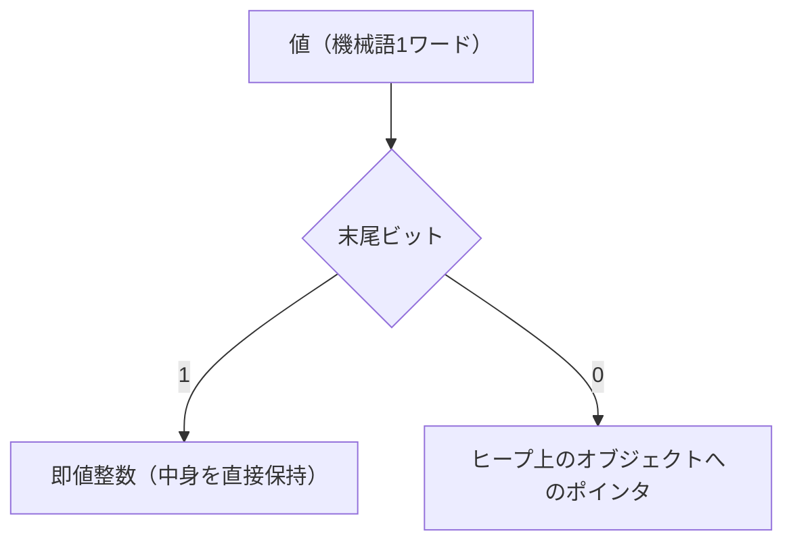
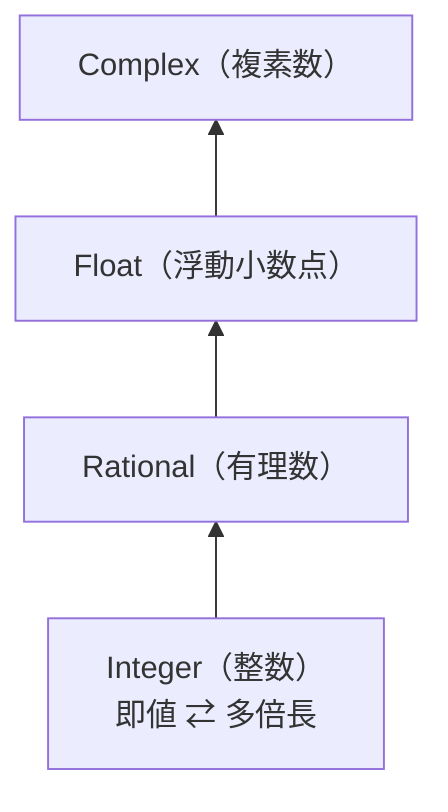
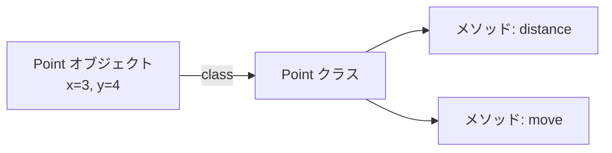

# 値の表現とコンテナ

基礎編の MiniRuby が扱える値は整数だけでした。本物の言語は、小数・文字列・配列・ハッシュ・オブジェクトなど、さまざまな種類の値を扱います。すると処理系には新しい問題が生まれます ── **「種類の違う値を、どうやって同じスタックや変数に入れるのか」**。この章では、値の内部表現という処理系の基礎を押さえたうえで、配列・文字列・ハッシュ・オブジェクトといった **コンテナ（容器）** をどう実装するかを見ていきます。

## 値をどう表現するか

これまで、MiniRuby の値は「Ruby の整数」そのものでした。スタックや `locals` 配列には Ruby の `Integer` が入っていました。しかし整数と文字列と配列が混在すると、VM は「いまスタックのてっぺんにあるのは何者か」を区別できなければなりません。`add` 命令は整数同士なら足し算ですが、文字列同士なら連結かもしれず、整数と配列なら誤りです。**値には「種類の情報」が必要**になります。

### タグ付き表現とボックス化

代表的なやり方が 2 つあります。

ひとつは、値といっしょに「種類を表す札（タグ, tag）」を持つ **タグ付き表現（tagged representation）** です。Ruby で素直に書くなら、各値を「種類と中身の組」で表します。

```ruby
[:int, 42]          # 整数 42
[:str, "hello"]     # 文字列 "hello"
[:array, [1, 2, 3]] # 配列
[:nil]              # nil
```

VM はてっぺんの値の先頭要素（タグ）を見て、整数同士なら加算、文字列同士なら連結、と振る舞いを切り替えられます。分かりやすい反面、ひとつひとつの値が「組」になるためメモリと手間が増えます。

もうひとつは **ボックス化（boxing）** です。すべての値を「ヒープ上のオブジェクトへの参照（ポインタ）」として統一し、オブジェクト自身が自分の種類を知っている、という方式です。Java の `Integer` や、多くの動的言語のオブジェクト表現がこれにあたります。統一的に扱える反面、整数のような小さな値までヒープに置くと遅くなります。

### 即値とポインタの使い分け

そこで実用的な処理系は、両者を組み合わせた巧妙な工夫をします。「**小さな整数はヒープに置かず、ポインタの中に直接埋め込む**」という手法で、Ruby の `Fixnum`（即値整数）がその代表です。

仕組みはこうです。オブジェクトへのポインタは、末尾の数ビットがいつも `0` になります。これは**アライメント（alignment）**という制約によるものです。64 ビット処理系では多くの場合オブジェクトを 8 バイト境界（アドレスが 8 の倍数となる位置）に配置します。8 の倍数は 2 進数で末尾 3 ビットが必ず `0` になるので、これらのビットはポインタとして意味を持ちません。この「いつも 0 のビット」を**タグ置き場**に流用するのです。Ruby (CRuby) では、整数 `n` を `2n+1` という形で表現します。末尾ビットが `1` なら「これはポインタではなく即値整数だ、本当の値は右に 1 ビットずらした値だ」と判断し、`0` なら「これは本物のオブジェクトへのポインタだ」と判断します。



この **即値（immediate value）** の工夫により、ほとんどの整数演算がヒープを一切触らずに済み、動的言語でも整数計算が高速になります。`true`/`false`/`nil` のような特別な値も、同じく即値として表現されることが多いです。値表現はそれぞれの処理系の性能を左右する重要な設計判断で、Ruby の実装でも中心的な話題のひとつです[Flanagan and Matsumoto, 2008](#cite:flanagan2008)。

> [!NOTE]
> 本書の MiniRuby 実装では、説明を簡単にするため、値はホスト言語 Ruby のオブジェクトをそのまま使います（タグ付けは Ruby の `Integer`/`String`/`Array` のクラスが代行してくれます）。ここで学んでほしいのは「自分でゼロから処理系を C などで書くなら、値の表現を自分で設計しなければならない」という事実です。

## 数値を広げる

ここまで「整数」と一括りにしてきましたが、本物の言語の数値は一枚岩ではありません。実用的な処理系は、用途の異なる複数の数値表現を内部に持ち、必要に応じて使い分けます。代表的なものを挙げます。

| 種類 | 内部表現 | 特徴・用途 |
|------|----------|------------|
| 即値整数（Fixnum） | 1 ワードに埋め込み | 機械語の整数演算そのまま。最速。範囲が限られる |
| 多倍長整数（Bignum） | ヒープ上の桁の配列 | ワードに収まらない巨大な整数。桁あふれしない |
| 浮動小数点数（Float） | IEEE 754 倍精度 | 実数の近似。高速だが誤差がある |
| 任意精度十進小数 | 十進の桁列 + スケール | 誤差を嫌う金額計算など。Ruby の `BigDecimal` |
| 有理数（Rational） | 分子と分母の組 | `1/3` を誤差なく厳密に保持 |
| 複素数（Complex） | 実部と虚部の組 | `3+4i`。科学技術計算 |

最初の壁が **桁あふれ（overflow）** です。即値整数は機械語 1 ワードに収まる範囲しか表せません。`2 ** 100` のような巨大な数を計算すると、その範囲を超えてしまいます。そこで多くの動的言語は、**演算結果がワードに収まらなくなった瞬間に、自動でヒープ上の多倍長整数（Bignum）へ昇格させる**という工夫をします。Bignum は整数を「桁の配列」として持ち、筆算と同じ要領で任意の大きさの加減乗除を行います。利用者からは一つの `Integer` に見えますが、内部では小さい値は即値（Fixnum）、大きい値は Bignum、と表現が切り替わっているのです。

```ruby
(2 ** 62).class   # => Integer（内部表現は即値 Fixnum の範囲）
(2 ** 100).class  # => Integer（内部表現は多倍長 Bignum へ昇格済み）
```

ホスト言語 Ruby はこの昇格を勝手にやってくれますが、**C などで自分で処理系を書くなら、加算命令のたびに「結果が即値の範囲に収まるか」を検査して昇格を判断**しなければなりません。`add` 命令の中身を Ruby で模すと、こうなります。

```ruby
# 1 ワード(64bit)のうち 1 ビットをタグに使う処理系を想定した即値の範囲
FIXNUM_MAX =  (1 << 62) - 1
FIXNUM_MIN = -(1 << 62)

def vm_add(a, b)
  r = a + b                              # まず素直に足す
  if r > FIXNUM_MAX || r < FIXNUM_MIN
    Bignum.from_integer(r)               # 範囲外 → ヒープ上の多倍長へ昇格
  else
    r                                    # 範囲内 → 即値(Fixnum)のまま
  end
end
```

本物の C 実装では、`a + b` の結果がオーバーフローしたかを「足す前に上限と比較する」か「CPU のオーバーフローフラグ（GCC の `__builtin_add_overflow` など）を見る」かして検出します。昇格先の `Bignum` は整数を「基数 `2^32` などの桁の配列」として持ち、加減乗除を筆算と同じ桁ごとの処理で行います。逆に、Bignum 同士の演算結果がまた即値の範囲に収まったら Fixnum へ降格させる実装もあります。

> [!NOTE]
> 本書の MiniRuby はホスト Ruby の `Integer` をそのまま使うため、この検査と昇格はホストが肩代わりしてくれます。上のコードは「もし自分で書くなら、即値の境界を自分で定義し、演算のたびに検査する必要がある」という実装の勘所を示すためのものです。

整数の次は **実数の近似** です。`3.14` のような **浮動小数点数（Float）** は、ほぼすべての処理系が CPU の備える IEEE 754 倍精度をそのまま使います。高速な反面、`0.1 + 0.2` が `0.3` にならないことに代表される **丸め誤差** を避けられません。

```ruby
0.1 + 0.2   # => 0.30000000000000004
```

誤差が許されない場面（金額計算など）のために、**任意精度の十進小数**（Ruby の `BigDecimal`）を用意する言語もあります。これは数を二進ではなく十進の桁列として保持し、`0.1` を `0.1` のまま厳密に扱えるようにしたものです。さらに「`1/3` を誤差なく」表したい要求には **有理数（Rational）** が応えます。分子と分母を整数の組として持ち、約分しながら厳密に計算します。科学技術計算で使う **複素数（Complex）** は、実部と虚部の二つの数の組として表現します。

> [!NOTE]
> 数値型はすべて「数の種類が違うだけ」に見えて、内部表現はまったく別物です。即値整数は 1 ワード、Bignum は桁の配列、Rational や Complex は二つの数の組 ── つまり前節で見た「タグ付き表現」の好例で、`add` 命令は両辺のタグを見て適切な加算ルーチンへ振り分けます。

### numeric tower ── 異なる数値が混ざるとき

種類が増えると、新しい問題が生まれます。**`1 + 2.0` や `1/2 + 0.5` のように、種類の違う数値を混ぜて演算したらどうなるのか** です。多くの言語は、数値の種類を「広さ」で順序づけた **numeric tower（数の塔）** という考え方で答えます。狭い型は広い型へ昇格でき、混在演算では**両辺をより広い側の型に揃えてから計算する**、というルールです。



塔の下にいる型は、上にいる型へ「損なわずに」格上げできます。たとえば整数 `1` は有理数 `1/1` とみなせ、有理数は浮動小数点で近似できます。そこで `1 + 2.0` は、整数 `1` を `Float` の `1.0` に揃えてから足し、`3.0` を返します。`(1/3r) + 0.5` なら有理数を Float に落として計算します。逆に、上の型を下へ自動で落とすことは（情報が失われるため）しません。

実装では、この昇格ルールを各数値クラスにどう持たせるかが設計の勘所です。Ruby は **coerce プロトコル** という仕組みを使います。`a + b` で `a` が相手 `b` の型を知らないとき、`a` は `b.coerce(a)` を呼んで「両辺を同じ型に揃えた組」を作ってもらい、その上で改めて加算します。こうすると、新しい数値型を後から追加しても、既存の演算子に手を入れずに塔へ組み込めます。

具体的に、最小の有理数クラスを書いてみると coerce の流れが見えてきます。`+` は「相手の型を知っているか」で 3 つに分岐します。

```ruby
class MyRational
  attr_reader :num, :den
  def initialize(num, den)
    @num, @den = num, den
  end

  def +(other)
    case other
    when MyRational              # 同じ型同士 → 通分して足す
      MyRational.new(@num * other.den + other.num * @den, @den * other.den)
    when Integer                 # 狭い型 → 自分の型へ引き上げてから足す
      self + MyRational.new(other, 1)
    else                         # 知らない型(Floatなど) → 相手に揃えてもらう
      a, b = other.coerce(self)  # [揃えた相手, 揃えた自分] が返る
      a + b                      # 改めて、揃った型同士で足す
    end
  end

  # 「より広い型」側から self を足されたときに呼ばれ、両辺を揃えた組を返す
  def coerce(other)
    [other.to_f, @num.to_f / @den]   # 両辺を Float に落として揃える
  end

  def to_f = @num.to_f / @den
end

third = MyRational.new(1, 3)
third + MyRational.new(1, 6)   # => MyRational(1/2)  … 同型分岐
third + 1                      # => MyRational(4/3)  … Integer 分岐
third + 0.5                    # => 0.8333...        … else 分岐(coerce 経由)
```

ポイントは、`MyRational` 自身は `Float` のことを一切知らないのに `third + 0.5` が動く点です。`+` は相手を知らないので `0.5.coerce(third)` を呼び、`Float#coerce` が `[third.to_f, 0.5]` を返してくれるので、あとは Float 同士の加算に帰着します。`1 + third`（左が `Integer`）のように左辺が相手を知らない場合は、逆に `Integer#+` が `third.coerce(1)` を呼び、上で定義した `MyRational#coerce` が両辺を Float に揃えます。このように **「広い側が変換を引き受ける」一つの約束** だけで、各型は自分より狭い型さえ知っていれば塔に参加でき、型を一つ増やしても既存の `+` を書き換えずに済みます。

> [!TIP]
> numeric tower は Scheme（R7RS）が明示的に規定したことで広く知られる概念で、Ruby の `Integer < Rational < Float < Complex` もこの発想に沿っています。「狭い型から広い型へ、必要なときだけ昇格する」という一本の原則が、`Fixnum→Bignum` の桁あふれ昇格と、`Integer+Float` の混在演算という別々に見える話を、ひとつの仕組みで貫いているのが面白いところです。

## コンテナを実装する

値の表現が決まれば、複数の値をまとめて持つ **コンテナ** を導入できます。配列・文字列・ハッシュは、見た目は違っても「**ヒープ上に確保された、可変サイズのデータ**」という点で共通しています。

実は、可変サイズのコンテナはほぼ例外なく、次の 3 つの情報をヒープ上の構造体にまとめて持ちます。

- **データ領域へのポインタ**：要素を並べた連続メモリの先頭アドレス。
- **長さ（length / size）**：いま実際に使っている要素数。
- **容量（capacity）**：確保済みで、まだ使っていない分も含めた「入れられる上限」。

`length` と `capacity` を分けるのが肝です。「いまの中身の量」と「確保済みの広さ」を区別することで、要素が 1 つ増えるたびにメモリを取り直さずに済みます。以下、配列・文字列・ハッシュの順に、この共通構造をそれぞれがどう具体化し、どこに固有の難しさがあるのかを実装レベルで見ていきます。

### 配列

**配列（array）** は、値を順番に並べて、添字（インデックス）でアクセスできるコンテナです。MiniRuby に配列を入れるには、まず構文（`[1, 2, 3]` というリテラルや、`a[i]` という要素アクセス）をパーサに足し、値の表現として「配列オブジェクト」を用意します。

内部表現は、先ほどの 3 つ組をそのまま素直に持った **動的配列（dynamic array / growable array）** です。ホスト言語 Ruby で骨組みを書くと、こうなります。

```ruby
class DynamicArray
  def initialize
    @entries  = Array.new(4)  # 容量 4 で確保（本物の処理系では生のメモリ領域）
    @length   = 0             # いま使っている個数
    @capacity = 4
  end

  def [](i)
    raise IndexError if i < 0 || i >= @length
    @entries[i]               # 先頭 + i の一発アクセス（O(1)）
  end

  def push(value)
    grow if @length == @capacity   # 満杯なら拡張してから入れる
    @entries[@length] = value
    @length += 1
  end

  private

  def grow
    @capacity *= 2                                # 容量を 2 倍に
    new_entries = Array.new(@capacity)
    @length.times { |i| new_entries[i] = @entries[i] }  # 全要素をコピー
    @entries = new_entries
  end
end
```

ここで考えるべきは **メモリの確保と拡張** です。`push` で容量を超えた瞬間に `grow` が走り、容量を 2 倍に取り直して既存要素を全部コピーします。1 回の `grow` は O(n) と高くつきますが、**2 倍ずつ広げる**おかげで `grow` が起きる頻度は指数的に下がります。n 回 push したときのコピー回数の合計は `n + n/2 + n/4 + … < 2n` に収まるので、**push 1 回あたりの平均（ならし, amortized）コストは O(1)** になります。もし「1 個ずつ」増やしていたら、毎回コピーが走って合計 O(n²) になってしまう ── ここが倍々戦略の勘所です（実際の倍率は言語ごとに違い、CRuby は概ね 2 倍弱、CPython は約 1.125 倍と、「速度」と「メモリの無駄」のバランスで選ばれています）。

要素アクセス `a[i]` 自体は「先頭アドレス + i × 要素サイズ」の計算一発（O(1)）で、配列が速い理由です。一方、**先頭や途中への挿入・削除は後続要素をすべてずらす必要があり O(n)** です。`a.unshift` が `a.push` より重いのはこのためです。

> [!NOTE]
> CRuby の配列（`RArray`）には、要素数の少ない配列を別領域に確保せずオブジェクト本体に直接埋め込む **embedded array** という最適化や、`dup` してもすぐには中身を複製せず、書き換えが起きるまで配列本体を共有する **コピーオンライト** など、さらに細かな工夫が入っています。「3 つ組の動的配列」はあくまで出発点で、実用処理系はそこに多くのチューニングを重ねています。

### 文字列

**文字列（string）** は、見方を変えれば「文字（バイト）の配列」です。実装の多くは配列と同じく、**ポインタ・長さ・容量**の 3 つ組でヒープ上の連続したバイト列を保持します。可変文字列への追記（`s << "x"`）が、配列の `push` とまったく同じ倍々拡張で実装できるのはこのためです。ただし文字列には、ただのバイト配列にはない固有の難しさが 3 つあります。

**1. 文字コード（エンコーディング）と添字の問題。** そもそも「文字をどんなバイト列で表すか」の取り決めを **文字エンコーディング（character encoding）** と呼びます。同じ「あ」でも UTF-8 では 3 バイト、Shift_JIS では 2 バイトと、符号化方式が違えばバイト列そのものが変わります。そのため処理系は、バイト列をただ持つだけでは「このバイトの並びをどう文字に戻すか」を決められません。そこで CRuby の文字列は、前述の **ポインタ・長さ・容量**に加えて、**自分がどのエンコーディングで符号化されているか**を表す情報（`Encoding` への参照）をオブジェクトごとに持ちます。文字列は「ただのバイト列」ではなく「バイト列＋エンコーディングの組」なのです。

```ruby
"あ".encoding    # => #<Encoding:UTF-8>
"あ".bytes       # => [227, 129, 130]（UTF-8 での 3 バイト）
"あ".encode("Shift_JIS").bytes  # => [130, 160]（別のバイト列に変換＝トランスコード）
```

エンコーディングを文字列ごとに持つと、新しい問題が 2 つ生まれます。ひとつは **エンコーディングの不一致**です。UTF-8 の文字列と Shift_JIS の文字列をそのまま連結・比較しようとすると、バイト列の意味が食い違うため、CRuby は `Encoding::CompatibilityError` を投げて早期にエラーにします（ただし両方が ASCII 範囲だけなら互換とみなして通します ── ここでも coderange が効いてきます）。もうひとつは **変換（トランスコード, transcode）** です。あるエンコーディングのバイト列を別のエンコーディングへ表に直すのが `encode` で、バイト列はそのままにエンコーディングの「札」だけ貼り替えるのが `force_encoding` です。外部（ファイルやネットワーク）から入ってきたバイト列を内部表現（多くは UTF-8）へそろえる「入口での変換」は、文字列を扱う処理系の定石です。

そして、エンコーディングが決まってはじめて「`n` 文字目」の取り出し方も決まります。`"あ"` のような文字は 1 バイトに収まらず、UTF-8 では 3 バイトで表現されます。すると配列のような添字計算一発とはいきません。先頭からバイトを読み、各バイトの先頭ビットを見て「この文字は何バイト分か」を判定しながら n 文字ぶん進む必要があり、`s[n]` が **O(n)** になってしまうのです。

```ruby
"abあい".bytesize  # => 6（バイト数：a,b が各1 + あ,い が各3）
"abあい".length    # => 4（文字数：バイト数とは一致しない）
```

そこで多くの処理系は、**「その文字列が ASCII（1 バイト文字）だけでできているか」を文字列ごとに覚えておく**最適化を使います。CRuby ではこれを **coderange** と呼びます。ASCII だけと分かっていれば「1 文字 = 1 バイト」なので `s[n]` を O(1) で返せ、マルチバイトを含むときだけ真面目に先頭から数えます。処理系は、扱う文字コードと「`length` とは文字数かバイト数か」を最初に明確に決めなければなりません。

**2. 可変か不変か。** Ruby の文字列は変更できますが、Java や Python の文字列は不変（immutable）です。不変にすると、同じ内容の文字列を安全に**共有**でき（コピーが要らない）、内容が変わらないのでハッシュ値を一度計算して使い回せ、ハッシュのキーにも安心して使えます。Ruby も `"...".freeze`（や frozen string literal）で同じリテラルを 1 個に共有でき、`Symbol` は「内容で一意化された不変文字列」そのものです。同じ内容の文字列を 1 つに集約するこの手法を **インターン（interning）** と呼びます。

**3. 部分文字列と連結のコスト。** `s[10, 1000]` のような部分文字列を毎回コピーで作ると重いので、不変文字列では**元の文字列のバッファを共有し、開始位置と長さだけを持つ**実装（shared string）がよく使われます。逆に連結は要注意で、ループ内で `result = result + line` を繰り返すと、毎回まるごと新しい文字列を作って O(n²) になります。**追記可能なバッファに `<<` で書き足し、最後に確定する**（ビルダ方式）のが定石です。

```ruby
buf = String.new      # 可変バッファ
lines.each { |line| buf << line << "\n" }   # 追記は ならし O(1)
result = buf
```

### ハッシュ

**ハッシュ（hash, 連想配列, 辞書）** は、キーと値の対応を持ち、キーから値を高速に引けるコンテナです。`h["name"] = "Alice"` のように使います。配列が「整数の添字」で引くのに対し、ハッシュは「任意の値（文字列など）」をキーにできます。

高速に引ける秘密が **ハッシュ関数（hash function）** です。キーをハッシュ関数にかけて整数（ハッシュ値）を求め、それを **`添字 = ハッシュ値 % バケット数`** で内部配列（バケット, bucket）の添字に変換し、その場所に「キーと値の組」を置きます。取り出すときも同じ計算で一発で場所が分かるので、平均的には要素数によらず **O(1)** でアクセスできます。

問題は、別々のキーが同じ添字に当たる **衝突（collision）** です。代表的な対処は 2 つあります。

- **チェイン法（separate chaining）**：各バケットに連結リストを持たせ、同じ添字に来た組をそこにつないでいく。
- **開番地法（open addressing）**：埋まっていたら次の空きバケットを順に探す（線形探索なら隣へ、隣も埋まっていればさらに隣へ）。

開番地法を線形探索で書くと、骨組みはこうなります。

```ruby
class OpenHash
  def initialize
    @cap     = 8
    @buckets = Array.new(@cap)   # 各要素は [key, value] か nil
    @size    = 0
  end

  def []=(key, value)
    rehash if @size >= @cap * 3 / 4   # 載荷率 0.75 を超えたら拡張
    i = key.hash % @cap
    until @buckets[i].nil? || @buckets[i][0].eql?(key)
      i = (i + 1) % @cap              # 衝突 → 隣の空きを探す
    end
    @size += 1 if @buckets[i].nil?
    @buckets[i] = [key, value]
  end

  def [](key)
    i = key.hash % @cap
    until @buckets[i].nil?
      return @buckets[i][1] if @buckets[i][0].eql?(key)
      i = (i + 1) % @cap
    end
    nil                              # 見つからなかった
  end

  private

  def rehash
    old = @buckets
    @cap *= 2
    @buckets = Array.new(@cap)
    @size = 0
    old.each { |e| self[e[0]] = e[1] if e }  # 全要素を新しい配列へ入れ直す
  end
end
```

実装で効いてくる勘所が 2 つあります。ひとつは **載荷率（load factor）と再ハッシュ（rehash）** です。要素が詰まってくる（上の例では 3/4 を超える）と衝突だらけになって O(1) が崩れるので、バケット配列を倍に取り直して全要素を入れ直します。配列の倍々拡張と同じ発想で、これにより ならし O(1) が保たれます。もうひとつは **キーの同一性** で、ハッシュは「`hash` 値が一致し、かつ `eql?` でも等しい」ものを同じキーとみなします。だから自作クラスをキーにするなら **`hash` と `eql?` を対で正しく定義**しなければならず、`hash` が雑だと衝突が増えて遅くなります。

ハッシュの実装品質は、ハッシュ関数の良し悪しと衝突処理の巧みさで決まります[Aho et al., 2006](#cite:aho2006)。

> [!TIP]
> Ruby のハッシュは **挿入順を保つ**という特徴があります。素朴な開番地法では順序が失われるため、CRuby は「キーと値の組を挿入順に並べた配列」と「ハッシュ値から組の位置を引く索引」を組み合わせて、高速なアクセスと挿入順の両立を実現しています（さらに、ごく小さなハッシュは索引を作らず線形探索で済ませる最適化も入っています）。

## クラスとオブジェクト

最後に、MiniRuby に **オブジェクト指向**を導入することを考えます。ここまでのコンテナは「データの入れ物」でしたが、オブジェクトは「**データと、それを操作する手続き（メソッド）をひとまとめにしたもの**」です。

### オブジェクトとは何か

処理系の視点では、オブジェクトはおおむね 2 つの部分からなります。

- **インスタンス変数（フィールド）**：そのオブジェクトが持つデータ。たとえば `Point` なら `x` と `y`。
- **クラスへの参照**：そのオブジェクトがどのクラスに属するか。クラスには「使えるメソッドの一覧」が入っています。



`p.distance` のようなメソッド呼び出しは、「`p` のクラスをたどり、`distance` という名前のメソッドを探して実行する」という処理になります。この「**名前からメソッドを探す**」工程を **メソッドディスパッチ（method dispatch）** と呼びます。

### メソッドディスパッチの仕組み

メソッドディスパッチは、概念的には「クラスのメソッド表（名前 → メソッド本体のハッシュ）を引く」だけです。継承がある言語では、自分のクラスで見つからなければ親クラスをたどって探します。

問題は速度です。`p.distance` をループの中で何百万回も呼ぶと、毎回ハッシュを引いて親をたどるコストが効いてきます。そこで「**前回この場所で呼んだメソッドを覚えておき、同じクラスなら探索を省く**」という高速化が生まれました。これが **インラインキャッシュ（inline cache）** で、Smalltalk-80 の実装で導入され[Deutsch and Schiffman, 1984](#cite:deutsch1984)、複数のクラスに対応した **多態インラインキャッシュ（polymorphic inline cache）** へ発展しました[Hölzle et al., 1991](#cite:holzle1991)。動的言語の高速化の要であり、高速化の章で改めて詳しく扱います。

> [!TIP]
> 「すべてはオブジェクト」という Ruby のような言語では、整数すらオブジェクトとして振る舞い、`1 + 2` も「`1` というオブジェクトに `+` メッセージを送る」メソッド呼び出しです。しかし前述の即値表現とインラインキャッシュのおかげで、実際には足し算が高速に実行されます。「概念上は全部メソッド呼び出し、実装上は賢く手を抜く」という二枚腰が、現代の動的言語処理系の腕の見せどころです。

---

この章では、値の内部表現という土台から、配列・文字列・ハッシュ・オブジェクトまでを見渡しました。これらのコンテナはすべて**ヒープにメモリを確保**します。すると当然、「使い終わったメモリは誰が片付けるのか」という問題が浮かびます。次章は、その問いに答える **メモリ管理とガベージコレクション** です。
