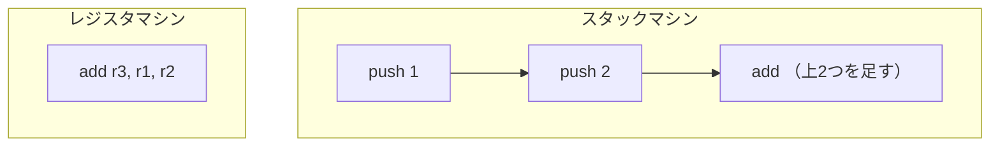
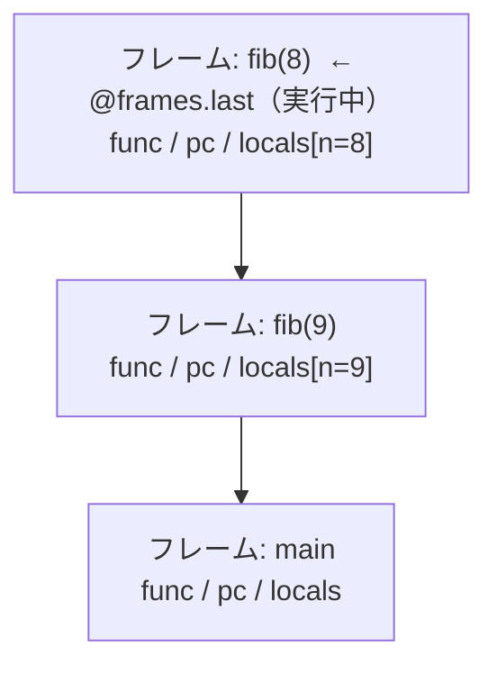

# 仮想マシン ── バイトコードで実行する

前章の AST インタプリタは、実行のたびに木をたどり、ノードの種類を判定していました。この章では、もう一段「機械寄り」の実行方式に進みます。AST をあらかじめ **バイトコード（bytecode）** ── 単純な命令の列 ── に翻訳（コンパイル）しておき、それを **仮想マシン（Virtual Machine, VM）** が一命令ずつ実行する方式です。木を毎回たどる代わりに、平坦な命令列を頭から実行していくので、ずっと高速になります。Java（JVM）も Ruby（YARV）も、この方式を採っています。

同じ MiniRuby を、今度はコンパイラと VM の組で動かしましょう。

## スタックマシンとレジスタマシン

VM には大きく 2 つの流儀があります。計算の途中結果をどこに置くか、で分かれます。

**スタックマシン（stack machine）** は、計算の途中結果を **スタック（stack）** ── 後入れ先出し（LIFO）の積み重ね ── に置きます。`1 + 2` は「`1` を積む」「`2` を積む」「上の 2 つを取り出して足し、結果を積む」という 3 命令になります。各命令は「どこのデータを使うか」をいちいち指定せず、暗黙に「スタックのてっぺん」を相手にします。そのため命令が短く単純で、コンパイラも書きやすいのが長所です。

**レジスタマシン（register machine）** は、本物の CPU のように、番号のついた作業場所（レジスタ）にデータを置きます。`1 + 2` は「レジスタ 1 と 2 を足してレジスタ 3 に入れろ」のように、使う場所を明示します。命令数は減りますが、ひとつの命令にレジスタ番号を複数埋め込む必要があり、命令が大きくなります。Lua の VM や Android の Dalvik はこちらです。



どちらにも長所短所があり、優劣は単純には決まりません（高速化の章で改めて比較します）。本書では **スタックマシン** を採用します。理由は、コンパイラが圧倒的に書きやすく、命令も読みやすいので、初めて VM を作るのに向いているからです。

## スタックマシン VM の構成要素

スタックマシン VM を動かすのに必要な部品は、驚くほど少なく、本質的には次の 3 つです。

- **バイトコード（bytecode）**：実行すべき命令を順番に並べた配列。VM にとっての「プログラム」です。
- **PC（program counter, プログラムカウンタ）**：いま何番目の命令を実行しているかを指す番号。本物の CPU のプログラムカウンタと同じ役割です。ふつうは命令を 1 つ実行するたびに 1 進み、ジャンプ命令だと別の位置に飛びます。
- **スタック（stack）**：計算の途中結果を積む場所。`push` で積み、演算命令が取り出して使います。

VM の動作は、この 3 つを使った**単純なループ**です ── 「PC の指す命令を取り出す → 種類に応じてスタックを操作する → PC を進める」を、プログラムが終わるまで繰り返すだけ。この中心ループを **命令ディスパッチループ（dispatch loop）** と呼びます。


## 四則演算 VM ── まず式を計算する

いきなり全部を作ると迷子になります。そこで、前章のインタプリタと同じ順番 ── **四則演算と画面出力 → 変数 → 関数** ── で、**いちばん小さい VM** から始めて、節を追うごとに命令を少しずつ増やしていきましょう。最初は変数も関数もない、**四則演算と画面出力だけ**をする VM です。`1 + 2 * 3` を計算して表示できれば成功です。

### この節の命令

四則演算と、結果を画面に出すのに要る命令はこれだけです。

| 命令 | 動作 |
|------|------|
| `[:push, n]` | 整数 `n` をスタックに積む |
| `[:add]` `[:sub]` `[:mul]` `[:div]` | 上 2 つを取り出して演算し、結果を積む |
| `[:pop]` | てっぺんを 1 つ捨てる |
| `[:print]` | てっぺんを取り出して表示する |

オペランド（命令にくっつくデータ）を持つのは `push` だけで、積む値 `n` を後ろに付けます。残りは引数なしで、暗黙に「スタックのてっぺん」を相手にします。

### 式をコンパイルする

コンパイラの仕事は、AST を受け取って命令の配列を吐き出すことです。スタックマシン向けには、覚えやすい原則があります ── **「式をコンパイルした命令列を実行すると、その式の値がスタックのてっぺんに 1 つ残る」**。この約束を全ノードで守れば、組み合わせは自動的にうまくいきます。

たとえば `[:add, 左, 右]` は、「左の命令列」「右の命令列」「`add`」の順に並べるだけ。左を実行すると左の値が積まれ、右を実行すると右の値が積まれ、`add` がその 2 つを足して結果を積む ── 約束どおり、値が 1 つ残ります。

```ruby
class Compiler
  def initialize
    @code = []          # 生成中の命令列
  end
  attr_reader :code

  def emit(*instr) = @code << instr   # 命令を 1 つ追加

  # 式 node をコンパイル（値が 1 つ積まれる命令列を生成）
  def compile_expr(node)
    case node[0]
    when :int
      emit(:push, node[1])

    when :add, :sub, :mul, :div
      compile_expr(node[1])   # 左 → 値が積まれる
      compile_expr(node[2])   # 右 → 値が積まれる
      emit(node[0])           # 上 2 つを演算して結果を積む

    else
      raise "未知の式: #{node.inspect}"
    end
  end
end
```

`compile_expr` が再帰的に自分を呼ぶので、どんなに深い式でも「部分式を先に積んでから演算命令」という順番が自然に展開されます。`1 + 2 * 3` をコンパイルすると、こうなります。

```
push 1
push 2
push 3
mul        ← 2 * 3 = 6
add        ← 1 + 6 = 7
```

掛け算が先に実行されるのは、パーサが優先順位を解決して `[:add, [:int, 1], [:mul, [:int, 2], [:int, 3]]]` という形の AST を作ってくれているからです。コンパイラは木の形に素直に従うだけで、優先順位を気にする必要はありません。

### VM で実行する

VM は、構成要素のところで見た**ディスパッチループ**そのものです。`@code`（命令列）、`@pc`（プログラムカウンタ）、`@stack`（値スタック）の 3 つだけで動きます。

```ruby
class VM
  def initialize(code)
    @code = code
    @stack = []     # 値スタック（計算の途中結果）
    @pc = 0         # 次に実行する命令の番号
  end

  def run
    while @pc < @code.size
      instr = @code[@pc]   # PC の命令を取り出す
      @pc += 1             # PC を進める
      case instr[0]
      when :push  then @stack.push(instr[1])
      when :pop   then @stack.pop
      when :print then puts @stack.pop
      when :add   then b, a = @stack.pop, @stack.pop; @stack.push(a + b)
      when :sub   then b, a = @stack.pop, @stack.pop; @stack.push(a - b)
      when :mul   then b, a = @stack.pop, @stack.pop; @stack.push(a * b)
      when :div   then b, a = @stack.pop, @stack.pop; @stack.push(a / b)
      end
    end
    @stack.last   # 残ったてっぺんが式の値
  end
end
```

ここで `add` が `b, a = @stack.pop, @stack.pop` と、**後ろから先に取り出している**ことに注意してください。スタックは後入れ先出しなので、あとに積んだ右オペランドが先に出てきます。引き算や割り算で順序を間違えると答えが狂うので、ここは大事なところです。

つないで動かしてみましょう。

```ruby
c = Compiler.new
c.compile_expr([:add, [:int, 1], [:mul, [:int, 2], [:int, 3]]])
VM.new(c.code).run   # => 7
```

`run` の戻り値で結果を受け取りましたが、`print` 命令を使えば VM 自身に表示させることもできます。コンパイルした命令列の末尾に `[:print]` を足すだけです。

```ruby
c = Compiler.new
c.compile_expr([:add, [:int, 1], [:mul, [:int, 2], [:int, 3]]])
c.emit(:print)        # 計算結果をてっぺんから取り出して表示
VM.new(c.code).run    # 7 と表示される
```

これで、変数も関数もないこの最小の VM でも、計算した答えを画面に出せます。表示はひとまず専用命令 `print` で済ませますが、関数呼び出しの節で `puts` という組み込み**関数**に作り直し、`print` 命令は役目を終えます ── 前章のインタプリタで `:print` ノードがたどったのと同じ道筋です。

たった数十行で、最初の VM が動きました。ここから命令を足していきます。

## ローカル変数のある VM ── 値を覚え、流れを変える

四則演算 VM は式を 1 つ計算するだけでした。本物のプログラムは、計算した値を**変数に覚え**、条件によって**流れを変え**ます。この節ではその 2 つ ── 変数と分岐 ── を足します。

### この節で増える命令

| 命令 | 動作 |
|------|------|
| `[:get_local, i]` | `i` 番目のローカル変数の値を積む |
| `[:set_local, i]` | てっぺんを `i` 番目のローカル変数に入れる（てっぺんの値は残す） |
| `[:lt]` `[:gt]` `[:eq]` | 上 2 つを比較し、`1`/`0` を積む |
| `[:jump, addr]` | PC を `addr` にする（無条件ジャンプ） |
| `[:jump_if_false, addr]` | てっぺんが `0` なら PC を `addr` にする |

ここで重要なのが **ローカル変数を名前ではなく番号で扱う**ことです。前章のインタプリタは変数を名前（環境 `env` のハッシュキー）で引いていましたが、VM では「ローカル変数を `0, 1, 2, ...` と並べた配列」を用意し、命令には**番号**を埋め込みます。配列の添字アクセスはハッシュ検索よりずっと速いからです。「名前を番号に置き換える」この下ごしらえこそ、[意味解析の章](semantic-analysis.md)で触れた「変数に番号を振る」作業です。コンパイラがコンパイル時に一度だけ行えば、実行時は番号で一発アクセスできます。

比較命令（`lt` など）が結果を `1`/`0` の整数で返すのは、MiniRuby が整数しか持たないからです。真偽値という独立した型を作らず、「`0` は偽、それ以外は真」と決めておけば、`jump_if_false` は「てっぺんが `0` か」を見るだけで分岐できます。

### コンパイラに変数と分岐を足す

変数を扱うには、コンパイラが「どの名前を何番に割り当てたか」を覚える必要があります。`@locals` 配列に出現順で名前を記録し、初出なら新しい番号を振ります。

```ruby
class Compiler
  def initialize
    @code = []          # 生成中の命令列
    @locals = []        # ローカル変数名 → 添字 を、出現順に記録
  end
  attr_reader :code

  def emit(*instr) = @code << instr

  def compile_expr(node)
    case node[0]
    when :int
      emit(:push, node[1])

    when :var
      index = @locals.index(node[1]) or raise "未定義の変数: #{node[1]}"
      emit(:get_local, index)                  # 名前を番号に変えて読む

    when :add, :sub, :mul, :div, :lt, :gt, :eq
      compile_expr(node[1])
      compile_expr(node[2])
      emit(node[0])

    else
      raise "未知の式: #{node.inspect}"
    end
  end

  # ローカル変数名に添字を割り当てる（初出なら新しい番号を振る）
  def local_index(name)
    @locals.index(name) || (@locals << name; @locals.size - 1)
  end
end
```

`local_index` は、変数名が初めて出てきたら新しい番号を割り当て、2 回目以降は同じ番号を返します。これで名前が番号に変わります。ただし、番号を**新しく割り当てる**のは代入のとき（と、後で見る関数の引数）だけです。読み出し `:var` は、すでに番号を持つ名前しか受け付けません ── まだ番号のない名前を読もうとしたら「未定義の変数」エラーです。前章のインタプリタは同じ誤りを**実行時**に見つけましたが、VM では**コンパイル時**に見つかります。[意味解析の章](semantic-analysis.md)で見た「誤りを実行前にまとめて見つける」利点が、さっそく顔を出しています。

次は、代入 `:assign`・条件分岐 `:if`・繰り返し `:while` です。前章のインタプリタと同じく、本書のコンパイラも「文」という別の種類を作らず、これらも**値が 1 つ残る式**としてコンパイルします。あわせて、式の並びをコンパイルする `compile_exprs` を用意します ── 途中の式の値は `pop` で捨て、最後の式の値だけを残す、前章の `eval_exprs` と同じ役割です。

`if` は、AST インタプリタでは Ruby の `if` で素直に書けました。しかし平坦な命令列には「入れ子」がありません。そこで **ジャンプ命令**で分岐を表現します。`if cond ... else ... end` は、次の形にコンパイルします。

```
        <cond の命令列>
        jump_if_false  L_else   ← 条件が 0 なら else へ飛ぶ
        <then の命令列>
        jump           L_end    ← then を実行したら end へ飛ぶ
L_else: <else の命令列>
L_end:  （続き）
```

問題は、`jump_if_false L_else` を生成する時点では、`L_else` が命令列の何番目になるか**まだ分からない**ことです。then 側をコンパイルし終えて初めて分かります。そこで、いったん飛び先を空けて命令を出し、あとから正しい番地で**埋め戻す**という定石を使います。これを **バックパッチ（backpatching, 後埋め）** と呼びます。コンパイルの進行を時間順に追うと、こうなります（番地は例です）。

```
コンパイルの進行                  生成される命令列（番地: 命令）
──────────────────────────────────────────────────────────────
1. cond をコンパイル              0〜2: <cond の命令列>
2. jump_if_false を出したい       3: [:jump_if_false, nil] ← 飛び先がまだ書けない！
3. then をコンパイル              4〜6: <then の命令列>
4. jump を出したい                7: [:jump, nil]          ← end の番地もまだ不明
5. ここで else の先頭番地が確定   → 3 番の nil に 8 を埋める（パッチ）
6. else をコンパイル              8〜10: <else の命令列>
7. ここで end の番地が確定        → 7 番の nil に 11 を埋める（パッチ）
```

「書けないところは空けて先へ進み、分かった時点で埋め戻す」── やっていることはこれだけです。`while` ループも同じジャンプの組み合わせで、「先頭で条件を判定し、偽なら脱出、本体の最後で先頭へ戻る」形に展開します。

```ruby
class Compiler
  # 式の並び exprs をコンパイルする（最後の式の値が 1 つ残る）
  def compile_exprs(exprs)
    if exprs.empty?
      emit(:push, 0)                         # 空の並びの値は 0 とする
      return
    end
    exprs.each_with_index do |expr, i|
      compile_expr(expr)
      emit(:pop) if i < exprs.size - 1       # 途中の値は捨てる
    end
  end

  # compile_expr の case に、代入・分岐・繰り返しを足す
  # （int・var・四則・比較は前掲のまま）
  def compile_expr(node)
    case node[0]
    when :assign
      compile_expr(node[2])                  # 右辺の値を積み…
      emit(:set_local, local_index(node[1])) # 変数に入れる（値はてっぺんに残る）

    when :if
      _, cond, then_body, else_body = node
      compile_expr(cond)
      jf = emit_placeholder(:jump_if_false)  # 飛び先は後で埋める
      compile_exprs(then_body)
      jend = emit_placeholder(:jump)
      patch(jf, @code.size)                  # else の先頭 = 現在地
      compile_exprs(else_body || [])
      patch(jend, @code.size)                # end の位置 = 現在地

    when :while
      _, cond, body = node
      top = @code.size                       # ループの先頭を覚える
      compile_expr(cond)
      jf = emit_placeholder(:jump_if_false)  # 条件が偽なら脱出
      compile_exprs(body)
      emit(:pop)                             # 本体の値は捨てる
      emit(:jump, top)                       # 先頭へ戻る
      patch(jf, @code.size)                  # 脱出先 = ループの直後
      emit(:push, 0)                         # while の値は 0
    end
  end

  def emit_placeholder(op)
    @code << [op, nil]
    @code.size - 1                           # この命令の位置を返す
  end

  def patch(index, addr)
    @code[index][1] = addr                   # 空けておいた飛び先を埋める
  end
end
```

`emit_placeholder` は飛び先を `nil` のまま命令を出し、その**位置**を覚えておきます。本体を出し終えて飛び先が確定したら、`patch` でその位置の `nil` を本当の番地に書き換えます。これがバックパッチです。`@code.size`（現在の命令数）が、ちょうど「次に出す命令の番地」になっていることを使っています。`while` では逆に、ループ先頭の番地は本体より**前**に確定しているので、`top` を覚えておいて後ろ向きのジャンプにそのまま使えます。

「値が 1 つ残る式」の約束が、それぞれでどう守られているかも見ておきましょう。**代入**は、`set_local` が値をてっぺんから**取り出さずに**変数へ書き込むので、右辺の値がそのまま代入式の値として残ります。**`if`** は then・else のどちらに進んでも `compile_exprs` が値を 1 つ残します（`else` がなければ空の並び＝ `0` が積まれます）。**`while`** は本体の値を毎回捨て、ループを抜けたあとに `0` を積みます ── 前章のインタプリタが `while` の値を `nil` としたのと同じ「値はない」扱いですが、MiniRuby の値は整数だけなので `0` で代用します。

### VM に変数を足す

VM 側は、ローカル変数を入れる `@locals` 配列が増え、`case` に 5 つの命令が加わるだけです。

```ruby
class VM
  def initialize(code, nlocals)
    @code = code
    @stack = []
    @pc = 0
    @locals = Array.new(nlocals, 0)   # ローカル変数を 0 で初期化
  end

  def run
    while @pc < @code.size
      instr = @code[@pc]
      @pc += 1
      case instr[0]
      when :push       then @stack.push(instr[1])
      when :pop        then @stack.pop
      when :add        then b, a = @stack.pop, @stack.pop; @stack.push(a + b)
      when :sub        then b, a = @stack.pop, @stack.pop; @stack.push(a - b)
      when :mul        then b, a = @stack.pop, @stack.pop; @stack.push(a * b)
      when :div        then b, a = @stack.pop, @stack.pop; @stack.push(a / b)
      when :lt         then b, a = @stack.pop, @stack.pop; @stack.push(a <  b ? 1 : 0)
      when :gt         then b, a = @stack.pop, @stack.pop; @stack.push(a >  b ? 1 : 0)
      when :eq         then b, a = @stack.pop, @stack.pop; @stack.push(a == b ? 1 : 0)
      when :get_local  then @stack.push(@locals[instr[1]])
      when :set_local  then @locals[instr[1]] = @stack.last
      when :jump       then @pc = instr[1]
      when :jump_if_false
        @pc = instr[1] if @stack.pop == 0
      end
    end
  end
end
```

`get_local` / `set_local` が `@locals[i]` という**配列の添字アクセス**になっている点を見てください。前章のハッシュ検索が、番号による一発アクセスに変わりました。これが VM が速い理由のひとつです。`jump` 系は `@pc` を直接書き換えるだけ ── ループは次の周回で新しい `@pc` の命令を読むので、それだけで制御の流れが変わります。

`while` で階乗（`1 × 2 × … × 5 = 120`）を計算してみましょう。

```ruby
# i = 1; result = 1
# while i < 6 do result = result * i; i = i + 1 end
program = [
  [:assign, "i",      [:int, 1]],
  [:assign, "result", [:int, 1]],
  [:while, [:lt, [:var, "i"], [:int, 6]], [
    [:assign, "result", [:mul, [:var, "result"], [:var, "i"]]],
    [:assign, "i",      [:add, [:var, "i"], [:int, 1]]],
  ]],
]

c = Compiler.new
c.compile_exprs(program)
vm = VM.new(c.code, 2)
vm.run   # result（locals[1]）が 120 になる
```

変数と分岐がそろい、ようやく「プログラムらしいプログラム」が動くようになりました。残るは関数です。

## フレームを導入する ── 関数呼び出しの準備

最後の拡張は**関数呼び出し**です。ここまでの VM は、命令列も変数も 1 組しか持っていませんでした。しかし関数を呼ぶと、呼ぶ側と呼ばれる側で別々の変数・別々の実行位置が要ります。`fib` が `fib` を呼べば、両者の `n` も「いま何番目の命令か」も違うからです。この「1 回の呼び出しぶんの作業スペース」をまとめる道具が、これから導入する**フレーム**です。

増える命令は `call` と `ret` の 2 つだけですが、その裏側ではフレーム・フレームスタック・関数表という 3 つの新しい道具が働きます。一度に出てくると本書でいちばん難しいところなので、二段に分けて進みましょう ── **この節でフレームを導入してディスパッチループを作り直し、次の節で `call`・`ret` を足して実際に関数を呼びます**。

### 「フレーム」とは何か

関数呼び出しを扱うには、ひとつ新しい道具が要ります。**呼び出しフレーム（call frame）**、略して**フレーム**です。

フレームとは、**1 回の関数呼び出しに必要な作業スペースを、ひとまとめにした入れ物**です。関数が動くには、最低限つぎの 3 つを覚えておく必要があります。

- **どの関数を実行中か**（その関数の命令列）
- **その関数をどこまで実行したか**（PC）
- **その関数のローカル変数の現在の値**（`locals` 配列）

勘のいい人は気づいたはずです ── この 3 つは、前節までの VM が持っていた `@code`・`@pc`・`@locals` そのものです。これまでは VM のトップレベルに 1 組だけ置いていました。**それを「呼び出しごとに 1 セット」作り、積み重ねられるようにまとめたものがフレーム**です。

これらは関数呼び出しごとに別々でなければなりません。`fib` が `fib` を呼べば、呼ぶ側と呼ばれる側とで `n` の値も「いま何番目の命令か」も違うからです。そこで「1 回の呼び出しぶんの 3 点セット」を 1 つのフレームにまとめ、呼び出しのたびに新しく作ります。

> [!NOTE]
> 「**どこに戻るか**（リターンアドレス）」が 4 つめの項目として要らないのか、と気になった人は鋭いです。一般的な CPU や VM ではフレームにリターンアドレスを別途保存しますが、本書の設計ではそれを**呼び出し元フレーム自身の PC** が兼ねています。`call` 命令を実行する時点で、ディスパッチループはすでに呼び出し元の PC を「`call` の次」へ進めてあります。新しいフレームを積んでもこの PC は `@frames` の下にそのまま残るので、`ret` で一番上を捨てて呼び出し元フレームに戻れば、その PC が指す場所からそのまま続行できます。つまり「戻り先」は、**各フレームが持つ PC**（2 つめ）と**フレームスタックの積み順**の組み合わせで、自動的に表現されているのです。

身近なたとえなら、**作業中の書類を載せたトレイ**を思い浮かべてください。新しい仕事（関数呼び出し）を頼まれたら、いま手元のトレイを脇に積んでおき、新しいトレイを出して作業します。仕事が終わったら（`ret`）そのトレイを片付け、積んでおいた一番上のトレイを手元に戻して、続きを再開します。

この「積む・片付ける」を素直に表すのが、おなじみの**スタック**です。VM はフレームを `@frames` というスタックに積み重ね、**一番上のフレーム（`@frames.last`）が「いま実行中の関数」**になります。`@frames` は、計算の途中結果を積む `@stack` とは**別の、もう 1 本のスタック**です ── 以後、区別が要るところでは `@stack` を**値スタック**、`@frames` を**フレームスタック**と呼びます。関数を呼ぶとフレームを 1 つ積み、`ret` で戻ると一番上を捨てる ── 前章で Ruby のメソッド呼び出し（＝ Ruby 自身のスタック）に相乗りしていた部分を、今度は**自前の配列で明示的に管理**するわけです。



フレームには Ruby の `Struct` を使い、3 つの中身（`func`・`pc`・`locals`）を持たせます。

```ruby
Frame = Struct.new(:func, :pc, :locals)
```

### ディスパッチループをフレーム対応にする

前節までの VM は `@pc`・`@locals` を直接さわっていました。これを**いま実行中のフレーム** `frame = @frames.last` 越しに読み書きするよう、書き換えます。やることは機械的で、`@pc` → `frame.pc`、`@locals` → `frame.locals`、`@code` → `frame.func[:code]` と置き換えるだけです。

```ruby
def run
  loop do
    frame = @frames.last                  # いま実行中の関数
    instr = frame.func[:code][frame.pc]   # PC の命令を取り出す
    frame.pc += 1                         # PC を進める
    case instr[0]
    # push / pop / add … get_local / set_local / jump … は前節と同じ。
    # ただし @locals は frame.locals、@pc は frame.pc になる。
    when :get_local  then @stack.push(frame.locals[instr[1]])
    when :set_local  then frame.locals[instr[1]] = @stack.last
    when :jump       then frame.pc = instr[1]
    when :jump_if_false
      frame.pc = instr[1] if @stack.pop == 0
    end
  end
end
```

（`push`/`add` などは紙幅の都合で省きました ── 中身は前節とまったく同じで、完成版は最後の「まとめ」に載せます。）

これでループは、`@frames.last` が指すフレーム越しに動くようになりました。ただし、この VM はまだ動かせません ── 最初のフレームを**積む**手段（関数を呼ぶ）も、フレームを**降ろす**手段（関数から戻る）もないからです。それを足すのが次の節です。

## 関数呼び出しのある VM ── call と ret

足場はそろいました。この節で `call`・`ret` の 2 命令と関数表を足し、MiniRuby の関数呼び出しを完成させます。

### この節で増える命令

| 命令 | 動作 |
|------|------|
| `[:call, name, argc]` | 関数 `name` を引数 `argc` 個で呼ぶ |
| `[:ret]` | 関数から戻る（てっぺんが戻り値） |

コンパイラ側も少しだけ増えます。関数呼び出し式 `[:call, name, args]` は「引数を左から積んでから `call`」にコンパイルします。

```ruby
class Compiler
  # compile_expr の case に 1 本追加：
  #   when :call
  #     _, name, args = node
  #     args.each { |a| compile_expr(a) }   # 引数を左から積む
  #     emit(:call, name, args.size)
end
```

`call` の結果はスタックに 1 つ残ります ── 「式の値が 1 つ残る」という約束どおりです。では `ret` は誰が出すのでしょうか。前章と同じく**関数の戻り値は本体の最後の式の値**なので、本体（式の並び）をコンパイルした直後、てっぺんにその値が残っているところへ `ret` を 1 つ置けば済みます。これは関数全体を組み立てる `compile_function`（後述）の仕事です。

### 関数表

VM を作る `initialize` には、**プログラム中のすべての関数を「名前 → その中身」で引ける表**を渡します（本書では**関数表**と呼びます）。「中身」とは、コンパイル済みの命令列 `code`、引数の個数 `nparams`、ローカル変数の総数 `nlocals` の 3 つです。

```ruby
@functions = {
  "main" => { code: [...], nparams: 0, nlocals: 2 },
  "fib"  => { code: [...], nparams: 1, nlocals: 1 },
}
```

この表は、次に出てくる `do_call` が**関数を名前で探すため**に使います。`fib` を呼ぶ命令 `[:call, "fib", 1]` が来たら、`@functions["fib"]` でその命令列を取り出し、新しいフレームを作る ── という流れです。前章のインタプリタが関数定義を集めて持っていたのと同じ役割で、VM ではそれが「コンパイル済み命令列の表」になっただけ、と考えてください。

> [!NOTE]
> **コラム: `def` は「実行文」か、それとも「ただの宣言」か**
>
> ここで `@functions` がプログラムの実行が始まる**前に**すべて出来上がっている点は、本物の Ruby とは大きく違うところです。Ruby の `def` は実は**実行文**で、その行に制御が到達したときに初めてメソッドが定義されます。だから次のように、条件によって定義を変えることすらできます。
>
> ```ruby
> if RUBY_VERSION >= "3.0"
>   def greet = "new"
> else
>   def greet() "old" end
> end
> ```
>
> 一方、この章の MiniRuby（VM で動かす版）では、`def` は実行時には**何も起こりません**。コンパイラがソース全体を先に走査して `def` をすべて集め、`@functions` という表に詰め込んでしまうからです。言い換えると、この VM は「`def` を実行する」のではなく「`def` を事前に回収する」処理系なのです。
>
> この割り切りのおかげで、関数呼び出しは「名前で表を引くだけ」という単純で速い処理になります。逆に Ruby のような動的な再定義（実行中にメソッドを差し替える、メソッドを消す、など）は表現できません。教育用の処理系では「定義は静的、実行は動的」と分けてしまうのが扱いやすく、本書もその立場を取っています。本物の言語がどこまで動的さを許すかは、設計上の大きな選択肢のひとつだと覚えておいてください。
>
> なお、**前章の AST インタプリタは逆の方式**でした ── `def` ノードを評価した時点で関数表に登録するので、あちらでは `def` は実行文です。そのため、関数定義より**前**にその関数を呼ぶプログラムは、AST インタプリタでは「未定義の関数」になり、この VM では（事前回収のおかげで）動いてしまいます。本書の例はすべて「定義してから呼ぶ」順なので差は出ませんが、同じ言語のつもりでも**処理系の実装方式が言語の振る舞いを決めてしまう**ことがある、という好例です。

### 関数呼び出しと戻り

まず、前節のディスパッチループに `call`・`ret` の 2 命令と、起動時に `main` のフレームを積む 1 行を足します。

```ruby
def run
  do_call("main", 0)          # ← 追加：トップレベルを関数として呼ぶ
  loop do
    # …ループの中身は前節のまま。case に次の 2 本を追加する：
    #   when :call
    #     result = do_call(instr[1], instr[2])
    #     @stack.push(result) if result        # 組み込みの戻り値
    #   when :ret
    #     do_return
    #     return @stack.pop if @frames.empty?  # main から戻ったら終了
  end
end
```

残るは関数呼び出しの実体 `do_call` と、戻り処理 `do_return` です。`call` 命令が実行される直前、引数はコンパイラの仕事のおかげで値スタックに積まれています。それらをローカル変数の配列に移し、新しいフレームを積めば、呼び出し完了です。

```ruby
class VM
  def do_call(name, argc)
    if name == "puts"                         # 組み込み関数
      raise "引数の個数が違います: puts" if argc != 1
      value = @stack.pop
      puts value
      return value                            # 出力した値をそのまま返す
    end
    func = @functions[name] or raise "未定義の関数: #{name}"
    if argc != func[:nparams]
      raise "引数の個数が違います: #{name}"
    end
    args = @stack.pop(argc)                   # 引数をまとめて取り出す
    locals = Array.new(func[:nlocals], 0)     # ローカルを 0 で初期化
    args.each_with_index { |v, i| locals[i] = v }  # 先頭に引数を置く
    @frames.push(Frame.new(func, 0, locals))  # 新しいフレームを積む
    nil
  end

  def call(name, argc) = do_call(name, argc)

  def do_return
    retval = @stack.pop   # 戻り値
    @frames.pop           # 自分のフレームを捨てる
    @stack.push(retval)   # 呼び出し元に値を返す（main なら run が受け取る）
  end
end
```

`do_call` がやっていることを、順を追って分解しましょう。`[:call, "fib", 1]`（「`fib` を引数 1 個で呼べ」）という命令が来た時点を考えます。

1. **引数を取り出す**：`call` 命令の直前で、コンパイラは引数を**値スタック `@stack`** に積んでおいてくれました。`@stack.pop(argc)` で、その `argc` 個をまとめて取り出します。
2. **ローカル変数の箱を用意する**：`Array.new(func[:nlocals], 0)` で、呼ばれる関数が使うローカル変数の本数ぶんの配列を作り、ぜんぶ `0` で初期化します。
3. **引数をローカルの先頭に置く**：取り出した引数を `locals[0], locals[1], ...` と並べます。「引数とは、ローカル変数のうち最初の数個である」という約束です。だから関数本体は、引数もふつうのローカル変数（`get_local 0` など）として読めます。
4. **フレームを作って積む**：`func`（命令列）・`pc = 0`（先頭から）・`locals`（いま作った箱）を 1 つの `Frame` にまとめ、`@frames` に積みます。

その手前の `argc != func[:nparams]` の検査にも目を留めてください。関数表に入れておいた `nparams` は、この**引数の個数チェック**のためにあります ── 前章の `eval_call` がやっていたのと同じ検査です。

なお、冒頭で `puts` を**組み込み関数**として特別扱いしているのは、前章のインタプリタの `eval_call` と同じ構図です。前章と同じく `puts` は出力した値をそのまま返し、`do_call` の戻り値が `run` の `call` 処理で値スタックに積まれるので、`puts(式)` も「値が 1 つ残る式」になります。四則演算の節の専用命令 `print` はここで役目を終え、これからは `[:call, "puts", 1]` という `call` 命令で画面に出します。

「**積めば呼び出し完了**」が魔法に見えないのは、ディスパッチループを思い出すと分かります。ループは毎回**先頭で `frame = @frames.last` を読み直す**のでした。だからフレームを積んだ次の周回では、`@frames.last` が新しいフレームに変わり、PC も 0、命令列も `fib` のものになる ── **何も特別なことをしなくても、自然に呼ばれた関数の実行が始まる**のです。`do_call` 自身は呼ばれた関数を実行しません。ただ「足場を 1 段積んで」戻るだけで、あとはループが引き継いでくれます。

> [!NOTE]
> VM には**スタックが 2 つ**ある点に注意してください。計算の途中結果を積む**値スタック `@stack`** と、呼び出しフレームを積む**フレームスタック `@frames`** です。「スタックに積む」「フレームを積む」はどちらも「積む」ですが、積む先が違います。引数や戻り値は `@stack` を通じてフレーム間を行き来し、フレームそのものは `@frames` に積まれます。

戻り処理 `do_return` は、この逆をたどります。`ret` 命令はコンパイラが「戻り値を値スタックに積んだ直後」に置いているので、`@stack.pop` で戻り値を受け取れます。それをいったん退避し、`@frames.pop` で自分のフレームを捨て（このときローカル変数の配列もまるごと消えます）、最後に戻り値を呼び出し元の値スタックへ積み直します。次の周回では `@frames.last` が呼び出し元のフレームに戻っているので、呼び出し元は「`call` の結果が値スタックのてっぺんに 1 つ積まれている」状態から、何ごともなかったように続きを実行できます。

ここまでの動きを、`fib(2)` の実行で時間順に眺めてみましょう。フレームスタックは次のように伸び縮みします。

```
(1) main 実行中    (2) fib(2) を call   (3) fib(2) が         (4) fib(1) が ret
                                            fib(1) を call
                                        ┌──────────┐
                                        │ fib n=1  │← last
                   ┌──────────┐         ├──────────┤          ┌──────────┐
                   │ fib n=2  │← last   │ fib n=2  │          │ fib n=2  │← last
┌──────────┐       ├──────────┤         ├──────────┤          ├──────────┤
│  main    │← last │  main    │         │  main    │          │  main    │
└──────────┘       └──────────┘         └──────────┘          └──────────┘
                                                              値スタックに 1 が
                                                              積まれている（戻り値）

このあと (5) fib(2) が fib(0) を call → ret で 0 が積まれ、(6) add で 1 + 0 = 1、
(7) fib(2) が ret して main に戻る ── という流れです。
```

`call` のたびにフレームが 1 段積まれ、`ret` のたびに一番上が消える。フレームそのものはフレームスタックの中で生き死にし、**戻り値だけが値スタックを通って**下のフレームへ渡る ── この 2 本のスタックの役割分担が見えれば、この節は理解できています。

**再帰がなぜ動くか**を、ここで改めて確認しましょう。`fib(n-1)` を呼ぶと新しいフレームが積まれ、そこには新しい `n` を含む独立した `locals` が用意されます。前節までは値も命令位置も 1 組しかありませんでしたが、今度は `@frames` という**自前の配列**でこれを管理しています。だから理屈の上では、ホスト言語のスタック制限とは無関係に深い再帰ができます。

### 動かしてみる

コンパイラと VM をつないで、フィボナッチを動かしましょう。各関数を `Compiler` でコンパイルし、`{code:, nparams:, nlocals:}` の形にまとめて関数表にします（トップレベルの式の並びは `main` という関数にまとめます）。この組み立てを行うのが `compile_program` です。ソース `src` は前章でも動かした `fib` のプログラム、`convert` は[構文解析の章](parsing.md)で作った「Prism の木 → 配列表現」の変換関数です。

```ruby
def compile_function(params, body)
  c = Compiler.new
  params.each { |p| c.local_index(p) }   # 引数を先頭の番号 0,1,… に割り当てる
  c.compile_exprs(body)                  # 最後の式の値がてっぺんに残り…
  c.emit(:ret)                           # …それが戻り値になる
  { code: c.code, nparams: params.size, nlocals: c.nlocals }
end

def compile_program(program)
  functions = {}
  defs, main = program.partition { |node| node[0] == :def }  # def を事前に集める
  defs.each do |_, name, params, body|          # 各 def をコンパイル
    functions[name] = compile_function(params, body)
  end
  functions["main"] = compile_function([], main)
  functions
end

functions = compile_program(convert(Prism.parse(src).value))
result    = VM.new(functions).run        # fib(10) を puts すれば 55
```

`55` が表示されれば、**バイトコードコンパイラと仮想マシンが完成**です。同じ MiniRuby のプログラムが、前章とはまったく違う仕組みで、しかし同じ答えを出しました。「AST を毎回たどる」のではなく「一度コンパイルした平坦な命令を実行する」── この差が、規模の大きなプログラムで速度の差となって効いてきます。

> [!IMPORTANT]
> コンパイラ（AST → バイトコード）と VM（バイトコードの実行）を**分けた**ことには、大きな意味があります。コンパイルは一度きり、実行は何度でも、という分担ができます。さらに、バイトコードを最適化したり、ファイルに保存して配ったり、別の高速化（次部の JIT）を後段に挟んだりする余地が生まれます。「いったん中間表現に落とす」という設計が、応用への扉を開くのです。

## 命令セットと実装のまとめ

三段階で組み立ててきた命令と実装を、ここで一覧にまとめます。まず、MiniRuby VM の**命令セットの全体像**です。

| 命令 | 動作 | 加わった節 |
|------|------|------|
| `[:push, n]` | 整数 `n` をスタックに積む | 四則演算 |
| `[:add]` `[:sub]` `[:mul]` `[:div]` | 上 2 つを取り出して演算し、結果を積む | 四則演算 |
| `[:pop]` | てっぺんを 1 つ捨てる | 四則演算 |
| `[:lt]` `[:gt]` `[:eq]` | 上 2 つを比較し、`1`/`0` を積む | ローカル変数 |
| `[:get_local, i]` | `i` 番目のローカル変数の値を積む | ローカル変数 |
| `[:set_local, i]` | てっぺんを `i` 番目のローカル変数に入れる（てっぺんの値は残す） | ローカル変数 |
| `[:jump, addr]` | PC を `addr` にする（無条件ジャンプ） | ローカル変数 |
| `[:jump_if_false, addr]` | てっぺんが `0` なら PC を `addr` にする | ローカル変数 |
| `[:call, name, argc]` | 関数 `name` を引数 `argc` 個で呼ぶ | 関数呼び出し |
| `[:ret]` | 関数から戻る（てっぺんが戻り値） | 関数呼び出し |

`print` 命令は四則演算の節で導入しましたが、関数呼び出しの節で組み込み関数 `puts` に置き換わったので、最終的な命令セットには含まれていません ── 前章のインタプリタで `:print` ノードが消えたのと同じです。

### 命令の名前はどう決めるか

ところで、なぜ「足し算」を `:add`、「変数の読み出し」を `:get_local` と呼ぶのでしょうか。命令名は VM の動作そのものには影響しません ── `:add` を `:plus` や `:op_017` に変えても、ディスパッチループの `when` をそろえれば同じように動きます。命令名は**バイトコードを読んでデバッグする人間のための名前**です。だからこそ、読みやすく一貫した名前を選ぶ価値があります。本書では次の素朴な原則に従っています。

- **動作を短い動詞で表す**（`push`, `pop`, `add`, `jump`）。1 命令 = 1 動作なので、名前も 1 語で足りることが多い。
- **対象を取るときは `動詞_対象`**（`get_local` / `set_local`、`jump_if_false`）。「何に対する操作か」を名前に含める。
- **同系統は語彙をそろえる**。`get_local` と `set_local`、`jump` と `jump_if_false` のように対称・段階的に並べると、命令列が「読める」ようになる。
- **オペランドは名前に入れず、配列の後続要素にする**（`[:push, n]`、`[:call, name, argc]`）。名前は動作だけを表し、可変部分はデータとして渡す。こうすると命令の種類が爆発せずに済む。

実在の VM は、ここからさらに **型や最適化の有無まで名前で区別**します。スタックに型タグを持たない設計では、足し算の対象が整数か浮動小数点かを命令名で表すしかないからです。代表的な VM の命名規則を並べてみましょう。

| VM | 整数の加算 | ローカル変数の読み出し | 条件分岐 | 命名のクセ |
|------|------|------|------|------|
| **本書（MiniRuby）** | `:add` | `:get_local` | `:jump_if_false` | 小文字シンボル＋動詞。型は区別しない |
| **JVM**（Java） | `iadd` | `iload` | `ifeq` / `if_icmplt` | 型接頭辞（`i`=int, `l`=long, `f`=float, `a`=参照） |
| **CPython** | `BINARY_OP` | `LOAD_FAST` | `POP_JUMP_IF_FALSE` | 大文字＋アンダースコア、`動詞_対象` |
| **Ruby（YARV）** | `opt_plus` | `getlocal` | `branchunless` | 小文字。最適化版に `opt_` 接頭辞 |
| **WebAssembly** | `i32.add` | `local.get` | `br_if` | 名前空間（`型.動作` / `分類.動作`） |
| **Lua** | `ADD R3 R1 R2` | （レジスタ直接） | `JMP` | レジスタマシンなので 3 オペランド形式 |

見比べると、考え方は驚くほど似ています ── どれも「動詞＋対象」を基本に、必要な情報（型・最適化・レジスタ）を接頭辞や名前空間で足しているだけです。MiniRuby は整数しか扱わないので型区別が要らず、いちばん短い名前で済んでいます。応用編で文字列や浮動小数点を足すと、`add` だけでは足りなくなり、JVM のように型で命令を分けたくなる場面が出てきます。そのとき「なぜ実在の VM は命令名に型を埋め込むのか」を、自分の手で再発見することになるはずです。

### 完成したコンパイラ

節ごとに足してきた `compile_expr` と `compile_exprs` を 1 つにまとめると、コンパイラの全体はこうなります。

```ruby
class Compiler
  def initialize
    @code = []          # 生成中の命令列
    @locals = []        # ローカル変数名 → 添字 を、出現順に記録
  end
  attr_reader :code
  def nlocals = @locals.size

  def emit(*instr) = @code << instr

  # 式の並び exprs をコンパイルする（最後の式の値が 1 つ残る）
  def compile_exprs(exprs)
    if exprs.empty?
      emit(:push, 0)                           # 空の並びの値は 0 とする
      return
    end
    exprs.each_with_index do |expr, i|
      compile_expr(expr)
      emit(:pop) if i < exprs.size - 1         # 途中の値は捨てる
    end
  end

  # 式 node をコンパイルする（値が 1 つ積まれる命令列を生成）
  def compile_expr(node)
    case node[0]
    when :int  then emit(:push, node[1])
    when :var
      index = @locals.index(node[1]) or raise "未定義の変数: #{node[1]}"
      emit(:get_local, index)
    when :add, :sub, :mul, :div, :lt, :gt, :eq
      compile_expr(node[1]); compile_expr(node[2]); emit(node[0])
    when :assign
      compile_expr(node[2])
      emit(:set_local, local_index(node[1]))   # 値はてっぺんに残る
    when :if
      _, cond, then_body, else_body = node
      compile_expr(cond)
      jf = emit_placeholder(:jump_if_false)
      compile_exprs(then_body)
      jend = emit_placeholder(:jump)
      patch(jf, @code.size)
      compile_exprs(else_body || [])
      patch(jend, @code.size)
    when :while
      _, cond, body = node
      top = @code.size
      compile_expr(cond)
      jf = emit_placeholder(:jump_if_false)
      compile_exprs(body)
      emit(:pop)                               # 本体の値は捨てる
      emit(:jump, top)
      patch(jf, @code.size)
      emit(:push, 0)                           # while の値は 0
    when :call
      _, name, args = node
      args.each { |a| compile_expr(a) }        # 引数を左から積む
      emit(:call, name, args.size)
    else
      raise "未知の式: #{node.inspect}"
    end
  end

  def local_index(name)
    @locals.index(name) || (@locals << name; @locals.size - 1)
  end

  def emit_placeholder(op)
    @code << [op, nil]; @code.size - 1
  end

  def patch(index, addr) = @code[index][1] = addr
end
```

### 完成した仮想マシン

VM も、四則演算の素朴なループに `@locals` と `@frames` を足していった結果、最終形はこうなります。前節までの `@pc`・`@locals`・`@code` は、すべて `frame`（= `@frames.last`）の中に収まっています。

```ruby
Frame = Struct.new(:func, :pc, :locals)

class VM
  def initialize(functions)
    @functions = functions   # 名前 => { code:, nparams:, nlocals: }
    @stack = []              # 値スタック（計算の途中結果）
    @frames = []             # 呼び出しフレームのスタック
  end

  def run
    do_call("main", 0)
    loop do
      frame = @frames.last
      instr = frame.func[:code][frame.pc]   # PC の命令を取り出す
      frame.pc += 1                          # PC を進める
      case instr[0]
      when :push       then @stack.push(instr[1])
      when :pop        then @stack.pop
      when :add        then b, a = @stack.pop, @stack.pop; @stack.push(a + b)
      when :sub        then b, a = @stack.pop, @stack.pop; @stack.push(a - b)
      when :mul        then b, a = @stack.pop, @stack.pop; @stack.push(a * b)
      when :div        then b, a = @stack.pop, @stack.pop; @stack.push(a / b)
      when :lt         then b, a = @stack.pop, @stack.pop; @stack.push(a <  b ? 1 : 0)
      when :gt         then b, a = @stack.pop, @stack.pop; @stack.push(a >  b ? 1 : 0)
      when :eq         then b, a = @stack.pop, @stack.pop; @stack.push(a == b ? 1 : 0)
      when :get_local  then @stack.push(frame.locals[instr[1]])
      when :set_local  then frame.locals[instr[1]] = @stack.last
      when :jump       then frame.pc = instr[1]
      when :jump_if_false
        frame.pc = instr[1] if @stack.pop == 0
      when :call
        result = do_call(instr[1], instr[2])
        @stack.push(result) if result          # 組み込みの戻り値
      when :ret
        do_return
        return @stack.pop if @frames.empty?    # main から戻ったら終了
      end
    end
  end

  def do_call(name, argc)
    if name == "puts"                          # 組み込み関数
      raise "引数の個数が違います: puts" if argc != 1
      value = @stack.pop
      puts value
      return value                             # 出力した値をそのまま返す
    end
    func = @functions[name] or raise "未定義の関数: #{name}"
    if argc != func[:nparams]
      raise "引数の個数が違います: #{name}"
    end
    args = @stack.pop(argc)
    locals = Array.new(func[:nlocals], 0)
    args.each_with_index { |v, i| locals[i] = v }
    @frames.push(Frame.new(func, 0, locals))
    nil
  end

  def do_return
    retval = @stack.pop
    @frames.pop
    @stack.push(retval)
  end
end
```

四則演算の数十行から始めて、変数・分岐・関数呼び出しと足していくと、この 1 枚にたどり着きます。**どの行も、いつ・なぜ足したのかを説明できる** ── それがこの章を順に組み上げてきたねらいでした。

## ここまでの到達点

基礎編はこれで完成です。MiniRuby という小さな言語を題材に、構文解析・意味解析・AST インタプリタ・バイトコード VM と、言語処理系の主要工程を一通り、自分の手で実装しました。AST インタプリタと VM という**2 つの実行方式**を作ったことで、「簡単だが遅い」「複雑だが速い」というトレードオフも体感できたはずです。

この骨格は、ここからいくらでも育てられます。続く応用編では、整数しか扱えなかった MiniRuby に、文字列・配列・オブジェクト・例外・クロージャ・並行処理といった「本物の言語の機能」を、どう載せていくかを見ていきます。土台ができたいま、その上に何を建てるかは自由自在です。
