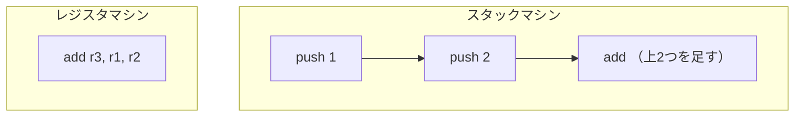

# 仮想マシン ── バイトコードで実行する

前章の AST インタプリタは、実行のたびに木をたどり、ノードの種類を判定していました。この章では、もう一段「機械寄り」の実行方式に進みます。AST をあらかじめ **バイトコード（bytecode）** ── 単純な命令の列 ── に翻訳（コンパイル）しておき、それを **仮想マシン（Virtual Machine, VM）** が一命令ずつ実行する方式です。木を毎回たどる代わりに、平坦な命令列を頭から実行していくので、ずっと高速になります。Java（JVM）も Ruby（YARV）も、この方式を採っています。

同じ MiniRuby を、今度はコンパイラと VM の組で動かしましょう。

## スタックマシンとレジスタマシン

VM には大きく 2 つの流儀があります。計算の途中結果をどこに置くか、で分かれます。

**スタックマシン（stack machine）** は、計算の途中結果を **スタック（stack）** ── 後入れ先出し（LIFO）の積み重ね ── に置きます。`1 + 2` は「`1` を積む」「`2` を積む」「上の 2 つを取り出して足し、結果を積む」という 3 命令になります。各命令は「どこのデータを使うか」をいちいち指定せず、暗黙に「スタックのてっぺん」を相手にします。そのため命令が短く単純で、コンパイラも書きやすいのが長所です。

**レジスタマシン（register machine）** は、本物の CPU のように、番号のついた作業場所（レジスタ）にデータを置きます。`1 + 2` は「レジスタ 1 と 2 を足してレジスタ 3 に入れろ」のように、使う場所を明示します。命令数は減りますが、ひとつの命令にレジスタ番号を複数埋め込む必要があり、命令が大きくなります。Lua の VM や Android の Dalvik はこちらです。



どちらにも長所短所があり、優劣は単純には決まりません（高速化の章で改めて比較します）。本書では **スタックマシン** を採用します。理由は、コンパイラが圧倒的に書きやすく、命令も読みやすいので、初めて VM を作るのに向いているからです。

## スタックマシン VM の構成要素

スタックマシン VM を動かすのに必要な部品は、驚くほど少なく、本質的には次の 3 つです。

- **バイトコード（bytecode）**：実行すべき命令を順番に並べた配列。VM にとっての「プログラム」です。
- **PC（program counter, プログラムカウンタ）**：いま何番目の命令を実行しているかを指す番号。本物の CPU のプログラムカウンタと同じ役割です。ふつうは命令を 1 つ実行するたびに 1 進み、ジャンプ命令だと別の位置に飛びます。
- **スタック（stack）**：計算の途中結果を積む場所。`push` で積み、演算命令が取り出して使います。

VM の動作は、この 3 つを使った**単純なループ**です ── 「PC の指す命令を取り出す → 種類に応じてスタックを操作する → PC を進める」を、プログラムが終わるまで繰り返すだけ。この中心ループを **命令ディスパッチループ（dispatch loop）** と呼びます。


## 命令セットを決める

まず MiniRuby 用の命令セット（どんな命令を用意するか）を設計します。スタックマシンなので、ほとんどの命令は「スタックのてっぺんを相手にする」短い命令になります。

| 命令 | 動作 |
|------|------|
| `[:push, n]` | 整数 `n` をスタックに積む |
| `[:add]` `[:sub]` `[:mul]` `[:div]` | 上 2 つを取り出して演算し、結果を積む |
| `[:lt]` `[:gt]` `[:eq]` | 上 2 つを比較し、`1`/`0` を積む |
| `[:get_local, i]` | `i` 番目のローカル変数の値を積む |
| `[:set_local, i]` | スタックのてっぺんを `i` 番目のローカル変数に入れる |
| `[:jump, addr]` | PC を `addr` にする（無条件ジャンプ） |
| `[:jump_if_false, addr]` | てっぺんが `0` なら PC を `addr` にする |
| `[:call, name, argc]` | 関数 `name` を引数 `argc` 個で呼ぶ |
| `[:ret]` | 関数から戻る（てっぺんが戻り値） |
| `[:pop]` | てっぺんを 1 つ捨てる |

ここで重要なのが **ローカル変数を名前ではなく番号で扱う**ことです。前章のインタプリタは変数を名前（ハッシュのキー）で引いていましたが、VM では「関数のローカル変数を `0, 1, 2, ...` と並べた配列」を用意し、命令には**番号**を埋め込みます。配列の添字アクセスはハッシュ検索よりずっと速いからです。「名前を番号に置き換える」この下ごしらえこそ、意味解析の章で触れた「変数に番号を振る」作業です。コンパイラがコンパイル時に一度だけ行えば、実行時は番号で一発アクセスできます。

## AST をバイトコードへコンパイルする

コンパイラの仕事は、AST を受け取って命令の配列を吐き出すことです。スタックマシン向けのコンパイルには、覚えやすい原則があります ── **「式をコンパイルした命令列を実行すると、その式の値がスタックのてっぺんに 1 つ残る」**。この約束さえ全ノードで守れば、組み合わせは自動的にうまくいきます。

たとえば `[:add, 左, 右]` は、「左の命令列」「右の命令列」「`add`」の順に並べればよい。左を実行すると左の値が積まれ、右を実行すると右の値が積まれ、`add` がその 2 つを足して結果を積む ── 約束どおり、値が 1 つ残ります。

```ruby
class Compiler
  def initialize
    @code = []          # 生成中の命令列
    @locals = []        # ローカル変数名 → 添字 を、出現順に記録
  end

  def emit(*instr) = @code << instr   # 命令を 1 つ追加

  # 式 node をコンパイル（値が 1 つ積まれる命令列を生成）
  def compile_expr(node)
    case node[0]
    when :int
      emit(:push, node[1])

    when :var
      emit(:get_local, local_index(node[1]))

    when :add, :sub, :mul, :div, :lt, :gt, :eq
      compile_expr(node[1])   # 左 → 値が積まれる
      compile_expr(node[2])   # 右 → 値が積まれる
      emit(node[0])           # 上 2 つを演算して結果を積む

    when :call
      _, name, args = node
      args.each { |a| compile_expr(a) }   # 引数を左から積む
      emit(:call, name, args.size)

    else
      raise "未知の式: #{node.inspect}"
    end
  end

  # ローカル変数名に添字を割り当てる（初出なら新しい番号を振る）
  def local_index(name)
    @locals.index(name) || (@locals << name; @locals.size - 1)
  end
end
```

`compile_expr` が再帰的に自分を呼ぶことで、どんなに深い式でも「部分式を先に積んでから演算命令」という順番が自然に展開されます。`local_index` は、変数名が初めて出てきたら新しい番号を割り当て、2 回目以降は同じ番号を返します。これで名前が番号に変わります。

### 条件分岐とジャンプ

`if` 文は、AST インタプリタでは Ruby の `if` で素直に書けました。しかし平坦な命令列には「入れ子」がありません。そこで **ジャンプ命令**で分岐を表現します。`if cond ... else ... end` は、次の形にコンパイルします。

```
        <cond の命令列>
        jump_if_false  L_else   ← 条件が 0 なら else へ飛ぶ
        <then の命令列>
        jump           L_end    ← then を実行したら end へ飛ぶ
L_else: <else の命令列>
L_end:  （続き）
```

問題は、`jump_if_false L_else` を生成する時点では、`L_else` が命令列の何番目になるか**まだ分からない**ことです。then 側をコンパイルし終えて初めて分かります。そこで、いったん飛び先を空けて命令を出し、あとから正しい番地で**埋め戻す**という定石を使います。これを **バックパッチ（backpatching, 後埋め）** と呼びます。

```ruby
class Compiler
  def compile_stmt(node)
    case node[0]
    when :assign
      compile_expr(node[2])                 # 右辺の値を積み…
      emit(:set_local, local_index(node[1])) # 変数に入れる

    when :if
      _, cond, then_body, else_body = node
      compile_expr(cond)
      jf = emit_placeholder(:jump_if_false)  # 飛び先は後で埋める
      then_body.each { |s| compile_stmt(s) }
      jend = emit_placeholder(:jump)
      patch(jf, @code.size)                  # else の先頭 = 現在地
      (else_body || []).each { |s| compile_stmt(s) }
      patch(jend, @code.size)                # end の位置 = 現在地

    else
      compile_expr(node)
      emit(:pop) if node[0] != :call         # 式文の値は捨てる
    end
  end

  def emit_placeholder(op)
    @code << [op, nil]
    @code.size - 1                           # この命令の位置を返す
  end

  def patch(index, addr)
    @code[index][1] = addr                   # 空けておいた飛び先を埋める
  end
end
```

`emit_placeholder` は飛び先を `nil` のまま命令を出し、その**位置**を覚えておきます。then や else を出し終えて飛び先が確定したら、`patch` でその位置の `nil` を本当の番地に書き換えます。これがバックパッチです。`@code.size`（現在の命令数）が、ちょうど「次に出す命令の番地」になっていることを使っています。

## 仮想マシンを実装する

コンパイル結果（関数ごとの命令列）ができたら、それを実行する VM を書きます。VM の中心は、先ほどの「PC の命令を取り出して実行する」ループです。

関数呼び出しを扱うため、VM は **呼び出しフレーム（call frame）** を積み重ねます。フレームには「いまどの関数を実行中か」「その関数の PC」「その関数のローカル変数の配列」を持たせます。関数を呼ぶとフレームを積み、`ret` で戻るとフレームを捨てます ── 前章で Ruby のスタックに相乗りしていた部分を、今度は**自前のスタックで明示的に管理**するわけです。

```ruby
Frame = Struct.new(:func, :pc, :locals)

class VM
  def initialize(functions)
    @functions = functions   # 名前 => { code:, nparams:, nlocals: }
    @stack = []              # 値スタック（計算の途中結果）
    @frames = []             # 呼び出しフレームのスタック
  end

  def run(main)
    call("main", 0)          # トップレベルを関数として呼ぶ
    loop do
      frame = @frames.last
      instr = frame.func[:code][frame.pc]   # PC の命令を取り出す
      frame.pc += 1                          # PC を進める
      op = instr[0]

      case op
      when :push       then @stack.push(instr[1])
      when :pop        then @stack.pop
      when :add        then b, a = @stack.pop, @stack.pop; @stack.push(a + b)
      when :sub        then b, a = @stack.pop, @stack.pop; @stack.push(a - b)
      when :mul        then b, a = @stack.pop, @stack.pop; @stack.push(a * b)
      when :div        then b, a = @stack.pop, @stack.pop; @stack.push(a / b)
      when :lt         then b, a = @stack.pop, @stack.pop; @stack.push(a <  b ? 1 : 0)
      when :gt         then b, a = @stack.pop, @stack.pop; @stack.push(a >  b ? 1 : 0)
      when :eq         then b, a = @stack.pop, @stack.pop; @stack.push(a == b ? 1 : 0)
      when :get_local  then @stack.push(frame.locals[instr[1]])
      when :set_local  then frame.locals[instr[1]] = @stack.last
      when :jump       then frame.pc = instr[1]
      when :jump_if_false
        frame.pc = instr[1] if @stack.pop == 0
      when :call
        result = do_call(instr[1], instr[2])
        @stack.push(result) if result        # 組み込みの戻り値
      when :ret
        do_return
        return @stack.pop if @frames.empty?  # main から戻ったら終了
      end
    end
  end
end
```

ここで `add` が `b, a = @stack.pop, @stack.pop` と、**後ろから先に取り出している**ことに注意してください。スタックは後入れ先出しなので、あとに積んだ右オペランドが先に出てきます。引き算や割り算で順序を間違えると答えが狂うので、ここは大事なところです。

`get_local` / `set_local` が `frame.locals[i]` という**配列の添字アクセス**になっている点も見てください。前章のハッシュ検索が、番号による一発アクセスに変わりました。これが VM が速い理由のひとつです。

### 関数呼び出しと戻り

残るは関数呼び出しの実体 `do_call` と、戻り処理 `do_return` です。`call` 命令が実行される直前、引数はコンパイラの仕事のおかげでスタックに積まれています。それらをローカル変数の配列に移し、新しいフレームを積めば、呼び出し完了です。

```ruby
class VM
  def do_call(name, argc)
    if name == "puts"                         # 組み込み関数
      puts @stack.pop
      return nil
    end
    func = @functions[name] or raise "未定義の関数: #{name}"
    args = @stack.pop(argc)                   # 引数をまとめて取り出す
    locals = Array.new(func[:nlocals], 0)     # ローカルを 0 で初期化
    args.each_with_index { |v, i| locals[i] = v }  # 先頭に引数を置く
    @frames.push(Frame.new(func, 0, locals))  # 新しいフレームを積む
    nil
  end

  def call(name, argc) = do_call(name, argc)

  def do_return
    retval = @stack.pop                        # 戻り値
    @frames.pop                                # 自分のフレームを捨てる
    @stack.push(retval) unless @frames.empty?  # 呼び出し元に値を返す
  end
end
```

引数 `argc` 個を `@stack.pop(argc)` でまとめて取り出し、`locals` 配列の先頭に並べます（引数はローカル変数の最初の何個か、という扱いです）。あとは新しいフレームを積むだけ。次のループからは、`@frames.last` が新しいフレームになるので、自動的に呼ばれた関数の命令が実行され始めます。`ret` のときは戻り値をいったん退避し、フレームを捨て、呼び出し元のスタックへ戻り値を積み直します。

**再帰がなぜ動くか**を、ここで改めて確認しましょう。`fib(n-1)` を呼ぶと新しいフレームが積まれ、そこには新しい `n` を含む独立した `locals` が用意されます。前章では Ruby のスタックに頼っていましたが、今度は `@frames` という**自前の配列**でこれを管理しています。だから理屈の上では、ホスト言語のスタック制限とは無関係に深い再帰ができます。

## 動かしてみる

コンパイラと VM をつないで、フィボナッチを動かしましょう。各関数を `Compiler` でコンパイルし、`{code:, nparams:, nlocals:}` の形にまとめて VM に渡します（トップレベルの文は `main` という関数にまとめます）。

```ruby
program  = parse_program(tokenize(src))     # 前章までのパーサ
functions = compile_program(program)        # 各 def と main をコンパイル
result   = VM.new(functions).run("main")
# fib(10) を puts すれば 55 と表示される
```

`55` が表示されれば、**バイトコードコンパイラと仮想マシンが完成**です。同じ MiniRuby のプログラムが、前章とはまったく違う仕組みで、しかし同じ答えを出しました。「AST を毎回たどる」のではなく「一度コンパイルした平坦な命令を実行する」── この差が、規模の大きなプログラムで速度の差となって効いてきます。

> [!IMPORTANT]
> コンパイラ（AST → バイトコード）と VM（バイトコードの実行）を**分けた**ことには、大きな意味があります。コンパイルは一度きり、実行は何度でも、という分担ができます。さらに、バイトコードを最適化したり、ファイルに保存して配ったり、別の高速化（次部の JIT）を後段に挟んだりする余地が生まれます。「いったん中間表現に落とす」という設計が、応用への扉を開くのです。

## ここまでの到達点

基礎編はこれで完成です。MiniRuby という小さな言語を題材に、構文解析・意味解析・AST インタプリタ・バイトコード VM と、言語処理系の主要工程を一通り、自分の手で実装しました。AST インタプリタと VM という**2 つの実行方式**を作ったことで、「簡単だが遅い」「複雑だが速い」というトレードオフも体感できたはずです。

この骨格は、ここからいくらでも育てられます。続く応用編では、整数しか扱えなかった MiniRuby に、文字列・配列・オブジェクト・例外・クロージャ・並行処理といった「本物の言語の機能」を、どう載せていくかを見ていきます。土台ができたいま、その上に何を建てるかは自由自在です。
