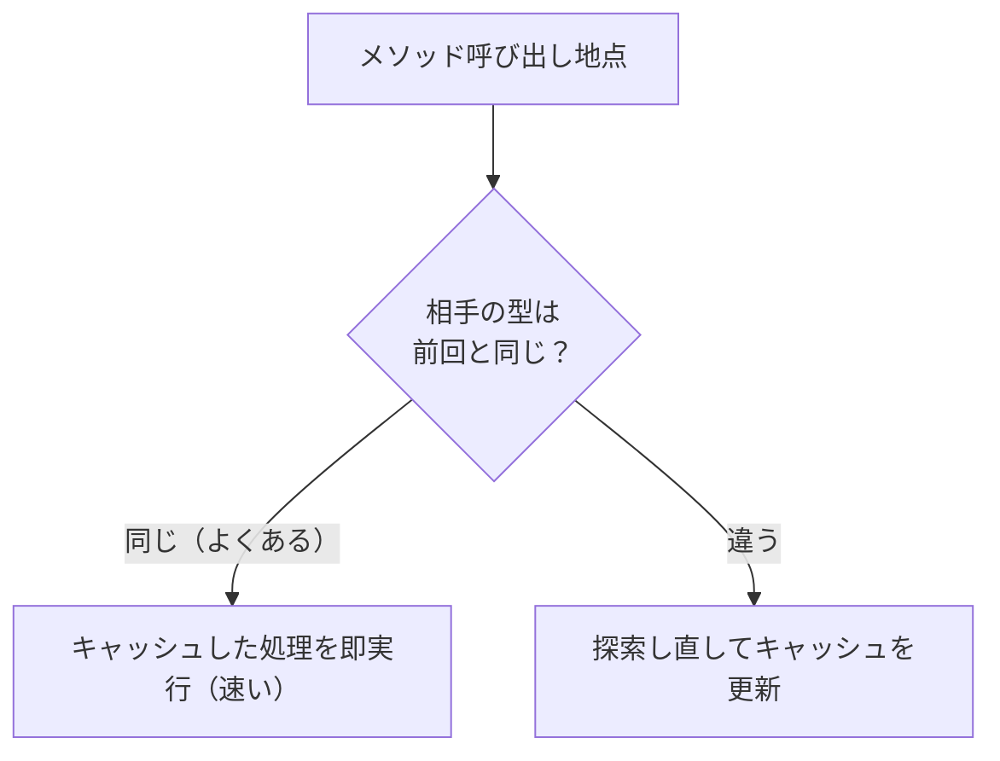

# VM の高速化

基礎編で作ったスタックマシン VM は、素直に動きますが、速さを追求したものではありませんでした。この章では、VM の構造そのものに手を入れて速くする技術を見ていきます。コンパイラ理論的な最適化（次章）とは違い、ここで扱うのは「**命令ディスパッチループをいかに速く回すか**」という、VM 特有の工夫です。インタプリタの実行時間の多くは、この中心ループに費やされるからです[Ertl and Gregg, 2003](#cite:ertl2003)。

## どこが遅いのか ── ディスパッチのコスト

まず、基礎編の VM の中心ループを思い出しましょう。

```ruby
loop do
  instr = frame.func[:code][frame.pc]   # 命令を取り出す
  frame.pc += 1
  case instr[0]                          # ← 種類を判定して分岐
  when :add then ...
  when :push then ...
  # ...
  end
end
```

命令を 1 つ実行するたびに、`case instr[0]` で「これは `add` か、`push` か……」と種類を判定し、対応する処理に飛びます。この「**次に何をするか命令の種類から判断して飛ぶ**」処理を **命令ディスパッチ（instruction dispatch）** と呼びます。

問題は、`add` のような中身の軽い命令ほど、ディスパッチのコストが相対的に大きくなることです。`a + b` の実体は CPU の足し算一発なのに、その前後で「種類を調べて分岐する」手間がかかる。ループの中で何百万命令も実行すると、この**ディスパッチのオーバーヘッドが実行時間の大半を占める**ことすらあります。VM 高速化の多くは、このディスパッチをいかに削るかに向けられます。

## スタックマシンとレジスタマシン、再考

基礎編で「スタックマシンとレジスタマシン」を紹介し、書きやすさからスタックマシンを選びました。速度の観点で改めて比べてみましょう。

`a = b + c` を考えます。スタックマシンでは、

```
get_local b      # b を積む
get_local c      # c を積む
add              # 上2つを足して積む
set_local a      # a に入れる
```

と **4 命令**かかります。一方、レジスタマシンなら、

```
add  a, b, c     # b と c を足して a へ（1命令）
```

と **1 命令**で済みます。命令数が少ないということは、**ディスパッチの回数が少ない**ということです。先ほど見たとおりディスパッチが重いので、命令数の削減は直接の高速化につながります。これがレジスタマシンの利点です。

ではレジスタマシンが常に勝つかというと、そう単純でもありません。レジスタマシンの命令は「`a`, `b`, `c`」と**オペランドを 3 つ**持つため、1 命令あたりのサイズが大きく、命令を読み解くコスト（デコード）が増えます。また、コンパイラが「どの値をどのレジスタに割り当てるか」を決める **レジスタ割り当て（register allocation）** という難しい仕事を背負います。スタックマシンはこの割り当てが不要で、コンパイラが単純です。

| 観点 | スタックマシン | レジスタマシン |
|------|--------------|--------------|
| 命令数 | 多い | 少ない |
| 1命令のサイズ | 小さい | 大きい |
| ディスパッチ回数 | 多い | 少ない |
| コンパイラの複雑さ | 単純 | 複雑（レジスタ割り当て） |

実際の処理系では、JVM や CRuby の YARV、CPython がスタックマシン、Lua や Android の Dalvik がレジスタマシンを採用しています。「どちらが速いか」は実装の質や言語の性質に依存し、決着はついていません。本書がスタックマシンを選んだのは、あくまで**学びやすさ**のためでした。ここから先の高速化テクニックは、どちらの方式にも応用できます。

## スレッデッドコード ── case 文を消す

スタックマシンのままディスパッチを速くする、古典的で効果の大きい技法が **スレッデッドコード（threaded code）** です[Bell, 1973](#cite:bell1973)。「スレッド（thread, 糸）」とは並行処理のスレッドとは無関係で、「命令から命令へと処理が**糸でつながって**いく」イメージから来た名前です。

基礎編の `case instr[0]` 方式の弱点は、命令を 1 つ実行するたびに中央の `case` 文へ戻り、命令種別の判定と分岐をやり直すことです（実際に「上から順に比較する」かどうかは実装言語やコンパイラに依存しますが、いずれにせよ毎命令ぶんのディスパッチ処理を通るため、中身の軽い命令ほどそのオーバーヘッドが目立ちます）。スレッデッドコードは、この**中央の `case` 文をなくし、各命令の処理の最後で「次の命令の処理へ直接飛ぶ」**ようにします。

イメージとしては、命令の種類（`:add` など）を、あらかじめ「その命令を処理するコードそのもの（への参照）」に置き換えておきます。すると実行時には、種類を調べる必要がなく、いきなりその処理を呼べます。Ruby で雰囲気を示すと、こうなります。

```ruby
# 命令の種類ごとに「処理（手続き）」を表で持つ
HANDLERS = {
  add:       ->(vm) { b, a = vm.pop, vm.pop; vm.push(a + b) },
  push:      ->(vm, n) { vm.push(n) },
  # ...
}

# コンパイル時に、命令列を「手続きの列」へ変換しておく（種類判定を前倒し）
threaded = code.map { |instr| [HANDLERS[instr[0]], *instr[1..]] }

# 実行時は case 文なしで、手続きを直接呼ぶだけ
threaded.each { |handler, *args| handler.call(vm, *args) }
```

ポイントは、「**種類を調べる作業を、実行のたびではなくコンパイル時に一度だけ済ませる**」ことです。ただし、上の Ruby の例はあくまで考え方を示すための概念例です ── Ruby で実際に `Proc#call` や `*args` 展開を使うと、その呼び出しコストのほうが大きく、`case` 方式より遅くなることも珍しくありません。本物のスレッデッドコードは、C 言語の「ラベルへのポインタ」機能（computed goto）やアセンブリレベルのジャンプを使い、各命令処理の末尾から次の命令処理へ CPU レベルで直接ジャンプします。これにより中央のディスパッチへ戻る往復がなくなり、実装や CPU によっては分岐予測や命令キャッシュの面でも有利になることがあります。ただし現代の CPU では間接分岐予測の挙動が複雑で、`case`（switch）方式とスレッデッドコードのどちらが速いかは、処理系・コンパイラ・CPU に依存します。それでも、スレッデッドコードはインタプリタ高速化の定番中の定番です。

## 命令融合 ── よく続く命令をまとめる

ディスパッチを減らすもうひとつの道は、**命令の数そのものを減らす**ことです。プログラムをよく観察すると、「いつも続けて現れる命令の組」があります。たとえば「ローカル変数を積む `get_local`」の直後に「足し算 `add`」が来る、という並びはとても多い。

そこで、頻出する命令の並びを**1 つの新しい命令にまとめて**しまいます。これを **命令融合（instruction fusion / superinstruction, スーパー命令）** と呼びます。`get_local` と `add` を融合した `get_local_add` という命令を作れば、2 回だったディスパッチが 1 回になります。

```
（融合前）get_local b ; add        ← ディスパッチ2回
（融合後）get_local_add b          ← ディスパッチ1回
```

融合後の `get_local_add b` は「すでにスタックのてっぺんにある値に、ローカル変数 `b` の値を足す」という 1 命令です。たとえば `a + b` をコンパイルした `get_local a ; get_local b ; add` の後ろ 2 命令が、この形にまとまります。さらに進めて、`get_local b ; get_local c ; add` の 3 命令を「`b` と `c` を読んで足す」`add_locals b, c` のような 1 命令にする設計もあります。

融合する組をどう選ぶかは、プログラムの統計をとって「よく出る並び」を見つけるか、あらかじめ有望な組を決め打ちします。命令の種類が増えるぶん VM は少し複雑になりますが、ディスパッチ回数が確実に減るので、効果は大きいです。多くの実用 VM がこの技法を取り入れています[Ertl and Gregg, 2003](#cite:ertl2003)。

## インラインキャッシュ ── 探索結果を覚える

最後に、動的言語の VM で特に効く高速化 ── **インラインキャッシュ（inline cache）** です。[値の表現の章](values-and-containers.md)で予告した技法を、ここで詳しく見ます。

動的言語では、`obj.method` のメソッド呼び出しや、`a + b` の演算ですら、「`a` の型を調べて、その型にふさわしい処理を**探す**」作業が必要でした（メソッドディスパッチ）。この探索は、毎回やると高くつきます。しかし現実には、**同じ場所のコードは、たいてい毎回同じ型を相手にする**という経験則があります。`points.each { |p| p.distance }` のループでは、`p` はいつも `Point` です。

そこで、「**この場所で前回探した結果（型と、対応する処理）を、その場所のすぐそばに覚えておく**」のがインラインキャッシュです。この「メソッド呼び出しが書かれている場所」を **call site**（Ruby 風に言えば send site）と呼びます ── インラインキャッシュは、call site ごとに前回の探索結果を覚える仕組みです。次にそこを通ったとき、相手の型が前回と同じなら、探索を丸ごと省いて覚えておいた処理を即実行できます。型が変わったときだけ、探し直してキャッシュを更新します。

なお、ここでいう「型」は、実装上はクラスのほか、オブジェクトの **shape**（処理系によって hidden class や map とも呼ばれます）── メソッド探索やフィールドアクセスの結果を決める内部情報 ── をキーにすることが多く、言語仕様上の型と一致するとは限りません。



インラインキャッシュは Smalltalk-80 の実装で生まれ[Deutsch and Schiffman, 1984](#cite:deutsch1984)、1 か所で複数の型を覚えられる **多態インラインキャッシュ（polymorphic inline cache, PIC）** へと発展しました[Hölzle et al., 1991](#cite:holzle1991)。今日の JavaScript エンジンや Ruby の高速化でも中心的な役割を果たしており、後述する JIT コンパイラとも密接に連携します（「相手はいつも `Point` だ」という観測を、JIT がさらに踏み込んだ最適化の前提に使う、といった具合に）。

> [!TIP]
> ここで紹介した技法には、共通する発想があります ── **「同じことを何度もするなら、一度やった結果を覚えて使い回す」**。スレッデッドコードは種類判定の結果を、命令融合は頻出パターンを、インラインキャッシュは型探索の結果を、それぞれ「覚えて省く」工夫です。高速化の多くは、この「繰り返しの中の無駄を見つけて削る」という一点に集約されます。

---

VM の構造を磨くことで、同じバイトコードをより速く実行できるようになりました。次章では視点を変え、**バイトコードや中間表現そのものを、よりよいものに書き換える**── コンパイラ理論で培われてきた古典的な最適化の数々を見ていきます。
